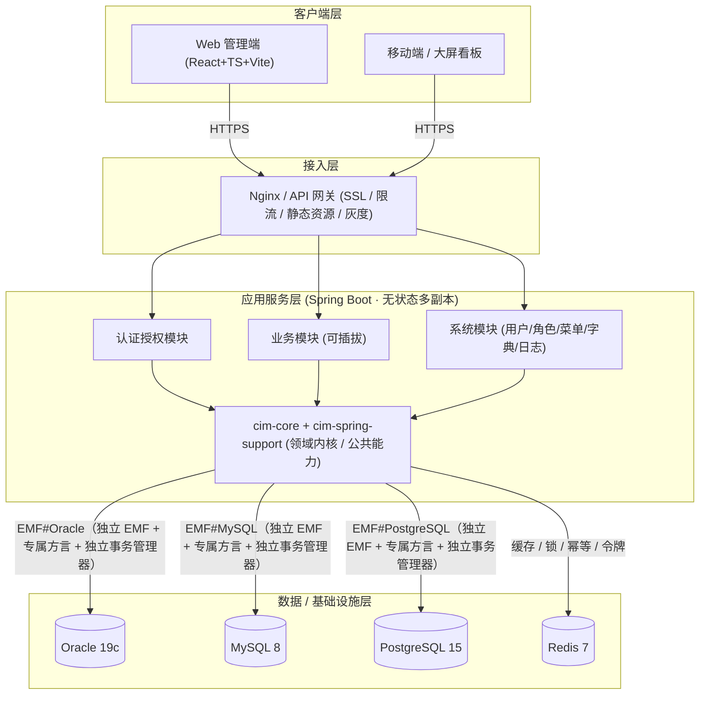
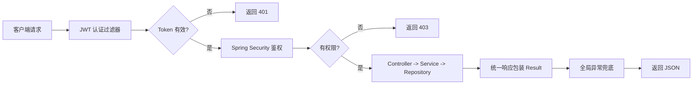

# CIM-AP 企业级基础框架

> 面向半导体 / 智能制造（CIM）场景的可商用前后端分离基础框架，作为后续业务系统（MES、EAP、SPC、WMS 等）的统一底座。

`cim-ap` 是一套 **企业级、可商用、可扩展** 的前后端分离基础框架。后端基于 **Java 21 + Maven + Spring Boot 3 + Spring Data JPA**，原生支持 **Oracle / MySQL / PostgreSQL** 多数据库；前端基于 **React 18 + TypeScript + Vite + SCSS**。框架内置统一响应、全局异常、安全认证、多租户/多数据源、日志、国际化、代码生成等基础能力，并附带 **RBAC 权限模型 + 登录认证 + 通用 CRUD** 的最小可用功能实现，作为后续业务扩展的基座。

> ⚠️ **阅读前请先看实现状态**：代码为按设计落地的**初始骨架**：后端基础框架见 `platform/server/`（Maven 多模块）、前端基础框架见 `platform/web/`（Vite 脚手架）、各业务系统见 `business/{iam-ap,mds-ap,mes-ap}/{server,web}/`，各 starter / 域模块 / ap 目前仅含占位，功能实现按 [§8 实现状态与落地路线](#8-实现状态与落地路线) 推进。文档中的代码示例、目录树、启动命令为该骨架的延续形态，请勿直接复制执行。

---

## 文档导航

本框架文档由总文档与后端 / 前端两份设计文档组成（另含 `docs/business/` 业务扩展目录与 `docs/repo/` 仓库文档目录），便于按角色阅读与维护：

| 文档 | 定位 | 章节 |
| --- | --- | --- |
| **总文档（本文档）** | 项目定位、技术栈总览、系统架构、快速开始、质量目标；§4/§7/§8/§9 为详细篇章入口（正文见 `docs/repo/`） | §1–§9（§4/§7/§8/§9 正文在 `docs/repo/`） |
| [后端基础框架设计文档](docs/platform/server/README.md) | Maven 多模块、分层、多数据库、统一响应/异常、安全认证、国际化、可插拔架构、通用数据模型（审计基类 + 分级历史）、多租户、缓存、事务一致性、异步与韧性、可观测、安全纵深防御、限流/幂等、API 规范、测试、配置密钥、数据生命周期、RBAC 示例、快速开始、部署、日志审计、代码生成器 | §1–§25 |
| [前端基础框架设计文档](docs/platform/web/README.md) | 技术栈与目录、请求层全链路（401 无感刷新/并发去重/幂等）、认证与路由守卫、权限体系（菜单/按钮/接口）、状态管理（Zustand）、国际化热切换、主题与 SCSS、组件与表单、性能与工程化、前端安全、可观测、测试与部署 | §1–§13 |
| [业务扩展文档](docs/business/README.md) | 业务系统（MES / EAP / SPC / WMS 等）设计，框架之上的扩展层；含 **`iam-ap`（统一登录 + 跨业务准入控制）**、`mds-ap`、`mes-ap` 的目录骨架 | 按需扩展 |
| [仓库文档（结构/约定/路线/FAQ）](docs/repo/README.md) | 仓库目录结构与工程约定、开发规范、实现状态与落地路线、FAQ（原总文档 §4/§7/§8/§9，已拆出独立成篇） | 见各文件 |

> 各文档章节编号**相互独立**；跨文档引用已标注来源（如「后端文档 §3」）。全部文档采用统一方法论：**先列常见做法利弊、指出不足，再给本框架优化设计**。

---

---

## 1. 项目定位与特性

| 维度 | 说明 |
| --- | --- |
| 定位 | 企业级业务系统统一底座（非业务系统本身） |
| 适用场景 | MES / EAP / SPC / WMS / QMS 等 CIM 子系统孵化 |
| 核心特性 | 多数据库、多租户、统一安全、统一日志、代码生成 |
| 设计原则 | 约定优于配置、低侵入、可插拔、可观测 |
| 商用就绪 | 权限隔离、审计日志、参数化配置、容器化部署 |

**开箱即用的基础能力：**

- 统一 API 响应结构（`Result<T>`）与全局异常处理
- JWT（RS256 非对称）+ Spring Security 认证鉴权，刷新令牌轮换 + 即时吊销机制
- 基于注解的细粒度权限（`@PreAuthorize` / 数据权限）
- 多数据库（Oracle / MySQL / PostgreSQL）原生支持：每库独立 EMF + 方言、应用层时间有序主键、JSON 通用 Converter、Flyway 多目录迁移（详见[后端文档 §3](docs/platform/server/README.md#3-多数据库支持oraclemysqlpostgresql)）
- 操作审计日志、登录日志（详见[后端文档 §24](docs/platform/server/README.md#24-日志与审计操作日志--登录日志--链路追踪)）
- 字典管理、参数配置、文件上传
- 分布式锁、限流、幂等（Redis：滑动窗口限流 + 幂等键 + 乐观锁/分布式锁，详见[后端文档 §16](docs/platform/server/README.md#16-限流--幂等--并发控制)）
- 多租户架构：共享库 + tenant_id 自动隔离、Schema/DB 级可切换（详见[后端文档 §10](docs/platform/server/README.md#10-多租户架构)）
- 缓存架构：多级缓存（Caffeine + Redis）+ 防穿透/击穿/雪崩（详见[后端文档 §11](docs/platform/server/README.md#11-缓存架构)）
- 事务与一致性：跨库发件箱(outbox)+中继、Saga 补偿（详见[后端文档 §12](docs/platform/server/README.md#12-事务与一致性跨库--发件箱)）
- 可观测性：结构化日志 + OpenTelemetry 链路 + Prometheus 指标（详见[后端文档 §14](docs/platform/server/README.md#14-可观测性指标--链路--日志)）
- 安全纵深防御：CORS/CSRF/安全头/暴力破解锁定/密钥轮换/依赖扫描（详见[后端文档 §15](docs/platform/server/README.md#15-安全纵深防御扩展-5)）
- 国际化（i18n）与统一校验
- 前端请求拦截、路由守卫、权限指令、主题系统、语言切换（i18n 热切换）
- 模块可插拔架构：横切能力 Starter 化，依赖即启用、移除即降级（详见[后端文档 §8](docs/platform/server/README.md#8-可插拔架构高度灵活)）
- 通用数据模型（审计基类 `Auditable` + 注解驱动自动历史）：**每个有历史记录的实体各自一张专属历史表**（`{X}Hist` / `{X}StateLog`，与主表同构），写操作自动落历史，无需 Task 子类（详见[后端文档 §9](docs/platform/server/README.md#9-通用数据模型审计基类--分级历史参考成熟实践并优化)）
- 代码生成器：一次产出主表实体 + 历史实体 + 两张表 DDL + CRUD 骨架，是「每实体一历史表」方案落地的关键依赖（详见[后端文档 §25](docs/platform/server/README.md#25-代码生成器设计)）

---

## 2. 技术栈总览

### 后端

| 分类 | 技术选型 |
| --- | --- |
| 语言 / 构建 | Java 21（LTS）、Maven 3.9+ |
| 框架 | Spring Boot 3.3.x、Spring MVC、Spring Security 6 |
| 数据访问 | Spring Data JPA（Hibernate 6）、支持 Oracle 19c / MySQL 8 / PostgreSQL 15 |
| 安全 | JWT（jjwt 0.12+）、Spring Security 6 资源服务器 |
| 接口文档 | SpringDoc OpenAPI 3（Swagger UI） |
| 校验 | Bean Validation（Hibernate Validator） |
| 缓存 / 分布式 | Redis（Lettuce）、Redisson 分布式锁 |
| 工具 | Lombok、MapStruct、Hutool、EasyExcel |
| 日志 | SLF4J + Logback（MDC 链路追踪） |
| 测试 | JUnit 5、Mockito、ArchUnit、Testcontainers |
| 运维 | Actuator、Micrometer + Prometheus、OpenTelemetry、Docker / K8s |

### 前端

| 分类 | 技术选型 |
| --- | --- |
| 语言 / 构建 | TypeScript 5、Vite 5、pnpm 9 |
| 框架 | React 18、React Router 6 |
| 状态管理 | Zustand（轻量） / Redux Toolkit（可选） |
| UI 组件 | Ant Design 5（企业级组件库） |
| 样式 | SCSS（Design Token + BEM）、CSS Modules |
| 请求 | Axios（拦截器封装）+ SWR/React Query（可选） |
| 表单 | React Hook Form + Zod 校验 |
| 国际化 | i18next + react-i18next |
| 图表 | ECharts / AntV（看板场景） |
| 工程化 | ESLint + Prettier + Stylelint + Husky |

---

## 3. 系统架构



> **多库接入口径（重要）**：上图三条库连线是**各自独立的 `EntityManagerFactory + TransactionManager + Dialect`**，并非「单个 EMF + `AbstractRoutingDataSource` 动态路由」通吃三库。后者会把异构方言混进同一个 `SessionFactory`，导致方言函数、类型推断、跨库事务边界全部失控；本框架仅在**同构库的读写分离 / 分片**场景才使用动态路由。详见[后端文档 §3](docs/platform/server/README.md#3-多数据库支持oraclemysqlpostgresql)。

**请求处理流程：**



---

## 4. 仓库目录结构

> 完整的目录树、状态表、命名取舍讨论、统一词汇原则、平台/业务分层决策与工程约定较长，已独立为 [docs/repo/structure.md](docs/repo/structure.md)，便于按主题维护与评审。

[→ 查看仓库目录结构与工程约定](docs/repo/structure.md)

---

## 5. 快速开始

> 以下步骤描述的是**代码骨架落地后**的启动方式。当前各模块仅含占位（🟡 骨架已生成，功能待按 §8 路线填充），可直接按骨架运行验证；正式功能实现后再据业务补全。

**前置依赖**

| 依赖 | 版本 | 用途 |
| --- | --- | --- |
| JDK | 21+ | 后端编译运行 |
| Maven | 3.9+ | 后端构建 |
| Node.js | 18+ / 20+ | 前端构建 |
| pnpm | 9+ | 前端包管理 |
| MySQL / Oracle / PostgreSQL | 8 / 19c / 15 | 主库（三选一或并存） |
| Redis | 7+ | 缓存、令牌、限流、幂等、锁 |
| Kafka / RabbitMQ | — | 可选，启用异步 / 集成事件时需要 |

**① 拉起中间件**

```bash
docker compose up -d mysql redis     # 最小集；完整集再加 kafka nginx
```

**② 启动后端（基础框架）**

```bash
cd platform/server
# 配置数据源（复制模板后按环境修改）
cp cim-bootstrap/src/main/resources/application.yml.example \
   cim-bootstrap/src/main/resources/application.yml

mvn clean install -DskipTests
mvn -pl cim-bootstrap spring-boot:run
```

> 各业务 ap 是独立应用：先确保已执行过 `cd platform/server && mvn clean install -DskipTests`（将 `com.cim:cim-*` 底座工件装入本地仓库），再在 `business/{ap}/server` 下执行 `mvn spring-boot:run`（如 IAM 默认端口 8081、MDS 8082、MES 8083）。

**③ 启动前端（基础框架）**

```bash
cd platform/web
pnpm install
pnpm dev          # http://localhost:5173
```

> 各业务 ap 前端在 `business/{ap}/web` 下独立运行（如 IAM 默认端口 5171、MDS 5172、MES 5173，各自代理到对应后端）。

**④ 验证**

| 检查项 | 地址 / 方式 | 预期 |
| --- | --- | --- |
| 接口文档 | `http://localhost:8080/swagger-ui.html` | OpenAPI 契约可见（后端 §17） |
| 健康检查 | `/actuator/health/liveness`、`/actuator/health/readiness` | `UP`（后端 §14） |
| 监控指标 | `/actuator/prometheus` | 指标可抓取 |
| 首次登录 | 前端登录页 | 完成登录后返回双令牌（后端 §21.2） |

> 更详细的环境说明见[后端文档 §22](docs/platform/server/README.md#22-环境要求与后端快速开始)，生产部署形态见[后端文档 §23](docs/platform/server/README.md#23-部署拓扑与弹性)与[前端文档 §13](docs/platform/web/README.md#13-构建与部署)。

---

## 6. 非功能需求与质量目标

> 以下为**设计目标值**，需在框架落地后通过压测校准；半导体 CIM 场景对审计完整性、数据可靠性和长周期运行稳定性要求高于一般后台系统。

| 类别 | 指标 | 目标 | 保障手段 |
| --- | --- | --- | --- |
| **性能** | 单实体 CRUD（P95） | ≤ 200 ms | 应用层主键省去 DB 往返、一级/二级缓存（后端 §11） |
| | 分页查询（P95） | ≤ 500 ms | 统一 `PageQuery` + Keyset 深分页（后端 §17） |
| | 登录认证（P95） | ≤ 500 ms | RS256 本地验签、权限菜单走缓存（后端 §5 / §11） |
| | 前端首屏（LCP） | ≤ 2.5 s | 路由级懒加载、产物分包、hash 长缓存（前端 §9 / §13） |
| **并发** | 单实例 QPS | ≥ 500（常规 CRUD） | 无状态 + 连接池调优 |
| | 扩展方式 | 水平扩容 | 会话外置 Redis，任意增减副本（后端 §23） |
| **可用性** | 服务可用性 | ≥ 99.9% | Liveness/Readiness 分离、滚动发布、灰度（后端 §14 / §23） |
| | 数据库故障隔离 | 单库故障不拖垮全局 | 每库独立 EMF（后端 §3） |
| **数据可靠性** | RPO | ≤ 5 min | 主从/备份 + 发件箱保证事件不丢（后端 §12） |
| | RTO | ≤ 30 min | 蓝绿/滚动发布 + 向后兼容迁移（后端 §23） |
| **审计完整性** | 写操作历史覆盖率 | 100%（`@History` 标注实体） | 变更检测闸门 + 同事务落历史（后端 §9） |
| | 历史不可篡改 | 仅追加，禁止 UPDATE/DELETE | 历史表只增不改不删（后端 §9.8） |
| **合规** | PII 脱敏 | 响应/日志全覆盖 | `@Sensitive` 字段脱敏 + 日志脱敏（后端 §15 / §20） |
| | 数据保留期 | 按类型可配（操作日志 N 年 / 状态流水 M 月） | 时序归档热/温/冷（后端 §20） |
| **安全** | 口令传输 | 应用层动态公钥加密 + `nonce` 防重放，**叠加** HTTPS，全程无明文 | 后端 §5.1 / 前端 §3 |
| | 口令存储 | 服务端混 `pepper`+`userId` **二次派生**（Argon2id）后落库；**前端摘要严禁直接入库** | 后端 §5.1 |
| | 令牌泄露处置 | ≤ 秒级吊销 | `user_token_version` + Redis 黑名单（后端 §5） |
| **容量** | 历史年增长 | 可控，按表分区归档 | 每实体专属历史表 + 分区 TTL（后端 §9 / §20） |

---

## 7. 开发规范

> 通用约定、编码强制约束、数据库对象命名已独立为 [docs/repo/conventions.md](docs/repo/conventions.md)。

[→ 查看开发规范](docs/repo/conventions.md)

---

## 8. 实现状态与落地路线

> 当前实现状态、P0–P7 落地顺序、版本演进规划已独立为 [docs/repo/roadmap.md](docs/repo/roadmap.md)。

[→ 查看实现状态与落地路线](docs/repo/roadmap.md)

---

## 9. 常见设计问答（FAQ）

> Q1–Q10 设计取舍问答已独立为 [docs/repo/faq.md](docs/repo/faq.md)。

[→ 查看常见设计问答（FAQ）](docs/repo/faq.md)

---

> 本文档为 `cim-ap` 企业级基础框架的**轻量入口**：项目定位、技术栈、系统架构、快速开始与质量目标在此；仓库目录结构、开发规范、实现状态与落地路线、FAQ 等详细篇章见 [`docs/repo/`](docs/repo/README.md)；后端与前端设计细节分别见 `docs/platform/server/README.md` 与 `docs/platform/web/README.md`。
