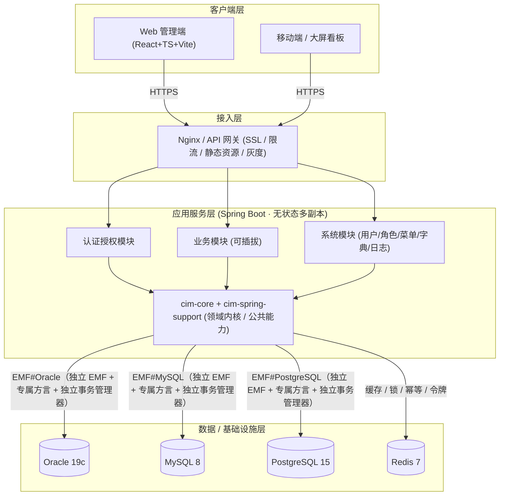
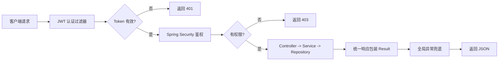

# CIM-AP 企业级基础框架

> 面向半导体 / 智能制造（CIM）场景的可商用前后端分离基础框架，作为后续业务系统（MES、EAP、SPC、WMS 等）的统一底座。

`cim-ap` 是一套 **企业级、可商用、可扩展** 的前后端分离基础框架。后端基于 **Java 21 + Maven + Spring Boot 3 + Spring Data JPA**，原生支持 **Oracle / MySQL / PostgreSQL** 多数据库；前端基于 **React 18 + TypeScript + Vite + SCSS**。框架内置统一响应、全局异常、安全认证、多租户/多数据源、日志、国际化、代码生成等基础能力，并附带 **RBAC 权限模型 + 登录认证 + 通用 CRUD** 的最小可用功能实现，作为后续业务扩展的基座。

> ⚠️ **阅读前请先看实现状态**：本仓库当前处于 **设计文档阶段**，`docs/` 下是完整设计，**工程代码尚未生成**。文档中的代码示例、目录树、启动命令均为「按此设计落地后」的形态，请勿直接复制执行。当前状态与建议的落地顺序见 [§8 实现状态与落地路线](#8-实现状态与落地路线)。

---
## 文档导航

本框架文档拆分为三份，便于按角色阅读与维护：

| 文档 | 定位 | 章节 |
| --- | --- | --- |
| **总文档（本文档）** | 项目定位、技术栈总览、系统架构、目录结构、快速开始、质量目标、开发规范、实现状态与 FAQ | §1–§9 |
| [后端基础框架设计文档](docs/server/README.md) | Maven 多模块、分层、多数据库、统一响应/异常、安全认证、国际化、可插拔架构、通用数据模型（审计基类 + 分级历史）、多租户、缓存、事务一致性、异步与韧性、可观测、安全纵深防御、限流/幂等、API 规范、测试、配置密钥、数据生命周期、RBAC 示例、快速开始、部署、日志审计、代码生成器 | §1–§25 |
| [前端基础框架设计文档](docs/web/README.md) | 技术栈与目录、请求层全链路（401 无感刷新/并发去重/幂等）、认证与路由守卫、权限体系（菜单/按钮/接口）、状态管理（Zustand）、国际化热切换、主题与 SCSS、组件与表单、性能与工程化、前端安全、可观测、测试与部署 | §1–§13 |

> 三份文档的章节编号**相互独立**；跨文档引用已标注来源（如「后端文档 §3」）。全部文档采用统一方法论：**先列常见做法利弊、指出不足，再给本框架优化设计**。

---
---

## 1. 项目定位与特性

| 维度 | 说明 |
| --- | --- |
| 定位 | 企业级业务系统统一底座（非业务系统本身） |
| 适用场景 | MES / EAP / SPC / WMS / QMS 等 CIM 子系统孵化 |
| 核心特性 | 多数据库、多租户、统一安全、统一日志、代码生成 |
| 设计原则 | 约定优于配置、低侵入、可插拔、可观测 |
| 商用就绪 | 权限隔离、审计日志、参数化配置、容器化部署 |

**开箱即用的基础能力：**

- 统一 API 响应结构（`Result<T>`）与全局异常处理
- JWT（RS256 非对称）+ Spring Security 认证鉴权，刷新令牌轮换 + 即时吊销机制
- 基于注解的细粒度权限（`@PreAuthorize` / 数据权限）
- 多数据库（Oracle / MySQL / PostgreSQL）原生支持：每库独立 EMF + 方言、应用层时间有序主键、JSON 通用 Converter、Flyway 多目录迁移（详见[后端文档 §3](docs/server/README.md#3-多数据库支持oraclemysqlpostgresql)）
- 操作审计日志、登录日志（详见[后端文档 §24](docs/server/README.md#24-日志与审计操作日志--登录日志--链路追踪)）
- 字典管理、参数配置、文件上传
- 分布式锁、限流、幂等（Redis：滑动窗口限流 + 幂等键 + 乐观锁/分布式锁，详见[后端文档 §16](docs/server/README.md#16-限流--幂等--并发控制)）
- 多租户架构：共享库 + tenant_id 自动隔离、Schema/DB 级可切换（详见[后端文档 §10](docs/server/README.md#10-多租户架构)）
- 缓存架构：多级缓存（Caffeine + Redis）+ 防穿透/击穿/雪崩（详见[后端文档 §11](docs/server/README.md#11-缓存架构)）
- 事务与一致性：跨库发件箱(outbox)+中继、Saga 补偿（详见[后端文档 §12](docs/server/README.md#12-事务与一致性跨库--发件箱)）
- 可观测性：结构化日志 + OpenTelemetry 链路 + Prometheus 指标（详见[后端文档 §14](docs/server/README.md#14-可观测性指标--链路--日志)）
- 安全纵深防御：CORS/CSRF/安全头/暴力破解锁定/密钥轮换/依赖扫描（详见[后端文档 §15](docs/server/README.md#15-安全纵深防御扩展-5)）
- 国际化（i18n）与统一校验
- 前端请求拦截、路由守卫、权限指令、主题系统、语言切换（i18n 热切换）
- 模块可插拔架构：横切能力 Starter 化，依赖即启用、移除即降级（详见[后端文档 §8](docs/server/README.md#8-可插拔架构高度灵活)）
- 通用数据模型（审计基类 `Auditable` + 注解驱动自动历史）：**每个有历史记录的实体各自一张专属历史表**（`{X}Hist` / `{X}StateLog`，与主表同构），写操作自动落历史，无需 Task 子类（详见[后端文档 §9](docs/server/README.md#9-通用数据模型审计基类--分级历史参考成熟实践并优化)）
- 代码生成器：一次产出主表实体 + 历史实体 + 两张表 DDL + CRUD 骨架，是「每实体一历史表」方案落地的关键依赖（详见[后端文档 §25](docs/server/README.md#25-代码生成器设计)）

---


## 2. 技术栈总览

### 后端

| 分类 | 技术选型 |
| --- | --- |
| 语言 / 构建 | Java 21（LTS）、Maven 3.9+ |
| 框架 | Spring Boot 3.3.x、Spring MVC、Spring Security 6 |
| 数据访问 | Spring Data JPA（Hibernate 6）、支持 Oracle 19c / MySQL 8 / PostgreSQL 15 |
| 安全 | JWT（jjwt 0.12+）、Spring Security 6 资源服务器 |
| 接口文档 | SpringDoc OpenAPI 3（Swagger UI） |
| 校验 | Bean Validation（Hibernate Validator） |
| 缓存 / 分布式 | Redis（Lettuce）、Redisson 分布式锁 |
| 工具 | Lombok、MapStruct、Hutool、EasyExcel |
| 日志 | SLF4J + Logback（MDC 链路追踪） |
| 测试 | JUnit 5、Mockito、ArchUnit、Testcontainers |
| 运维 | Actuator、Micrometer + Prometheus、OpenTelemetry、Docker / K8s |

### 前端

| 分类 | 技术选型 |
| --- | --- |
| 语言 / 构建 | TypeScript 5、Vite 5、pnpm 9 |
| 框架 | React 18、React Router 6 |
| 状态管理 | Zustand（轻量） / Redux Toolkit（可选） |
| UI 组件 | Ant Design 5（企业级组件库） |
| 样式 | SCSS（Design Token + BEM）、CSS Modules |
| 请求 | Axios（拦截器封装）+ SWR/React Query（可选） |
| 表单 | React Hook Form + Zod 校验 |
| 国际化 | i18next + react-i18next |
| 图表 | ECharts / AntV（看板场景） |
| 工程化 | ESLint + Prettier + Stylelint + Husky |

---


## 3. 系统架构



> **多库接入口径（重要）**：上图三条库连线是**各自独立的 `EntityManagerFactory + TransactionManager + Dialect`**，并非「单个 EMF + `AbstractRoutingDataSource` 动态路由」通吃三库。后者会把异构方言混进同一个 `SessionFactory`，导致方言函数、类型推断、跨库事务边界全部失控；本框架仅在**同构库的读写分离 / 分片**场景才使用动态路由。详见[后端文档 §3](docs/server/README.md#3-多数据库支持oraclemysqlpostgresql)。

**请求处理流程：**



---


## 4. 仓库目录结构

> 以下代码目录为**设计规划形态**，当前仓库尚未生成（状态标记见下表与 [§8](#8-实现状态与落地路线)）。

```
cim-ap
├── README.md                  # 总文档（本文件）
├── docs
│   ├── server/README.md       # 后端设计文档 §1–§25
│   └── web/README.md          # 前端设计文档 §1–§13
├── docker-compose.yml         # 本地开发依赖：MySQL / Redis（+ 可选 Kafka / Nginx）
│
├── server/                   # 【后端工程根】Java Maven 多模块，pom.xml 在此
│   ├── pom.xml                # 父 BOM（依赖版本收敛 / 插件 / enforcer）
│   ├── Dockerfile
│   ├── cim-core               # 领域内核：实体 / 领域服务 / Repository 端口（零 Spring 依赖）
│   ├── cim-spring-support     # Spring 适配：基类 / 工具 / 注解 / AOP 切面
│   ├── cim-jpa-starter        # 持久化（多库 EMF / 审计 / 历史 / 多租户过滤）
│   ├── cim-auth-starter       # 认证（RS256 / 刷新轮换 / 数据权限）
│   ├── cim-cache-starter      # 缓存（多级缓存 / 防穿透）
│   ├── cim-mq-starter         # 消息（发件箱中继 / 集成事件）
│   ├── cim-i18n-starter       # 国际化
│   ├── cim-obs-starter        # 可观测（指标 / 链路 / 日志）
│   ├── cim-gen-starter        # 代码生成器（见后端文档 §25）
│   ├── cim-system             # 系统域模块：用户/角色/菜单/字典/日志
│   ├── cim-business           # 业务域模块（后续按域孵化）
│   └── cim-bootstrap          # 启动装配模块（仅 Main + 配置）
│
├── web/                  # 【前端工程根】Node + Vite，package.json 在此
│   ├── package.json
│   ├── index.html
│   ├── Dockerfile
│   └── src
│       ├── main.tsx / App.tsx # 应用入口与根组件（路由挂载）
│       ├── assets / styles    # 静态资源与 SCSS Design Token
│       ├── layouts / router   # 布局与动态路由 + 守卫
│       ├── services           # Axios 实例 + 拦截器 + 模块 API
│       ├── components         # 通用组件（含 <Perms> 权限组件）
│       ├── hooks              # 自定义 Hooks（usePermission / useTable / useRequest）
│       ├── stores             # Zustand 域切片（auth / user / app / dict）
│       ├── locales            # i18n 资源与初始化
│       ├── types              # 全局 TS 类型（与后端 DTO/Result 对齐）
│       ├── modules            # 业务模块自包含（system / dashboard …）
│       └── utils              # 工具
│
└── deploy/                    # 运维编排：Nginx 配置 / K8s manifests / 生产 compose
```

#### 顶层目录命名取舍

| 候选方案 | 优点 | 不足 / 风险 | 结论 |
| --- | --- | --- | --- |
| **`server/` + `web/`**（采用） | 简短、日常 `cd` 与 CI 路径都更省；前后端**地位对等**；通配度高，团队成员无需解释即可理解 | `server` 在 Java 语境可能与 Servlet 容器概念纠缠；`web` 字面只指「网页」，将来加移动端时需要再演进 | ✅ **采用**（短板见下方规避） |
| `backend/` + `frontend/` | 语义**最精确**、零歧义；`frontend` 天然涵盖移动端 / 大屏 / 桌面端 | 名称偏长（8 字符），高频路径输入成本高 | 备选 |
| `apps/server` + `apps/web`（Nx/Turborepo 风格） | 未来加更多应用时有扩展位 | 当前只有 2 个应用，`apps/` 属**提前优化**，白白多一层路径 | ❌ 当前不做（第三个应用出现再迁，见下方演进） |
| `services/` + `ui/` | `services` 暗示清晰的微服务边界 | `services` 与当前「单体多模块」现状矛盾；`ui` 内涵偏窄，忽略了请求层 / 权限 / 状态管理等非 UI 部分 | ❌ 不采用 |
| 后端平铺仓库根 + `web/`（原方案） | Maven 命令最短 | 前后端地位不对等；`.mvn/`、`target/`、`pom.xml` 污染仓库根 | ❌ 已废弃 |

> **`server/web` 的两个已知短板与规避**
> 1. **`server` 的歧义**：本项目 `server/` 下不存在任何 Servlet 容器或 `web.xml` 概念，且每份 README 均标注「后端工程根 / Maven 工程根」，配合 `pom.xml` 位置即可消除歧义。
> 2. **`web` 装不下移动端**：约定 —— 在出现**第三个前端应用**（移动端 / 桌面端 / 大屏独立工程）之前保持现状；届时一次性升级为 `apps/web`、`apps/mobile`、`apps/desktop`，`server/` 保持不变，`docs` 同步跟进。**这是渐进式演进，不是现在就提前搭 `apps/` 层。**
>
> **统一词汇原则**：`docs/server`、`docs/web` 与代码目录 `server/`、`web/` **同名**，务必保持同步改动，避免出现「文档一套叫法、代码另一套」。

> **`server/` 内部不再套一层**（不做 `server/modules/cim-core`）：Maven `<modules>` 已是扁平声明，再多一层只会加深路径、无实际收益。同理 `web/` 内也不做 `web/web/`。

#### 由此带来的工程约定

| 关注点 | 约定 | 理由 |
| --- | --- | --- |
| **Maven 工程根** | 父 POM **下沉到 `server/pom.xml`**，`<modules>` 用相对路径（`cim-core` 等）；仓库根不再是 Maven 工程 | 一套仓库两套构建体系（Maven / pnpm），硬要用 Maven 驱动 pnpm（如 frontend-maven-plugin）是反模式：慢、难调试。CI 里两个 job 并行更合适 |
| **构建命令** | 后端在 `server/` 下执行 `mvn`；如需从根执行用 `mvn -f server/pom.xml` | 路径语义明确 |
| **Docker 构建上下文** | 各工程根放自己的 `Dockerfile`，context = 该目录 | 避免 `.` context 拷贝整个 monorepo（含无关的前/后端代码）导致镜像臃肿、缓存失效 |
| **CI 触发** | 按路径过滤：`server/**` 触发后端 job，`web/**` 触发前端 job | 前端改样式不必跑全套 Maven 构建 |
| **前后端契约** | 后端产出 OpenAPI JSON，前端用 `openapi-typescript` 生成 TS 类型，**经 CI 产物传递**，不设共享源码目录 | 避免为「共享」引入一个两边都要依赖的第三方目录；契约单向流动即可 |
| **运维编排** | 本地开发 compose 放仓库根（命令最短）；Nginx/K8s/生产编排收口 `deploy/` | 开发高频命令要短，生产编排要集中治理 |

| 目录 | 当前状态 | 说明 |
| --- | --- | --- |
| `docs/**` | ✅ 已完成 | 三份设计文档（总 / 后端 25 节 / 前端 13 节） |
| `server/**` | 🔲 未生成 | 模块划分与依赖方向见[后端文档 §1](docs/server/README.md#1-maven-多模块) |
| `web/**` | 🔲 未生成 | 目录规范见[前端文档 §1](docs/web/README.md#1-技术栈与目录结构) |
| `deploy/**` | 🔲 未生成 | Nginx 配置 / K8s manifests / 生产 compose |
| `docker-compose.yml` | 🔲 未生成 | 建议首先创建，用于本地一键拉起依赖中间件 |

---


## 5. 快速开始

> 以下步骤描述的是**代码按设计落地后**的启动方式。当前代码尚未生成，请勿直接执行。

**前置依赖**

| 依赖 | 版本 | 用途 |
| --- | --- | --- |
| JDK | 21+ | 后端编译运行 |
| Maven | 3.9+ | 后端构建 |
| Node.js | 18+ / 20+ | 前端构建 |
| pnpm | 9+ | 前端包管理 |
| MySQL / Oracle / PostgreSQL | 8 / 19c / 15 | 主库（三选一或并存） |
| Redis | 7+ | 缓存、令牌、限流、幂等、锁 |
| Kafka / RabbitMQ | — | 可选，启用异步 / 集成事件时需要 |

**① 拉起中间件**

```bash
docker compose up -d mysql redis     # 最小集；完整集再加 kafka nginx
```

**② 启动后端**

```bash
cd server
# 配置数据源（复制模板后按环境修改）
cp cim-bootstrap/src/main/resources/application.yml.example \
   cim-bootstrap/src/main/resources/application.yml

mvn clean install -DskipTests
mvn -pl cim-bootstrap spring-boot:run
```

**③ 启动前端**

```bash
cd web
pnpm install
pnpm dev          # http://localhost:5173
```

**④ 验证**

| 检查项 | 地址 / 方式 | 预期 |
| --- | --- | --- |
| 接口文档 | `http://localhost:8080/swagger-ui.html` | OpenAPI 契约可见（后端 §17） |
| 健康检查 | `/actuator/health/liveness`、`/actuator/health/readiness` | `UP`（后端 §14） |
| 监控指标 | `/actuator/prometheus` | 指标可抓取 |
| 首次登录 | 前端登录页 | 完成登录后返回双令牌（后端 §21.2） |

> 更详细的环境说明见[后端文档 §22](docs/server/README.md#22-环境要求与后端快速开始)，生产部署形态见[后端文档 §23](docs/server/README.md#23-部署拓扑与弹性)与[前端文档 §13](docs/web/README.md#13-构建与部署)。

---


## 6. 非功能需求与质量目标

> 以下为**设计目标值**，需在框架落地后通过压测校准；半导体 CIM 场景对审计完整性、数据可靠性和长周期运行稳定性要求高于一般后台系统。

| 类别 | 指标 | 目标 | 保障手段 |
| --- | --- | --- | --- |
| **性能** | 单实体 CRUD（P95） | ≤ 200 ms | 应用层主键省去 DB 往返、一级/二级缓存（后端 §11） |
| | 分页查询（P95） | ≤ 500 ms | 统一 `PageQuery` + Keyset 深分页（后端 §17） |
| | 登录认证（P95） | ≤ 500 ms | RS256 本地验签、权限菜单走缓存（后端 §5 / §11） |
| | 前端首屏（LCP） | ≤ 2.5 s | 路由级懒加载、产物分包、hash 长缓存（前端 §9 / §13） |
| **并发** | 单实例 QPS | ≥ 500（常规 CRUD） | 无状态 + 连接池调优 |
| | 扩展方式 | 水平扩容 | 会话外置 Redis，任意增减副本（后端 §23） |
| **可用性** | 服务可用性 | ≥ 99.9% | Liveness/Readiness 分离、滚动发布、灰度（后端 §14 / §23） |
| | 数据库故障隔离 | 单库故障不拖垮全局 | 每库独立 EMF（后端 §3） |
| **数据可靠性** | RPO | ≤ 5 min | 主从/备份 + 发件箱保证事件不丢（后端 §12） |
| | RTO | ≤ 30 min | 蓝绿/滚动发布 + 向后兼容迁移（后端 §23） |
| **审计完整性** | 写操作历史覆盖率 | 100%（`@History` 标注实体） | 变更检测闸门 + 同事务落历史（后端 §9） |
| | 历史不可篡改 | 仅追加，禁止 UPDATE/DELETE | 历史表只增不改不删（后端 §9.8） |
| **合规** | PII 脱敏 | 响应/日志全覆盖 | `@Sensitive` 字段脱敏 + 日志脱敏（后端 §15 / §20） |
| | 数据保留期 | 按类型可配（操作日志 N 年 / 状态流水 M 月） | 时序归档热/温/冷（后端 §20） |
| **安全** | 口令传输 | 应用层动态公钥加密 + `nonce` 防重放，**叠加** HTTPS，全程无明文 | 后端 §5.1 / 前端 §3 |
| | 口令存储 | 服务端混 `pepper`+`userId` **二次派生**（Argon2id）后落库；**前端摘要严禁直接入库** | 后端 §5.1 |
| | 令牌泄露处置 | ≤ 秒级吊销 | `user_token_version` + Redis 黑名单（后端 §5） |
| **容量** | 历史年增长 | 可控，按表分区归档 | 每实体专属历史表 + 分区 TTL（后端 §9 / §20） |

---


## 7. 开发规范

### 7.1 通用约定

| 规范项 | 约定 |
| --- | --- |
| 包命名 | 反向域名 `com.cim.{module}.{layer}`（如 `com.cim.system.domain`） |
| 接口前缀 | `/api/{module}/{resource}`；版本演进走 URI（后端 §17） |
| 时间类型 | Java 侧一律 `LocalDateTime`（**禁用 `Date` / `Calendar`**），UTC 存储、前端本地化展示 |
| 标识符 | Java / TS 均小驼峰；常量全大写下划线 |
| 提交信息 | `type(scope): 描述`（feat / fix / docs / refactor / test / chore） |
| 分支策略 | `main` / `develop` / `feature/*` / `release/*` / `hotfix/*` |
| 代码审查 | PR + 至少 1 人 Approve + CI 全绿（含 ArchUnit 架构守卫） |

### 7.2 编码强制约束

| 领域 | 必须 | 禁止 |
| --- | --- | --- |
| **主键** | 应用层时间有序 ID（雪花 / UUIDv7），由 `IdGenerator` 统一注入 | `@GeneratedValue(IDENTITY)` / 数据库自增（跨库不可移植，后端 §3） |
| **分层依赖** | `Controller → Service → Repository` 逐层调用 | Controller 直接注入 Repository；Service 互相循环依赖 |
| **对象边界** | Controller 出入参一律 DTO（`MapStruct` 转换） | Entity 直接作为请求/响应体（导致字段越权暴露，后端 §2） |
| **事务** | `@Transactional` 标注在 Service 方法，边界内只做 DB 操作 | 事务内发起远程调用 / MQ 发送 / 大循环（长事务拖垮连接池，后端 §12） |
| **异常** | 业务失败抛 `BizException(BizCode, args)`；由全局处理器统一转 `Result` | `e.printStackTrace()`、吞异常、`try-catch` 后返回 null |
| **日志** | SLF4J + MDC（`traceId` 贯穿）；敏感字段脱敏后才打印 | `System.out.println`；明文打印口令/令牌/身份证号（后端 §14 / §15） |
| **JSON 字段** | 统一走 `@Convert` 存 TEXT/CLOB | 使用数据库方言原生 JSON 类型（跨库不可移植，后端 §3） |
| **DDL** | 一律 Flyway 迁移脚本，`ddl-auto: validate` | `ddl-auto: update`（生产会误删列，后端 §3） |
| **历史实体** | 主表 `ALTER` 必须同一迁移文件带对应的 `ALTER {X}_hist` | 只改主表不改历史表（schema drift，后端 §9.8） |
| **前端存储** | `localStorage` 仅存 `lang` / `theme` 白名单 | 持久化 token 或权限数据（XSS 直接失守，前端 §5 / §10） |
| **前端权限** | `<Perms>` 无权限时**不渲染** | 用 CSS `display:none` 隐藏（DOM 仍在，可被绕过，前端 §4） |
| **口令传输** | 前端「一次摘要 + 动态公钥加密」，`nonce` 防重放；**且必须有 HTTPS** | 明文 POST；前端硬编码公钥（后端 §5.1 / 前端 §3） |
| **口令派生** | 服务端混入 `pepper` + 不可变 `userId` 做**二次派生**后才落库，并用 `MessageDigest.isEqual` 定长比对 | **把前端传来的摘要直接入库**（拖库即可回放登录，等于没加密；后端 §5.1） |
| **文案国际化** | 所有面向用户文案走 i18n `t()`；缺失时四级兜底至**默认中文** | 组件内硬编码中文；**把未翻译的裸 key 显示给用户**（前端 §6） |

### 7.3 数据库对象命名

| 对象 | 规范 | 示例 |
| --- | --- | --- |
| 表 | 小写蛇形，业务前缀分组 | `equipment_def`、`sys_user` |
| 历史表 | 主表名 + `_hist`（状态流水为 `_state_log`） | `equipment_def_hist`、`equipment_state_log` |
| 字段 | 小写蛇形（全局 `PhysicalNamingStrategy` 统一转换） | `tenant_id`、`op_time` |
| 索引 | `idx_{表名}_{字段}` | `idx_equipment_def_code` |
| 唯一约束 | `uk_{表名}_{字段}`，软删除需含 `deleted` 列 | `uk_equipment_def_code_tenant_deleted`（后端 §9.7） |

---


## 8. 实现状态与落地路线

### 8.1 当前实现状态

| 层次 | 内容 | 状态 |
| --- | --- | --- |
| 设计文档 | 总文档 §1–§9、后端文档 §1–§25、前端文档 §1–§13 | ✅ 完成 |
| 后端工程代码 | 父 BOM、各 starter、领域模块、启动模块 | 🔲 未生成 |
| 前端工程代码 | Vite 脚手架、请求层、权限、i18n、主题 | 🔲 未生成 |
| 基础设施 | `docker-compose`、`Dockerfile`、CI 流水线、K8s 编排 | 🔲 未生成 |
| 数据库脚本 | Flyway 多目录迁移（含主表 + 历史表成对 DDL） | 🔲 未生成 |

> 文档中所有 ✅ / 🔲 标记含义：**✅ = 设计已完成**，**🔲 = 仅规划或未落地**，均不代表代码已实现。

### 8.2 建议落地顺序

依赖驱动的推进顺序，避免返工：

| 阶段 | 交付物 | 依赖的前置设计 |
| --- | --- | --- |
| **P0 骨架** | 父 BOM + `cim-core` + `cim-spring-support` + `cim-bootstrap` + `docker-compose` | 后端 §1 / §2 |
| **P1 持久化** | `cim-jpa-starter`（多库 EMF、`IdGenerator`、`PhysicalNamingStrategy`、Flyway 多目录、租户过滤器） | 后端 §3 / §10 |
| **P2 数据模型** | `Auditable` + 基类族 + `BaseHistoryData` + `@History` 拦截器 + 变更检测 | 后端 §9 |
| **P3 安全** | `cim-auth-starter`（RS256、刷新轮换、数据权限、RBAC）+ 登录接口 | 后端 §5 / §15 / §21.1 / §21.2 |
| **P4 横切能力** | cache / i18n / obs / mq starter、`Result<T>`、全局异常、限流幂等 | 后端 §4 / §7 / §11 / §13 / §14 / §16 |
| **P5 效率工具** | `cim-gen-starter` 代码生成器（**P2 每实体一历史表的落地保障**） | 后端 §25 / §9.8 |
| **P6 前端底座** | 请求层 + 守卫 + 权限 + i18n + 主题 + 通用 CRUD 页面 | 前端 §1–§8 |
| **P7 生产化** | 部署编排、灰度、监控告警、数据归档作业 | 后端 §20 / §23、前端 §13 |

### 8.3 版本演进规划

| 阶段 | 内容 |
| --- | --- |
| 一期 | 本框架底座 + RBAC + 通用 CRUD（当前目标） |
| 二期 | 代码生成器、工作流引擎、文件中心 |
| 三期 | 多租户 SaaS 化、灰度发布、可观测平台 |
| 业务 | 在 `cim-business` 中孵化 MES / EAP / SPC 模块 |

---


## 9. 常见设计问答（FAQ）

**Q1：为什么历史表要「每实体一张」，而不是一张通用表存 JSON？**
A：通用 JSON 表（如 `sys_history_record`）看似零 schema 维护，但会导致：所有实体历史挤一张表 → 数据量爆炸、索引失效、写入热点；无法按实体业务字段建索引与检索；丢失类型安全与关系型约束；单表故障影响全系统审计。因此本框架采用 `{X}` ↔ `{X}Hist` 一一对应且结构同构，schema drift 由代码生成器 + Flyway 主/历同步迁移 + 启动自检四项机制治理（后端 §9 / §9.8）。

**Q2：为什么不用数据库自增主键，而用应用层雪花 ID？**
A：`@GeneratedValue(IDENTITY)` 在 Oracle 需要 12c+ 且性能差，跨三库行为不统一，也无法支持分库分表与离线生成。应用层时间有序 ID（雪花 / UUIDv7）DB 无关、索引局部性好、可提前分配用于批量关联插入，且与历史表的 `history_id` 同源。雪花算法的 workerId 分配与时钟回拨问题在后端 §3.1 有专门兜底。

**Q3：为什么选择 JPA 而非 MyBatis / MyBatis-Plus？**
A：框架要原生支持 Oracle / MySQL / PostgreSQL 三库，JPA 的方言抽象与类型映射更有优势；审计基类、历史实体、软删除、乐观锁、租户过滤等「横切建模」能力用 JPA 的 `@MappedSuperclass` / Filter / 拦截器可以零侵入实现，而 MyBatis 需大量 XML 与人工维护。复杂查询场景仍可用 `@Query` 原生 SQL 或 Keyset 分页兜底（后端 §3 / §17）。

**Q4：既然强调审计完整，为什么历史写入允许异步？**
A：区分两类一致性。**关键业务数据**（定义类实体）历史同事务写入，保证不丢；**高频状态流水**（秒级）若同事务会成为写入瓶颈，改为 outbox + 异步消费，历史短暂延迟但不影响主业务。失败也不会丢——outbox 行与业务同事务落库，中继保证至少一次投递（后端 §12）。

**Q5：多租户为什么默认「共享库 + tenant_id」而不是独立库？**
A：成本与运维复杂度。共享库模式下单套集群服务所有租户，备份、迁移、升级统一；独立库只在强隔离需求（金融、涉密）时才值得付出 N 套实例的代价。因此本框架默认判别式隔离，但把 Schema 级 / DB 级做成**可切换策略**，租户规模上来后按租户迁移，业务代码零改造（后端 §10）。

**Q6：i18n 全量放数据库，每次翻译都要查库吗？性能如何保障？**
A：不会。启动时全量加载到 Redis Hash（`i18n:msg:{localeCode}`），运行时命中缓存，**零 DB 查询**；通过版本号 `i18n:version` 检测变更并热刷新。前端按版本号拉取，切换语言无需刷新页面，改文案无需重新发版（后端 §7 / 前端 §6）。

**Q7：前端为什么不能把 token 存 localStorage？**
A：`localStorage` 对页面 JS 完全可读，一旦发生 XSS（第三方组件、富文本渲染都可能引入），攻击者可一次性窃取长期凭证。本框架把 accessToken **只存内存**，refreshToken 放 httpOnly + SameSite Cookie（JS 不可读），刷新走「单例 + 队列重放」避免并发相互挤掉——整体是 XSS 与 CSRF 的折中最优解（前端 §3 / §10、后端 §5）。

**Q8：三库并存时，方言差异怎么扛？**
A：三层防御：① 每库**独立 EMF + 独立 Dialect**，物理隔离避免方言混用；② JSON、布尔、大字段等易冲突类型统一走 `@Convert` 存 TEXT/CLOB，不碰方言原生类型；③ 抽取 `DbCapability` 能力抽象（如「是否支持批量插入」「是否有 MERGE」），业务按能力选择实现而非写三家分支。DDL 差异由 Flyway 多目录迁移分库维护（后端 §3）。

**Q9：前端已经把口令加密了，服务端为什么还要做二次派生？**
A：因为**客户端传来的任何值都不能当作最终凭证**。假如服务端把前端传来的摘要直接入库，那么这个摘要就等价于一个新口令——攻击者拖库后**根本无需破解**，直接拿库里的值构造请求就能登录，前端加密全部白费。服务端必须引入**只有服务端才掌握的 pepper**（存于 Vault/KMS，不入库不入镜像）做二次派生，让「登录请求中的值」与「库中的值」之间是 Argon2id 单向变换的关系，从而无法反向回放（后端 §5.1）。

**Q10：为什么不允许把未翻译的 key 直接显示给用户？**
A：界面出现 `equipment.status.run` 这类裸 key 有三个问题：用户完全看不懂；暴露了内部 key 结构与命名，属于信息泄漏；更糟的是它会**掩盖译文缺失**——看起来"有值"就没人去补翻译。因此框架要求四级兜底（目标语言 → **默认中文** → 内置兜底包 → `humanize` 可读降级），任何一级都不允许返回裸 key，同时触发缺失上报生成待翻译工单，把问题在上游解决掉（前端 §6）。

---

> 本文档为 `cim-ap` 企业级基础框架的自包含总说明，后端与前端细节分别见 `docs/server/README.md` 与 `docs/web/README.md`。
