# 后端基础框架设计文档（cim-ap Backend）

> 本文档为 `cim-ap` 后端设计与实现说明，涵盖模块划分、分层架构、多数据库、统一响应/异常、安全认证、国际化、可插拔架构、通用数据模型（审计基类 + 分级历史）、多租户、缓存、事务与一致性、异步事件与韧性、可观测性、安全纵深防御、限流/幂等、API 规范、测试策略、配置与密钥、数据生命周期、RBAC/登录/通用 CRUD 示例、快速开始、部署与弹性、日志与审计、代码生成器。
> 章节编号自 §1 起，与总文档、前端文档相互独立；跨文档引用已标注来源。
> 全文采用统一方法论：**先列常见做法利弊、指出不足，再给本框架优化设计**。
> ⚠️ 本文为**设计文档**，`✅` 表示设计已完成，**不代表代码已实现**；当前仓库无任何工程代码，实现状态见[总文档 §8](../../README.md#8-实现状态与落地路线)。

## 目录

- [1. Maven 多模块](#1-maven-多模块)
- [2. 分层架构](#2-分层架构)
- [3. 多数据库支持（Oracle/MySQL/PostgreSQL）](#3-多数据库支持oraclemysqlpostgresql)
- [4. 统一响应与全局异常](#4-统一响应与全局异常)
- [5. 安全认证（JWT + Spring Security）](#5-安全认证jwt--spring-security)
- [6. 基础能力矩阵](#6-基础能力矩阵)
- [7. 国际化（全量数据库驱动 · 系统级 / 用户级）](#7-国际化全量数据库驱动-系统级-用户级)
- [8. 可插拔架构（高度灵活）](#8-可插拔架构高度灵活)
- [9. 通用数据模型：审计基类 + 分级历史（参考成熟实践并优化）](#9-通用数据模型审计基类--分级历史参考成熟实践并优化)
- [10. 多租户架构](#10-多租户架构)
- [11. 缓存架构](#11-缓存架构)
- [12. 事务与一致性（跨库 / 发件箱）](#12-事务与一致性跨库--发件箱)
- [13. 异步 · 事件 · 消息 · 韧性](#13-异步--事件--消息--韧性)
- [14. 可观测性（指标 / 链路 / 日志）](#14-可观测性指标--链路--日志)
- [15. 安全纵深防御（扩展 §5）](#15-安全纵深防御扩展-5)
- [16. 限流 · 幂等 · 并发控制](#16-限流--幂等--并发控制)
- [17. API 设计规范（版本化 / 分页 / 契约）](#17-api-设计规范版本化--分页--契约)
- [18. 测试策略](#18-测试策略)
- [19. 配置与密钥管理](#19-配置与密钥管理)
- [20. 数据生命周期与合规](#20-数据生命周期与合规)
- [21. 基础功能实现示例](#21-基础功能实现示例)
  - [21.1 RBAC 权限模型](#211-rbac-权限模型)
  - [21.2 登录认证时序](#212-登录认证时序)
  - [21.3 通用 CRUD 基类](#213-通用-crud-基类)
- [22. 环境要求与后端快速开始](#22-环境要求与后端快速开始)
- [23. 部署拓扑与弹性](#23-部署拓扑与弹性)
- [24. 日志与审计（操作日志 / 登录日志 / 链路追踪）](#24-日志与审计操作日志--登录日志--链路追踪)
- [25. 代码生成器设计](#25-代码生成器设计)

---

---

## 1. Maven 多模块

```
server/                      # 后端工程根（对应仓库顶层 `server/`，Maven 工程根，父 POM 在此）
├── pom.xml                 # 父 BOM（依赖版本收敛 / 插件 / enforcer）
├── cim-core               # 领域内核：实体 / 领域服务 / Repository 端口（零 Spring 依赖）
├── cim-spring-support     # Spring 适配：基类 / 工具 / 注解 / AOP 切面（框架无关逻辑下沉）
├── cim-jpa-starter        # 持久化 starter（多库 EMF / 审计 / 历史 / 多租户过滤，见 §3/§9/§10）
├── cim-auth-starter       # 认证 starter（RS256 / 刷新轮换 / 数据权限，见 §5/§15）
├── cim-cache-starter      # 缓存 starter（多级缓存 / 防穿透，见 §11）
├── cim-mq-starter         # 消息 starter（发件箱中继 / 集成事件，见 §12/§13）
├── cim-i18n-starter       # 国际化 starter（见 §7）
├── cim-obs-starter        # 可观测 starter（指标 / 链路 / 日志，见 §14）
├── cim-gen-starter        # 代码生成器 starter（主/历实体 + 成对 DDL，见 §25，provided 作用域）
├── cim-system             # 系统域模块：用户/角色/菜单/字典/日志（自包含 ctrl→entity）
├── cim-business           # 业务域模块（后续按域孵化，每个域自包含）
└── cim-bootstrap         # 启动装配模块（仅 Main + 配置，按需引入各 starter/域）
```

> **仓库定位**：本目录即仓库顶层 `server/`（后端工程根），Maven 父 POM 下沉于此，`<modules>` 使用相对路径；`.mvn/`、`target/` 等构建产物不外溢到仓库根。仓库整体采用 `server/` + `web/` 顶层划分，命名取舍与工程约定见[总文档 §4](../../README.md#4-仓库目录结构)。

父 BOM 统一收敛 Spring Boot、JPA、JWT、Lombok 等版本；子模块按需引入，**避免依赖漂移与循环依赖**。新增 `cim-cache/mq/obs-starter` 以承载 §11/§12/§13/§14 的横切能力。

#### 利弊分析（常见做法 vs 本框架优化）

| 维度 | 常见做法 | 优点 | 不足 / 风险 | 本框架优化 |
| --- | --- | --- | --- | --- |
| **模块粒度** | 按技术层拆（controller / service / dao 各一模块） | 看似清晰 | 构建慢、跨模块调用密集、极易循环依赖 | **按业务域拆**（每域自包含 ctrl→entity），域可独立测试、未来按域抽微服务零改造 |
| **common 模块** | 一个万能 `common` 塞所有工具 | 省事 | 变成「垃圾桶」，业务引 common、common 又引业务 → 循环依赖；领域测试被迫引 Spring | **拆分为 `cim-core`（零 Spring，纯领域+端口）+ `cim-spring-support`（框架适配）**，依赖单向 |
| **依赖方向** | 业务模块直接依赖具体基础设施（JPA / 安全实现） | 直来直去 | 换存储/认证要改业务代码 | **依赖向内**：业务依赖 `cim-core` 的接口/端口，基础设施在 starter 中实现（六边形，呼应 §8 可插拔） |
| **启动装配** | `bootstrap` 依赖全部业务 | 简单 | 启动慢、单测要起全栈 | `bootstrap` **仅做装配**，各域/ starter 按需引入，可裁剪 |
| **版本管理** | 各模块各自引版本 | — | 版本漂移、jar 冲突 | 父 **BOM 统一收敛 + maven-enforcer 依赖树检查**，可审计 |
| **横切能力载体** | 散落于各业务模块 | 无 | 能力重复实现、难统一升级 | **横切能力收口为独立 starter**（cache/mq/obs/i18n/auth/jpa），缺省即可降级 |

#### 优化后的依赖方向

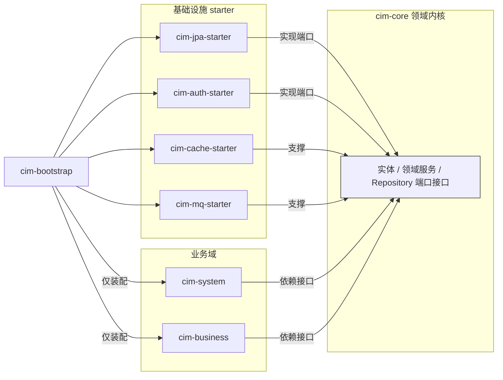

**关键设计点：**

1. **按业务域自包含拆分**，而非按技术层拆分——每个域模块内含 controller→service→repository→entity，可独立编译与测试。
2. **`cim-core` 零 Spring 依赖**：只放领域模型、`Repository` 端口接口、应用服务接口；保持纯净以便单测与复用。
3. **依赖单向（箭头向内）**：`business → core`，`infra adapter → core`，`bootstrap → 选择装配`；`core` 绝不反向依赖业务或基础设施。
4. **common 收口为 `cim-core` + `cim-spring-support`**，杜绝「万能桶」与循环依赖。
5. **父 BOM + enforcer** 统一版本、拦截冲突；每个域模块可独立打包，微服务化零改造。
6. **横切能力 starter 化**（cache/mq/obs/gen 新增），与 §8 可插拔一致：引入依赖即具备能力，移除即降级；`cim-gen-starter` 为 `provided` 作用域，不进生产包。

---

## 2. 分层架构

分层是解耦的关键，但朴素「Controller→Service→Manager→Repository」常退化为**贫血模型 / 事务脚本**：实体只是 getter/setter 容器，业务散落 Service，且实体被直接返回到 API。本节**先列利弊，再给优化设计**。

#### 利弊分析（常见做法 vs 本框架优化）

| 维度 | 常见做法 | 不足 / 风险 | 本框架优化 |
| --- | --- | --- | --- |
| **模型形态** | 贫血实体 + 事务脚本 Service | 逻辑散落 Service、难单测、易重复、改一处牵全身 | **富领域**：行为内聚到实体 / 领域服务，Service 只做编排 |
| **持久化外泄** | Service 直接返回 `Entity` 给 Controller | API 与 DB 强耦合，改表即改 API，过度抓取、字段泄露 | **DTO 与 Entity 严格分离**（MapStruct）；`Repository` 端口在 `cim-core`，JPA 实现在 starter |
| **跨层调用** | Controller 直连 Repository | 事务边界混乱、不可测 | **依赖单向（箭头向内）**，禁止跨层 |
| **Manager 层** | 含糊「复杂逻辑放 manager」 | 人人都塞 → manager hell、职责不清 | 明确为**跨聚合领域服务**或**应用编排**，非垃圾箱 |
| **读模型** | 列表 / 报表也加载完整聚合 | 列表页 N+1、性能差、过度抓取 | **CQRS-lite**：写走聚合，读走独立 `QueryRepository` + 接口投影 DTO |
| **外部集成** | 业务直接调用外部（EAP / SECS / 三方） | 外部模型击穿业务，变更牵一发动全身 | **防腐层（ACL）** 隔离：外部模型不渗入 domain |
| **应用边界** | Service 混杂事务、鉴权、日志、历史 | 横切逻辑侵入业务、难复用 | **横切靠切面 / 端口**（审计 AOP、数据权限 Specification、历史拦截器），业务 Service 只编排 |

#### 优化后的分层（六边形 / Clean-lite）

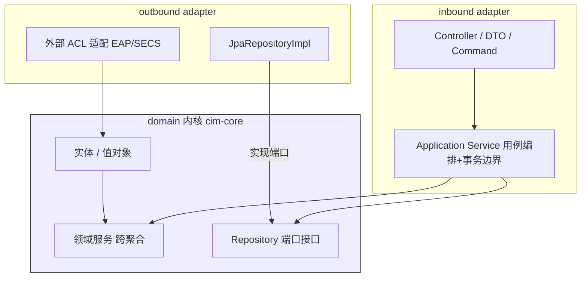

**关键设计点：**

1. **依赖向内（箭头指向 domain）**：domain 不 import 任何 Spring/JPA 注解，保持纯净、可单测；基础设施在 starter 中实现端口。
2. **DTO 边界**：Controller ↔ DTO（MapStruct 自动映射），**永不暴露 Entity**；写操作用 `Command`/`SaveDTO` 入参对象。
3. **CQRS-lite**：写操作走领域聚合保证不变性；列表 / 报表走 `QueryRepository` + 接口投影（只读 DTO），避免加载全聚合与 N+1。
4. **应用服务 = 用例编排 + 事务边界**，不含跨聚合业务（那是领域服务职责）；`Manager` 仅在确有跨聚合编排时需要，且命名语义明确。
5. **防腐层 ACL**：对接 EAP / SECS / 三方系统时加适配层，外部报文模型转换为内部领域模型，隔离变更。

```java
// 1) Repository 端口（定义在 cim-core，无 JPA 依赖）
public interface EquipmentRepository {
    Equipment load(EquipmentId id);
    void save(Equipment equipment);
    List<EquipmentSummary> queryByFactory(String factoryId); // 读模型投影
}
// 2) JPA 实现（在 cim-jpa-starter，实现端口）
@Repository
public class JpaEquipmentRepository implements EquipmentRepository { /* SpringData + 投影 */ }

// 3) DTO 映射（MapStruct，Entity 永不外泄）
@Mapper(componentModel = "spring")
public interface EquipmentMapper {
    EquipmentVO toVO(Equipment e);
}

// 4) 防腐层：外部 EAP 报文 → 内部领域模型
@Component
public class EquipmentAcl {
    public Equipment toDomain(EapEquipmentDto dto) { /* 字段映射 + 校验 */ }
}
```

> 与 §1 模块划分、`§8` 可插拔、`§3/§9/§10` 基础设施 starter 一脉相承：domain 只定义端口，具体实现由 starter 注入，业务域零感知。

---

## 3. 多数据库支持（Oracle/MySQL/PostgreSQL）

一套代码同时跑在 Oracle / MySQL / PostgreSQL 是核心诉求，但三者**方言、主键、分页、JSON、事务、标识符大小写、NULL 排序**差异巨大。朴素做法（用一个 `EntityManagerFactory` + 动态数据源路由「通吃」三库）会在生产环境频繁翻车。本节**先列利弊，再给优化设计**。

#### 利弊分析（常见做法 vs 本框架优化）

| 维度 | 常见做法 | 优点 | 不足 / 风险 | 本框架优化 |
| --- | --- | --- | --- | --- |
| **多库接入** | 单一 `EntityManagerFactory` + `AbstractRoutingDataSource` 动态路由 | 配置简单、注解切换数据源 | 异构方言混在同一 `SessionFactory`，方言函数/类型推断易错；跨库事务边界混乱 | **每库独立 `EMF + TxManager + Dialect`**（异构库物理隔离）；`AbstractRoutingDataSource` 仅用于**同构库的读写分离 / 分片** |
| **主键生成** | `@GeneratedValue(IDENTITY)` | 零代码 | Oracle 的 IDENTITY 需 12c+、性能差；跨库不统一；无法分布式 / 分库分表 | **应用层分配「时间有序 ID」（雪花 / UUIDv7）**，DB 无关、利于索引局部性，且与 §9 历史 `history_id` 同源 |
| **DDL 管理** | `ddl-auto: update` | 开发省事 | 生产灾难（误删列、类型漂移）；三库行为不一致 | **Flyway 多目录迁移（per-DB location）**，`ddl-auto: validate` 仅校验，不自动改结构 |
| **JSON 字段** | 原生 JSON 类型（`@Type(JsonType)` / `OracleJsonType`） | 库内可做 JSON 函数查询 | 类型强绑定方言，换库要改注解 | **`@Convert` 存 `TEXT/CLOB` 字符串 + Jackson 序列化**，业务零方言代码 |
| **分页 / 排序** | 业务 SQL 硬编码 `LIMIT` / `ROWNUM` | — | 换库即坏；Oracle NULL 默认排最前易错 | **Spring Data `Pageable` + Dialect 自动改写；`NULLS LAST` 显式声明** |
| **标识符大小写** | 不统一 | — | Oracle 默认大写、MySQL 小写、PG 保留大小写，导致跨库表名/列名错乱 | **全局 `PhysicalNamingStrategy` 统一小写蛇形 + 显式 quoting** |
| **连接池** | 默认 Hikari 不调优 | — | Oracle / PG 各有最优参数，默认配置吞吐受限 | **每库 `HikariConfig` 分库调优**（PG `preparedStatementCacheSize`、Oracle `defaultRowPrefetch`） |
| **读副本** | 无 | — | 报表/列表压主库，主库抖动 | 同方言 **`AbstractRoutingDataSource` 读写分离**（主写从读），路由键由事务语义决定 |

#### 优化后的架构

```mermaid
flowchart TB
  App[业务 Repository / Service]
  subgraph Cap[方言能力抽象]
    DC[DbCapability 路由: nullOrdering / concat / jsonFn / pagination]
  end
  App --> DC
  App --> ID[IdGenerator: 雪花 / UUIDv7 注入 @PrePersist]
  App --> EM[每库独立 EntityManagerFactory]
  EM -->|MySQL| M[MySQLDialect + Hikari]
  EM -->|Oracle| O[Oracle12cDialect + Hikari]
  EM -->|PostgreSQL| P[PostgreSQLDialect + Hikari]
  App --> Fly[Flyway 多目录迁移: db/migration/{mysql,oracle,pg}]
  M --> DB1[(MySQL)]
  O --> DB2[(Oracle)]
  P --> DB3[(PostgreSQL)]
```

**关键设计点：**

1. **异构库物理隔离**：每个数据库一个 `LocalContainerEntityManagerFactoryBean`，各自绑定 `hibernate.dialect`、`packagesToScan`、独立 `PlatformTransactionManager` 与 `HikariDataSource`。`AbstractRoutingDataSource` 只在同一方言的「主-从 / 分片」场景使用，绝不把三种方言塞进同一个 `SessionFactory`。
2. **统一主键 = 应用层时间有序 ID**：实体基类（见 §9 `Auditable`）通过 `@PrePersist` 由 `IdGenerator` 注入雪花 ID 或 UUIDv7；彻底规避 Oracle 序列/自增差异，支持分布式与分库分表，且历史表 `history_id` 同源生成。
3. **JSON 走 Converter，不碰原生类型**：自定义 `JpaJsonConverter implements AttributeConverter<Object, String>`，把 POJO 序列化为 `String` 存入 `TEXT`(MySQL)/`CLOB`(Oracle)/`TEXT`(PG)，读取再反序列化——业务实体与具体方言解耦。
4. **DDL 用 Flyway 而非 `ddl-auto`**：`db/migration/mysql`、`/oracle`、`/pg` 各自维护增量脚本；启动时 `ddl-auto=validate` 仅校验实体与库表一致，杜绝自动改表。
5. **`DbCapability` 能力抽象**：把跨库差异（NULL 排序方向、字符串拼接、分页方言函数、JSON 查询函数）收敛到一个接口，业务代码只调能力、不写方言分支。

#### 关键代码示例

```java
// 1) 多 EntityManagerFactory（以 Oracle 为例，MySQL/PG 同理换 Dialect + 包扫描）
@Configuration
@EnableJpaRepositories(basePackages = "com.cim.oracle",
        entityManagerFactoryRef = "oracleEmf", transactionManagerRef = "oracleTx")
public class OracleJpaConfig {
    @Bean
    public LocalContainerEntityManagerFactoryBean oracleEmf(
            @Qualifier("oracleDs") DataSource ds,
            @Value("${cim.jpa.oracle.dialect}") String dialect) {
        var emf = new LocalContainerEntityManagerFactoryBean();
        emf.setDataSource(ds);
        emf.setPackagesToScan("com.cim.domain");
        emf.setJpaVendorAdapter(new HibernateJpaVendorAdapter());
        var props = new HashMap<String, Object>();
        props.put("hibernate.dialect", dialect);              // Oracle12cDialect
        props.put("hibernate.ddl-auto", "validate");          // 不自动改表
        props.put("hibernate.physical_naming_strategy",
                   LowercaseSnakeNamingStrategy.class.getName()); // 统一小写蛇形
        emf.setJpaPropertyMap(props);
        return emf;
    }
    @Bean public PlatformTransactionManager oracleTx(
            @Qualifier("oracleEmf") EntityManagerFactory emf) {
        return new JpaTransactionManager(emf);
    }
}

// 2) 应用层时间有序主键（注入实体基类，避免 IDENTITY 方言差异）
//    注意：分布式部署必须解决 workerId 分配与时钟回拨，详见 §3.1
@Component
public class IdGenerator {
    private final Snowflake snowflake;
    public IdGenerator(@Value("${cim.id.worker-id}") int workerId) {
        this.snowflake = new Snowflake(workerId, 1);
    }
    public String nextId() {
        try { return snowflake.nextIdStr(); }
        catch (ClockBackwardsException e) { return UUIDv7.random().toString(); } // 兜底
    }
}
```

> **§3.1 时间有序 ID 的生产级风险（资深架构必看）**
> - **时钟回拨**：雪花依赖机器时钟，NTP 校正或虚拟机迁移可能回拨，导致 ID 重复/递减。框架捕获 `ClockBackwardsException` 并**降级到 UUIDv7**，或启用「时钟回拨等待+告警」。
> - **workerId 分配**：硬编码 workerId 在容器随机调度时会冲突。应由**部署平台/配置中心下发**（K8s StatefulSet 序号、或 Consul/Redis 自增分配），保证同数据中心唯一。
> - **可读性**：雪花为数值，跨库关联排查不便；对可读性要求高的实体可用 **UUIDv7**（时间前缀 + 随机，索引局部性接近雪花）。
> - 统一封装在 `IdGenerator`，业务与具体算法解耦，未来切换不影响实体。

> 该设计与 §8 可插拔呼应：每种数据库的 `JpaConfig` + `HikariConfig` + `Flyway` 可封装为 `cim-jpa-{mysql|oracle|pg}-starter`，引入依赖即启用对应库支持，移除即降级；与 §9 的历史 `history_id`（雪花/UUIDv7）同源，保证审计链路全局有序。

---

## 4. 统一响应与全局异常

统一的响应与异常处理是前后端契约的基础。朴素 `Result` + 零星 handler 会导致**错误信息泄露、无稳定错误码、校验信息不结构化、消息未国际化（与 §7 矛盾）**。本节**先列利弊，再给优化设计**。

#### 利弊分析（常见做法 vs 本框架优化）

| 维度 | 常见做法 | 不足 / 风险 | 本框架优化 |
| --- | --- | --- | --- |
| **错误表达** | 散用字符串 / 混合 HTTP 状态 | 前端无法按类型分支、难统计、易变 | **`BizCode` 枚举**（稳定码 + HTTP 映射 + i18n 键），契约稳定 |
| **信息泄露** | 直接返回 `e.getMessage()` | SQL/栈信息外泄、安全隐患 | **5xx 仅返回 `traceId` + 通用语**，详情落服务端日志 |
| **校验错误** | 单串「参数校验失败」 | 前端无法定位具体字段 | **字段级 `errors` Map（field → 提示）**，精确到字段 |
| **消息国际化** | 硬编码中文 | 与 §7 全量 DB i18n 矛盾 | 消息走 **§7 `DatabaseMessageSource`**（i18n 键 + `{占位符}`） |
| **异常分类** | 业务/系统/校验混一 | 无法区分 4xx（客户端）与 5xx（服务端） | **分层**：`BizException`(已知业务) / `SystemException`(未知) / `ValidationException`(参数) |
| **链路追踪** | 无 | 排障困难 | 响应含 **`traceId`**（取自 MDC），与 §14 日志/链路联动 |
| **错误码分段** | 全局乱序 | 难按模块归类、难统计 | **`BizCode` 按模块分段**（1000=用户/权限，2000=业务…），预留区间 |

#### 优化后的设计

- **`Result<T>`**：`code`（业务码）/ `msg`（i18n 解析后提示）/ `data` / `errors`（字段级）/ `traceId` / `timestamp`。
- **`BizCode` 枚举**：每个码含 `httpStatus` + i18n 键 + 默认模板，稳定可审计；按模块分段。
- **`BizException(code, args…)`**：携带 i18n 参数；handler 经 `DatabaseMessageSource` 解析为最终消息。
- **全局 handler**：`@Valid` → 字段级 `errors` + 400；`BizException` → 业务码 + i18n 消息；`AccessDeniedException` → 403；`AuthenticationException` → 401；其余 → 500 + `traceId` + 通用语（不泄露），全部写入 MDC `traceId` 统一日志。

```java
// 1) 统一响应结构（含 traceId 与字段级 errors）
public record Result<T>(int code, String msg, T data,
                        Map<String,String> errors, String traceId, long timestamp) {
    public static <T> Result<T> ok(T data) {
        return new Result<>(0, "success", data, null, MDC.get("traceId"), System.currentTimeMillis());
    }
    public static <T> Result<T> fail(BizCode code, Map<String,String> errors) {
        return new Result<>(code.code(), null, null, errors, MDC.get("traceId"), System.currentTimeMillis());
    }
}

// 2) 错误码枚举（稳定契约 + i18n 键 + HTTP 映射 + 模块分段）
public enum BizCode {
    USER_NOT_FOUND(1001, HttpStatus.NOT_FOUND, "biz.user.notFound"),
    PARAM_INVALID(1002, HttpStatus.BAD_REQUEST, "biz.param.invalid");
    public final int code; public final HttpStatus http; public final String i18nKey;
    BizCode(int c, HttpStatus h, String k) { code=c; http=h; i18nKey=k; }
}

// 3) 业务异常（携带 i18n 参数）
public class BizException extends RuntimeException {
    public final BizCode code; public final Object[] args;
    public BizException(BizCode code, Object... args) { this.code=code; this.args=args; }
}

// 4) 全局异常（结构化 + 国际化 + 防泄露）
@RestControllerAdvice
public class GlobalExceptionHandler {
    @Autowired MessageSource i18n;   // §7 DatabaseMessageSource
    private String msg(BizCode c, Object[] a) {
        return i18n.getMessage(c.i18nKey, a, c.i18nKey, LocaleContextHolder.getLocale());
    }
    @ExceptionHandler(BizException.class)
    public ResponseEntity<Result<Void>> handleBiz(BizException e) {
        return ResponseEntity.status(e.code.http)
            .body(Result.fail(e.code, null).withMsg(msg(e.code, e.args)));
    }
    @ExceptionHandler(MethodArgumentNotValidException.class)
    public ResponseEntity<Result<Void>> handleValid(MethodArgumentNotValidException e) {
        Map<String,String> errs = new HashMap<>();
        e.getBindingResult().getFieldErrors()
            .forEach(fe -> errs.put(fe.getField(),
                i18n.getMessage(fe.getDefaultMessage(), null, fe.getDefaultMessage(),
                                LocaleContextHolder.getLocale())));
        return ResponseEntity.badRequest().body(Result.fail(BizCode.PARAM_INVALID, errs));
    }
    @ExceptionHandler(Exception.class)
    public ResponseEntity<Result<Void>> handleOther(Exception e) {
        log.error("unexpected error, traceId={}", MDC.get("traceId"), e);  // 详情仅落日志
        return ResponseEntity.status(500)
            .body(Result.fail(BizCode.SYSTEM_ERROR, null)
                .withMsg(MDC.get("traceId")));   // 对外仅暴露 traceId
    }
}
```

> 与 §7 国际化、§5 认证（traceId/操作人）、§8 可插拔（异常定义归入 `cim-core`，handler 在 `cim-spring-support`）、§14 可观测（traceId 贯通）一脉相承，保证全链路契约一致。

---

## 5. 安全认证（JWT + Spring Security）

认证授权是企业框架的安全边界。朴素 JWT 实现（对称密钥、令牌存 `localStorage`、刷新令牌不轮换、退出仅靠前端删 token）有诸多隐患。本节**先列利弊，再给优化设计**。

#### 利弊分析（常见做法 vs 本框架优化）

| 维度 | 常见朴素做法 | 优点 | 不足 / 风险 | 本框架优化 |
| --- | --- | --- | --- | --- |
| **令牌签名** | HS256 共享密钥 | 实现简单 | 密钥一旦泄露全网伪造；多服务需共享同一密钥 | **RS256 非对称**（私钥签名 / 公钥验签），资源服务器零密钥分发，且为未来接入 OIDC 预留 |
| **令牌存储** | `localStorage` 存 JWT | 前端取用方便 | XSS 即可窃取，令牌长期有效 | **`refreshToken` 用 `httpOnly + SameSite=Strict` Cookie**；`accessToken` 仅存内存（或极短时效 Cookie），杜绝 XSS 窃取 |
| **刷新令牌** | 长期固定、不轮换 | 实现简单 | 被盗后可被长期冒用 | **每次刷新即轮换 + `jti` 复用检测**：旧 refresh 被二次使用 → 吊销整族令牌 |
| **吊销 / 退出** | 仅前端删 token，服务端无感知 | 无 | 令牌在过期前仍可被滥用，无法即时踢人 | **`user_token_version` 计数 + Redis 黑名单**（TTL=剩余有效期）；退出 / 改密即 bump 版本，全量失效 |
| **数据权限** | SQL 字符串拼接注入租户/工厂条件 | 直观 | **SQL 注入风险**，且难维护 | **`@DataPermission` + JPA `Specification` / MyBatis 拦截器，参数绑定**注入，零拼接、防注入 |
| **多端适配** | 仅 Bearer Header | 统一 | 浏览器 Cookie 场景易遭 CSRF；App 无 Cookie | **双通道**：Web 走 Cookie、App 走 Bearer + 设备绑定（`deviceId`） |
| **口令传输** | 明文 POST（仅依赖 HTTPS） | HTTPS 并非端到端：TLS 终止代理、网关/APM 抓包、企业出站代理都可能看到明文；等保与合规审计普遍要求应用层二次保护 | **应用层加密**：动态公钥（优先 **SM2 国密**，兼容 RSA-OAEP）+ `nonce`/`ts` 防重放，详见 §5.1 |
| **服务端派生** | 把前端传来的摘要/密文**直接入库** | **致命缺陷**：前端传来的值等价于新口令，拖库后可**直接回放登录**，加密形同虚设 | **服务端二次派生**（混入用户名/用户标识 + pepper），详见 §5.1 |
| **密码存储** | 明文 / 弱哈希（MD5/SHA） | — | 拖库即破 | **Argon2id / BCrypt + pepper**，自适应成本因子（落地细节见 §5.1） |
| **算法钉死** | 不校验算法 | 无 | **JWT 算法混淆攻击**（RS256→HS256 用公钥当 HMAC 密钥签） | **验签时强制 `RS256` 且用预设公钥**，拒绝 `alg=none`/算法变更 |
| **暴力破解** | 无限制 | 无 | 撞库 / 暴力登录 | **登录失败计数 + 指数退避 + 账户锁定 + 验证码**（见 §15/§16） |

#### 优化后的认证架构

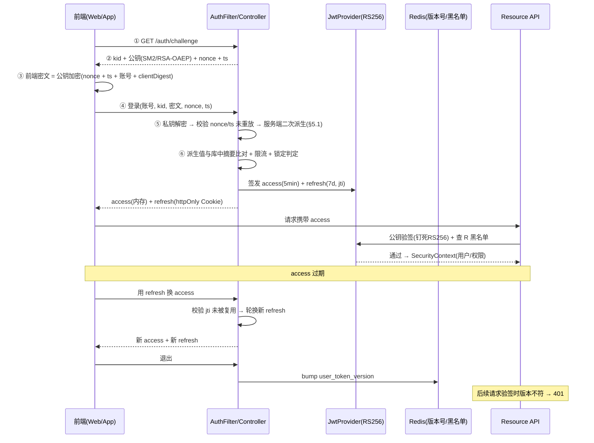

**关键设计点：**

1. **RS256 非对称**：认证中心持私钥签发，各资源服务器仅持公钥验签，密钥不下发；天然支持未来 OIDC/SSO 接入。
2. **双令牌 + 分通道存储**：`accessToken` 短期（5–15min）存内存；`refreshToken` 长期存 `httpOnly` Cookie（Web）/ 安全存储（App），降低 XSS/CSRF 暴露面。
3. **刷新轮换 + 复用检测**：每次刷新签发新 refresh 并使旧 jti 失效；检测到旧 refresh 复用即判定泄露，吊销该用户整族令牌。
4. **即时吊销**：`Redis` 维护 `user:{id}:token_version`，JWT 内嵌 `version`；退出/改密/踢人时版本+1，所有旧令牌验签即失败；黑名单仅兜底（TTL 对齐剩余有效期，内存可控）。
5. **数据权限零拼接**：`@DataPermission` 注解声明作用域（租户/工厂/部门），由 JPA `Specification` 或 MyBatis 拦截器以**参数绑定**方式追加 `WHERE` 条件，杜绝注入。
6. **算法钉死**：验签严格限定 `RS256` 并使用启动时注入的公钥对象，拒绝 `alg` 字段被篡改的令牌（防算法混淆攻击）。
7. **与历史审计打通**：`JwtAuthenticationFilter` 解析出的操作人写入 `SecurityContext`，§9 的审计基类 `Auditable`（createUser/eventUser）自动取用，**历史记录自动带操作人**，无需业务传参。

#### 5.1 登录口令：前端加密传输 + 服务端二次派生

明确两条硬性要求：**① 口令不得明文传输**；**② 服务端收到密文后不得直接使用**，必须混入用户标识做二次派生。

##### 为什么必须是两层（单层方案的致命缺陷）

| 常见做法 | 缺陷 / 攻击后果 |
| --- | --- |
| 明文 POST，仅依赖 HTTPS | HTTPS **不是端到端**：TLS 终止在网关/CDN、企业出站代理、APM 抓包、Nginx 访问日志都可能留存明文；等保与合规审计普遍要求应用层二次保护 |
| 前端 `MD5/SHA(口令)` 后传，**服务端直接把这个摘要入库** | **致命**：此时该摘要等价于新口令。攻击者拖库后**无需破解**，直接用库里的值构造请求即可登录，前端哈希形同虚设 |
| 前端加密原文，服务端解密后 BCrypt 落库 | 比前两种强，但服务端在解密后**确实持有过明文**，存在内存 dump、日志误打、APM 采样的泄露面 |
| **本框架（两层不可逆）** | 服务端**全程不见明文口令**，只拿到不可逆摘要；再混入服务端独有的 pepper 做派生，拖库无法回放登录 |

> 论证核心：**客户端传来的任何值都不能当作最终凭证**。只要库里的值可以被直接用于登录，加密就白做了。服务端必须引入**只有服务端知道的要素**（pepper），且最终结果不可逆。

##### 完整流程

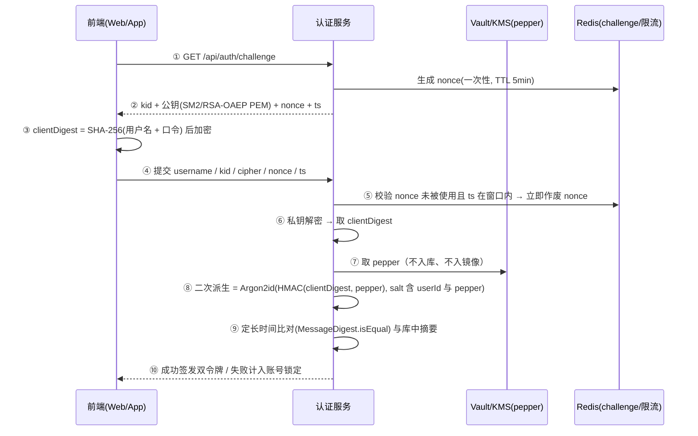

##### 派生公式

```
【客户端】C1 = Base64( SHA-256( lower(username) ":" rawPassword ) )
         payload = nonce | ts | username | C1
         cipher   = Base64( SM2_Encrypt( pubKey(kid), payload ) )      // 国密优先，RSA-OAEP 兼容

【服务端】解出 C1 后：
         hmac     = HMAC-SHA256( C1, key = pepper )                    // ① 服务端独有因子
         derived  = Argon2id( hmac, salt = SHA-256(userId | pepper), m=64MB, t=3, p=1 )
         ok       = MessageDigest.isEqual( derived, stored )           // ② 定长时间比对，防时序侧信道
```

##### 「加用户名二次加密」的关键修正（重要 trade-off）

用户的思路方向完全正确——混入用户标识能让**同一口令对不同用户产生不同摘要**，避免彩虹表一次破解全表。但若直接把 `username` 用作派生因子，会带来一个隐蔽陷阱：

> ⚠️ **账号一旦改名或变更大小写，存量口令摘要将全部失效**，用户集体无法登录。

因此本框架的处理是：**保留「加用户名」的安全收益，同时切断改名风险**——

| 因子 | 作用 | 为何这样放 |
| --- | --- | --- |
| **`userId`（不可变）** | 派生 **salt** 的主成分 | 雪花/UUIDv7 永不变更，摘要长期稳定 |
| **`username`（可变）** | 参与 HMAC 的 **message**（非 key） | 满足"用户名参与混淆"，但改名不影响 salt 主体 |
| **`pepper`（服务端独有）** | HMAC 的 **key** | 存于 Vault/KMS，不入库不入镜像；泄露会削弱防护，故必须外置（§19） |

> 若业务确需支持改名：走「旧标识派生值验证通过 → 用新标识重新派生并重存」的迁移流程，短期双标识兼容读。**更推荐从一开始就禁止改名**（常见做法：改名 = 换绑定账号）。

##### 修改密码

修改密码必须走**同一条加密通道**，且同时校验旧口令：

1. 前端用同一 `kid` 分别加密 `oldSecret`（旧口令）与 `newSecret`（新口令）的 `clientDigest`；
2. 服务端先用上面的派生流程校验旧口令，通过后**用新的 `newSecret` 重新派生并落库**——`userId` 不变，故派生公式稳定；
3. 成功后 **bump `user_token_version`**（§5）踢掉该用户其他会话，并写 §24 登录/操作日志（`action=CHANGE_PASSWORD`）；
4. **禁止**提供"仅凭 token、不要旧口令即可改密"的接口，除非叠加短信/邮箱二次验证。

##### 配套红线

| 禁止 | 说明 |
| --- | --- |
| 前端硬编码公钥 | 必须向 `/api/auth/challenge` 动态获取（`kid` 支持轮换） |
| 把 `cipher` / `clientDigest` / 明文写入 `localStorage`、Cookie 或 URL | 与 §10「令牌零落盘」是同一条红线 |
| 任何日志打印 `payload` / `clientDigest` / pepper | 审计日志只记结果（成功/失败），**绝不记凭证本身**（§24） |
| 服务端把 `clientDigest` 直接入库 | **本框架最核心的禁止项**——等于把客户端值当作口令 |
| 忽略 nonce 校验 | 无 nonce 的密文可被随时重放登录 |
| 用应用层加密替代 HTTPS | 应用层加密是**叠加**而非替代，HTTPS 仍是强制前提 |

> **国密优先**：半导体/国企场景常有合规要求，默认采用 **SM2**（加密）+ **SM3**（摘要）；通过 §8 的策略接口提供 **RSA-OAEP + SHA-256** 兼容实现，配置切换后上层调用不变。

##### 服务端派生实现

```java
@Component
public class PasswordHashService {

    @Value("${cim.security.pepper-ref}") private String pepperRef; // Vault/KMS 引用，非明文
    @Autowired SecretClient secretClient;                          // §19 密钥外置

    /** 注册/改密：由客户端摘要派生最终存库值 */
    public String deriveForStore(String userId, String username, String clientDigest) {
        byte[] pepper = secretClient.getSecretBytes(pepperRef);    // 不入库、不入镜像
        byte[] hmac   = hmacSha256(clientDigest.getBytes(UTF_8), pepper);
        byte[] mixed  = concat(hmac, username.getBytes(UTF_8));    // username 作 message 参与混淆
        byte[] salt   = sha256((userId + "|").getBytes(UTF_8), pepper); // userId 作 salt 主成分
        return argon2id(mixed, salt);                              // m=64MB, t=3, p=1
    }

    /** 登录校验：定长时间比对，杜绝时序侧信道 */
    public boolean matches(String userId, String username, String clientDigest, String stored) {
        byte[] a = deriveForStore(userId, username, clientDigest).getBytes(UTF_8);
        byte[] b = stored.getBytes(UTF_8);
        return MessageDigest.isEqual(a, b);                        // 非 String.equals()
    }
}
```

> `clientDigest` 在此**始终被视为不可信输入**：它只是客户端做的一次哈希，服务端从不把它当作凭证本身，也不直接入库——这正是"服务端二次派生"的全部意义。

#### 关键代码示例

```java
// 1) RS256 令牌提供（私钥签、公钥验，算法钉死）
@Component
public class JwtProvider {
    private final RSAPrivateKey privateKey;   // 启动时从配置/密钥库加载
    private final RSAPublicKey  publicKey;
    public String generate(UserDetails u, long ttlSec, long version) {
        return Jwts.builder()
            .subject(u.getUsername()).claim("auth", authorities(u))
            .claim("ver", version)            // 用于即时吊销
            .claim("jti", UUID.randomUUID().toString())
            .issuedAt(now()).expiration(exp(ttlSec))
            .signWith(privateKey, Jwts.SIG.RS256).compact();
    }
    public Claims parse(String token) {        // 资源服务器仅用公钥
        return Jwts.parser().verifyWith(publicKey).build().parseSignedClaims(token).getPayload();
    }
}

// 2) 登录签发 + 刷新轮换
public LoginVO login(LoginDTO dto) {
    UserDetails u = userDetailsService.loadUserByUsername(dto.username());
    if (!passwordEncoder.matches(dto.password(), u.getPassword()))
        throw new BizException("用户名或密码错误");
    long ver = redis.incr("user:" + u.getUsername() + ":token_version"); // 每次登录家族隔离
    String access  = jwt.generate(u, 600, ver);                          // 10min
    String refresh = jwt.generate(u, 604800, ver).jti(uuid);             // 7d + jti
    redis.set("refresh:" + uuid, u.getUsername(), 604800);
    return new LoginVO(access, refresh);   // refresh 经 Set-Cookie(httpOnly) 下发
}
public LoginVO refresh(String oldRefresh) {
    Claims c = jwt.parse(oldRefresh);
    String jti = c.get("jti", String.class);
    if (redis.get("revoked:" + jti) != null)        // 复用检测：旧 jti 已被吊销
        throw new BizException("令牌疑似泄露，请重新登录");
    redis.set("revoked:" + jti, "1", c.getExpiration() - now()); // 旧 jti 进黑名单
    return rotate(c);                                // 签发新 access + 新 refresh
}

// 3) 请求过滤器（验签 + 黑名单/版本校验 + 算法钉死在 JwtProvider 内）
public class JwtAuthFilter extends OncePerRequestFilter {
    protected void doFilterInternal(req, res, chain) {
        String t = resolveAccessToken(req);
        if (t != null) {
            Claims c = jwt.parse(t);
            long ver = redis.get("user:" + c.getSubject() + ":token_version");
            if (c.get("ver", Long.class) != ver) { res.sendError(401, "令牌已失效"); return; }
            SecurityContextHolder.getContext().setAuthentication(toAuth(c)); // 注入操作人→供 §9 审计
        }
        chain.doFilter(req, res);
    }
}

// 4) 数据权限（参数绑定，零 SQL 拼接）
@Target(ElementType.METHOD) @Retention(RUNTIME)
public @interface DataPermission { Scope value() default Scope.FACTORY; }
// 由 Specification 拦截：return (root, q, cb) -> cb.equal(root.get("factoryId"), currentFactoryId());
```

> 该设计与 §8 可插拔呼应：认证能力封装为 `cim-auth-spring-boot-starter`（RS256 配置、过滤器、注解开箱即用），依赖即启用；与 §9 审计基类的 `createUser/eventUser` 自动取 `SecurityContext` 操作人，保证历史记录的操作人零侵入落地。更深的安全加固（CORS/CSRF/限流/锁定/密钥轮换）见 §15。

---

## 6. 基础能力矩阵

| 能力 | 实现方式 | 状态 |
| --- | --- | --- |
| 统一响应 | `Result<T>` + `RestControllerAdvice` | ✅ |
| 全局异常 | `GlobalExceptionHandler` + `BizCode` 模块分段 | ✅ |
| 认证鉴权 | RS256 非对称双令牌 + 刷新轮换/复用检测 + 版本号即时吊销 + 算法钉死 + 数据权限零拼接（详见 §5） | ✅ |
| 多数据库 | 每库独立 EMF+TxManager+Dialect，应用层时间有序主键（含 workerId/时钟回拨兜底），JSON 走 Converter，Flyway 多目录迁移（详见 §3） | ✅ |
| 多租户 | 共享库 + 租户列 + Hibernate Filter 自动隔离 + 租户解析器（详见 §10） | ✅ |
| 缓存 | 多级缓存（本地 Caffeine + Redis）+ 防穿透/击穿/雪崩（详见 §11） | ✅ |
| 操作审计 / 分级历史 | 注解 + AOP 落库，变更检测闸门 + **每个实体一张专属历史表**（`{X}Hist` / `{X}StateLog`，详见 §9） | ✅ |
| 日志与审计 | 三层分离（技术/操作/登录）+ `@AuditLog` 标注 Service + 脱敏落库 + 分级可靠写入（详见 §24） | ✅ |
| 事务一致性 | 单库本地事务 + 跨库发件箱(outbox)+中继（详见 §12） | ✅ |
| 异步 / 事件 | 领域事件（进程内）+ 集成事件（MQ，发件箱中继）+ 韧性（详见 §13） | ✅ |
| 可观测 | 指标(Prometheus)/链路(OTel)/结构化日志（详见 §14） | ✅ |
| 国际化 | 数据库驱动（locale/i18n 两表）+ Redis 缓存，详见 §7 | ✅ |
| 安全纵深防御 | CORS/CSRF/安全头/暴力破解锁定/密钥轮换/依赖扫描（详见 §15） | ✅ |
| 限流 / 幂等 / 并发 | Redis + 注解，滑动窗口 + 幂等键 + 乐观锁增强（详见 §16） | ✅ |
| API 规范 | URI 版本化 + 标准分页/排序 + 契约文档（详见 §17） | ✅ |
| 测试策略 | 测试金字塔 + ArchUnit 架构守卫 + Testcontainers（详见 §18） | ✅ |
| 配置 / 密钥 | 配置中心 + 密钥管理(KMS/Vault) + 环境隔离（详见 §19） | ✅ |
| 数据生命周期 | 保留/归档/脱敏/合规擦除（详见 §20） | ✅ |
| 通用数据模型 | 审计基类 `Auditable` + 分级历史（详见 §9） | ✅ |
| 代码生成 | 元数据驱动，**主实体 + 历史实体 + 成对 DDL 全链路产出** + dry-run + CI 守卫（详见 §25，§9.8 依赖） | ✅ |
| 文件中心 | 对象存储抽象 + 分片/断点续传 | 🔲 预留 |
| 工作流引擎 | 状态机 + 流程编排 | 🔲 预留 |

---

## 7. 国际化（全量数据库驱动 · 系统级 / 用户级）

框架 **所有 i18n 文案统一存放数据库**，实现热更新、免发版。按使用方划分为 **系统级** 与 **用户级** 两类，共用 `sys_locale` + `sys_i18n` 两表，仅靠 `sys_i18n.scope` 区分：

| 级别 | 内容 | 维护方 | 来源 |
| --- | --- | --- | --- |
| 系统级 `SYSTEM` | 框架/校验/异常/状态码等平台内置文案 | 管理员 / 开发 | 应用启动 **种子** 写入（可在库内热改） |
| 用户级 `USER` | 菜单名、按钮、字段标签、状态描述等业务/UI 文案 | 运营 / 翻译 | 管理后台创建 |

> Spring 侧通过 **数据库版 `MessageSource`** 对接，原有 `@Valid` 校验、异常消息等机制零改造即可命中 DB 文案，并支持热更新。

#### 数据模型（两表：locale + i18n）

| 表 | 作用 |
| --- | --- |
| `sys_locale` | 语言目录：zh-CN / en-US / zh-TW …（可后台热增） |
| `sys_i18n` | 译文主体：`locale_code × code` 唯一，含 `scope`（SYSTEM/USER）、`module`、`content` |

```mermaid
erDiagram
  SYS_LOCALE ||--o{ SYS_I18N : "1:N 译文"
  SYS_LOCALE { string id PK code "zh-CN" name "简体中文" is_default boolean sort int status tinyint }
  SYS_I18N { string id PK locale_code FK code "sys.user.title" scope "SYSTEM/USER" module "system/business" description varchar content varchar "支持 {name} 占位符" tenant_id string }
```

- `UNIQUE(locale_code, code)` 保证同一语言下键唯一；`tenant_id` 支持多租户译文覆盖（见 §10）。
- `scope` 区分 **系统级 / 用户级**；系统级（`SYSTEM`）由应用启动种子写入、后台可热改、管理端锁定不可删。
- 不另设键目录表：i18n 体量小，键级元数据随译文行存储的冗余可忽略，换来零 join、更易管理与扩展语种。

#### Spring 集成（数据库版 MessageSource）

> **硬性要求（不可协商）**：任何情况下都**不得**把未翻译的 code（如 `common.user.name`）返回给前端或直接落到响应/日志里；默认兜底语言固定为**中文（zh-CN）**。

```java
@Component
public class DatabaseMessageSource extends AbstractMessageSource {

    /** 默认兜底语言：中文（简中）。该常量不可为空，且不允许运行时改成败控制 enabled=false */
    public static final Locale FALLBACK_LOCALE = Locale.SIMPLIFIED_CHINESE;

    @Autowired I18nCache i18nCache;          // 多级缓存支撑，见 §11
    @Autowired MissingI18nReporter reporter; // 缺失译文上报，后台生成待翻译工单

    @Override
    protected MessageFormat resolveCode(String code, Locale locale) {
        String msg = i18nCache.get(code, locale.toLanguageTag());
        if (msg == null) {                                   // ① 回退：默认语言（zh-CN）
            msg = i18nCache.get(code, FALLBACK_LOCALE.toLanguageTag());
        }
        if (msg == null) {                                   // ② 回退：随包发布的内置静态兜底包
            msg = BuiltinI18n.get(code);
        }
        if (msg == null) {                                   // ③ 仍未命中 = 译文确实缺失
            reporter.report(code, locale);                   // 上报，禁止静默失败
            msg = humanize(code);                            // 绝不返回裸 code
        }
        return new MessageFormat(msg, locale);
    }

    /** code → 可读兜底文案：`user.name` → `User name`。足够定位问题且不暴露裸 key */
    private String humanize(String code) {
        String tail = code.contains(".") ? code.substring(code.lastIndexOf('.') + 1) : code;
        return Arrays.stream(tail.split("[._-]"))
                     .filter(s -> !s.isEmpty())
                     .map(s -> Character.toUpperCase(s.charAt(0)) + s.substring(1))
                     .collect(Collectors.joining(" "));
    }
}
```

> 将其声明为 Primary `MessageSource` 后，Spring 校验、异常、页面取词全部走 DB，且支持热更新。

**四级兜底链（自上而下逐级降级，永不到底）**

| 级别 | 来源 | 说明 |
| --- | --- | --- |
| L1 目标语言 | DB（→ Redis 缓存） | 用户当前选择的语言，如 `en-US` |
| L2 **默认兜底** | DB（→ Redis 缓存） | 固定 **`zh-CN`**，保证「只要有中文就一定看得懂」 |
| L3 内置兜底包 | 随 jar 发布的静态最小集 | 防止 Redis/DB 不可用时连核心按钮文案都丢失 |
| L4 人性化降级 | `humanize(code)` | 仅在前三级全缺时触发（`user.name` → `User name`），**同步上报缺失工单** |

> L4 只是"不让用户看到裸 key"的最后防线，**不代表可接受**。它被触发意味着译文遗漏，应由 CI 前的 i18n 巡检（校验各语言包覆盖率）拦截在上线之前。

#### 查询、缓存与热更新

- 启动时（及后台保存后）将各语言译文批量载入 **Redis Hash** `i18n:msg:{localeCode}` = { code → content }，并自增版本号 `i18n:version`。
- 取词 `I18nService.get(code, localeCode)`：命中即返回；缺失走**四级兜底链**（目标语言 → **默认 `zh-CN`** → 内置兜底包 → `humanize(code)` 绝不返回裸 code，见上节）。
- 任一译文变更 → 更新 DB → 刷新对应语言 Redis + 版本号 +1 → 前端下次拉取即生效（**热更新，免发版**）。

#### 前端集成

- 启动 / 切换语言请求 `GET /api/i18n/messages?lang=en-US&v={i18n:version}`，全量注入 `i18next`；版本号不变命中本地缓存。
- 用户语言偏好存 `sys_user.lang` 或 `localStorage`。

#### 管理后台

- 按 `scope` + `module` 过滤管理键；系统级键仅管理员可改，用户级键开放给翻译角色。
- 翻译编辑按 locale 列展示、缺失高亮；支持 Excel 导入导出（EasyExcel）。
- 保存即刷新缓存，可选「草稿 / 发布」状态。

#### 扩展

- **多租户覆盖**：`sys_i18n` 增加 `tenant_id`，优先取租户译文、回退全局（与 §10 一致）。
- **个人偏好覆盖（可选）**：新增 `sys_i18n_user_override(user_id, i18n_id, content)`，支持单用户自定义译文。

---

## 8. 可插拔架构（高度灵活）

框架以「积木式」组合为设计原点：横切能力封装为可独立启停的 Starter，业务模块按需挂载，扩展点清晰、可替换、可降级。核心手段如下：

#### 设计原则

- **约定优于配置**：开箱即用，零配置即可运行；需定制时再覆盖。
- **条件化装配**：能力仅在依赖存在 / 配置开启时生效，缺省即可降级。
- **面向接口 + 多实现**：核心抽象提供默认与可选实现，配置切换、Bean 覆盖。
- **事件驱动解耦**：跨模块副作用（审计、通知）走事件，监听器可插拔。

#### 落地机制

1. **能力 Starter 化**：认证、i18n、多数据源、审计、限流、文件存储、缓存、消息、可观测等各封装为 `cim-*-spring-boot-starter`，通过 Maven 依赖决定是否纳入。
2. **AutoConfiguration + 条件注解**：`@AutoConfiguration` 配合 `@ConditionalOnProperty` / `@ConditionalOnClass` / `@ConditionalOnMissingBean`，仅当配置开启或依赖存在时装配，且允许业务方注入自定义 Bean 覆盖默认实现。
3. **策略接口 + 多实现**：如 `I18nProvider`、`AuthProvider`、`FileStorage`、`DataSourcePolicy`、`CacheProvider`，靠 `spring.cim.xxx.mode` 配置选择，默认实现可被替换。
4. **事件驱动**：审计、通知、操作日志通过 `ApplicationEvent` 发布，监听器可插拔、可异步、可整体禁用。
5. **注解即扩展点**：`@AuditLog` / `@DataPermission` / `@RateLimit` / `@Idempotent` 等 + AOP 切面，提供全局开关，按需启用。
6. **配置外部化 + Feature Flag**：行为全部由 `application.yml` / 配置中心（Nacos/Apollo）驱动，支持动态生效（见 §19）。

#### 装配示意

```mermaid
graph LR
  CORE["cim-core<br/>自动装配核心"]
  S1["cim-auth-starter"]
  S2["cim-i18n-starter"]
  S3["cim-jpa-starter"]
  S4["cim-cache-starter"]
  S5["cim-mq-starter"]
  BIZ["cim-business<br/>业务模块"]
  CORE -. "@ConditionalOnProperty" .-> S1
  CORE -. .-> S2
  CORE -. .-> S3
  CORE -. .-> S4
  CORE -. .-> S5
  BIZ --> CORE
```

#### 代码示例

```java
// 条件化自动装配：i18n 能力可开关、可覆盖
@AutoConfiguration
@ConditionalOnProperty(prefix = "cim.i18n", name = "enabled", havingValue = "true", matchIfMissing = true)
@ConditionalOnClass(DatabaseMessageSource.class)
public class I18nAutoConfiguration {
    @Bean
    @ConditionalOnMissingBean   // 业务方提供同名 Bean 即可替换默认实现
    public MessageSource messageSource(I18nCache cache) {
        return new DatabaseMessageSource(cache);
    }
}

// 策略接口：文件存储多实现，靠配置切换
public interface FileStorage {
    String put(String bucket, InputStream in);
    InputStream get(String bucket, String key);
}
// LocalFileStorage / MinioStorage / AliyunOssStorage … 由 cim.storage.mode 选择

// 事件驱动：审计监听可异步、可独立禁用
@EventListener
@Async
public void onOperation(OperationEvent e) {
    auditLogRepository.save(AuditLog.of(e));
}
```

> 以上机制共同保证：新增业务域只需引入对应 Starter / 模块，不改动核心；下线某能力只需移除依赖或关闭配置项，**真正高度灵活可插拔**。横切能力 starter 的缓存（§11）、消息（§12/§13）、可观测（§14）构成企业级底座。

---

## 9. 通用数据模型：审计基类 + 分级历史（参考成熟实践并优化）

我们参考了成熟 MES 项目（cec_jiutian kernel）的 `EventTask` 泛型模板 + `Historizable` 标记 + 统一审计基类实践，也对比了业界 Hibernate Envers / JPA 审计方案。但**不照搬**——先分析利弊，再给出优化设计，目标是「可商用的企业级底层框架」。

### 9.1 参考方案利弊分析与优化决策

| 参考做法 | 优点 | 不足 / 风险 | 本框架优化 |
| --- | --- | --- | --- |
| 统一审计基类 + AOP 填充 | 审计字段一致、零业务侵入 | 命名 `EventData` 易与「事件」混淆；审计字段强耦合进所有实体基类 | 重命名为 `Auditable`，语义清晰；审计与业务字段分层 |
| `EventTask` 模板 + `addHistory()` 整行拷贝 | 写操作即自动落库、透明可控 | ① 每次写都无脑拷贝，**未变更也落历史**（历史污染）；② `BeanUtils` 反射拷贝**全部字段**（含大字段/瞬态）；③ 5 个泛型参数 + 每个操作写 Task 子类，**样板重** | ① **变更检测**：仅被追踪字段真正变更才记录；② **字段白名单**（而非无差别全字段反射拷贝）；③ 提供「注解驱动自动历史」拦截器，**简单 CRUD 无需 Task 子类** |
| **同构历史表**（`XxxDefHist extends XxxDef`，**每实体一张专属历史表**） | 结构一致、易查询、可按业务字段检索；符合关系建模直觉，历史与主表等价可查 | ① 主表加列需同步历史表（**schema drift**）；② 复合主键 `(PK+timeKey)`，timeKey 取自 eventTime，**同毫秒并发写会主键冲突**；③ 每个写操作都要写 Task 子类 | **坚持「每个有历史记录的实体各自一张专属历史表」**（这是正确的建模），但修正其缺陷：① 主键改为**独立应用层 `historyId`**，业务主键降为 `bizId` 普通索引列，彻底消除复合主键并发冲突；② 加**变更检测闸门**，未变更不落历史；③ **注解驱动自动落库**，零 Task 子类；④ schema drift 用 **Flyway 主表/历史表同步迁移规范 + 代码生成器**治理（见 §9.7），而非改用通用单表来回避 |
| ~~通用单一历史表（一张表存所有实体的 JSON 快照）~~ | 建表少、零 schema drift | ① **所有实体历史挤一张表**，数据量爆炸、索引失效、单表成为写入热点；② 无法按实体业务字段建索引/检索，审计追溯要全表扫 JSON；③ 丢失关系型约束与类型安全；④ 单表损坏影响全系统审计 | **不采用**。历史表必须与实体一一对应（`{X}Hist` / `{X}StateLog`），保证可按业务字段查询、可分区归档、故障域隔离 |
| `RevisionData` 版本状态机 | 主数据多版本生命周期清晰 | 与 `@Version` 乐观锁语义易混 | 明确**三层分离**（乐观锁 / 业务版本 / 历史审计，见 §9.5） |
| 同步写历史（同事务） | 审计强一致 | 高频状态变更被业务事务拖累；历史写失败致业务回滚 | 按策略：**关键数据同事务**；**高频数据走事务发件箱(outbox)+异步**，历史失败不影响业务（见 §12） |
| 软删除 `deleted` 字段 | 逻辑删除、可恢复 | **与业务唯一约束冲突**（同 code 一删一活无法并存）；唯一索引需含 `deleted` | 唯一约束改为 **`(biz_key, deleted)` 或 `(biz_key, tenant_id, deleted)`**，删除行 `deleted` 置特定值（如 id 后缀），见 §9.7 |

#### 优化后核心抽象（命名与分层）

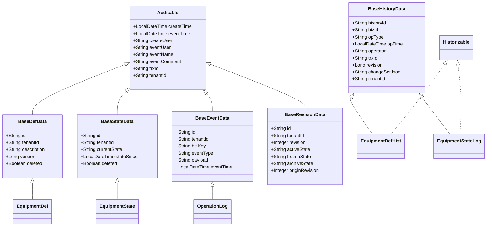

> 修正点（与初版不一致处）：①`Auditable` 时间字段统一为 `LocalDateTime`（对齐总文档开发规范「时间类型 LocalDateTime」，弃用 `Date`）；② 各基类主键统一为 `String id`（应用层时间有序 ID），修正类图原 `Long id` 与代码 `String id` 的冲突；③ `BaseRevisionData` 增加 `tenantId` 并改以 `String id` 为业务主键、`revision` 降为业务版本列（原把 `revision` 当 `@Id` 不妥）；④ 历史模型由「通用单表 `sys_history_record`」改为 **`BaseHistoryData` 历史表基类 + 每个实体一张专属历史表**（`BaseHistoryData.revision` 用 `Long` 表示业务版本号快照）。

| 基类 / 概念 | 变更频率 | 典型场景 | 历史机制 | 落库位置 |
| --- | --- | --- | --- | --- |
| **`Auditable`（审计基类）** | — | 所有实体共有 | 操作审计字段（时间/人/事件/事务） | 内嵌于每个实体 |
| **`BaseDefData`** | 低（定义/配置，天~月级） | 设备定义、工艺配方、物料、菜单 | 整行快照（仅变更时） | **专属历史表** `{X}Hist`（如 `equipment_def_hist`） |
| **`BaseStateData`** | 高（状态/指标，秒~分级） | 设备实时状态、工单、批次 | 状态机变迁流水 | **专属状态流水表** `{X}StateLog`（如 `equipment_state_log`） |
| **`BaseEventData`** | 追加（不可变） | 操作日志、告警、采样 | 本身即流水，无独立历史 | 自身即流水 |
| **`BaseRevisionData`** | 版本演进 | 主数据多版本管理 | revision + Active/Frozen/Archive | 主表自身（版本维度） |
| **`BaseHistoryData`（历史表基类）** | — | 所有历史表共有 | 历史行主键 + 操作元信息 + 字段级变更集 | 由各实体历史表继承，`{X}Hist` / `{X}StateLog` |

- **`Auditable`（审计字段基类）**：所有业务实体继承，统一 `createTime/eventTime/createUser/eventUser/eventName/eventComment/trxId/tenantId`，由 AOP 切面在写操作时自动填充（语义清晰，不叫 `EventData` 以免与「事件」混淆）。
- **`BaseDefData`（定义表/当前态）**：审计字段 + 主键、租户、描述、乐观锁、逻辑删除。声明 `@History(SNAPSHOT)` 即开启整行快照历史，**落该实体专属的 `{X}Hist` 历史表**。
- **`BaseStateData`（状态表/当前态）**：`currentState`/`stateSince` + 状态机注解；高频变更，历史只记变迁流水，落该实体专属的 `{X}StateLog` 表。
- **`BaseEventData`（事件/流水表）**：`bizKey`/`eventType`/`payload`，天然不可变。
- **`BaseRevisionData`（版本基类）**：`revision` + `activeState`/`frozenState`/`archiveState`/`originRevision`，主数据版本生命周期（区别于 `@Version` 乐观锁）。
- **`BaseHistoryData`（历史表基类，`@MappedSuperclass`）**：为**每一张**实体历史表提供公共列——独立主键 `historyId`、业务主键 `bizId`、操作类型 `opType`(I/U/D)、操作时间 `opTime`、操作人 `operator`、事务号 `trxId`、业务版本 `revision`、字段级变更 `changeSetJson`、租户 `tenantId`。**不包含任何业务字段**，业务字段由各实体历史表自己持有（与主表同构）。

> **核心原则：一个需要历史记录的实体 = 一张专属历史表。**不存在「一张通用表存所有实体历史」的做法：`{X}Hist` 与 `{X}` 一一对应（`equipment_def` ↔ `equipment_def_hist`），历史表结构与主表同构（含该实体的全部业务字段），因此可按业务字段建索引、做字段级审计检索、按时间分区归档，且故障域隔离在单个实体内。

#### 历史策略注解（三种）

通过 `@History` 声明历史策略，由框架在写操作时**自动触发**记录；无需手写历史逻辑。**无论哪种策略，历史都落在该实体专属的历史表中**：

```java
public enum HistoryStrategy { SNAPSHOT, STATE_LOG, NONE }

@Target(ElementType.TYPE) @Retention(RetentionPolicy.RUNTIME)
public @interface History {
    HistoryStrategy value() default HistoryStrategy.SNAPSHOT;
    String[] include() default {};   // 仅追踪这些字段（白名单），为空=全部
}
```

| `value` | 含义 | 适用 | 落库（均为实体专属表） |
| --- | --- | --- | --- |
| `SNAPSHOT`（默认） | 整行快照写入同构历史表 | `BaseDefData` 子类（定义/低频） | **`{X}Hist`**（如 `equipment_def_hist`），与主表同构 |
| `STATE_LOG` | 仅记状态变迁 | `BaseStateData` 子类（状态/高频） | **`{X}StateLog`**（如 `equipment_state_log`） |
| `NONE` | 不记录 | 事件类/临时表 | — |

> 选型建议：定义/低频实体用 `SNAPSHOT`（可像主表一样按字段查询、追溯任意时点整行）；高频状态实体用 `STATE_LOG`（只记变迁，避免历史表被秒级写入撑爆）。若团队偏好零代码透明审计，也可整体切换为 **Hibernate Envers**（`@Audited` + `{X}_AUD` + `REVINFO`）——其同样是**每个被审计实体一张 `_AUD` 表**，与本框架「每实体一表」的原则一致。

#### 三层版本语义（乐观锁 / 业务版本 / 历史审计）

许多框架把三者混为一谈，本框架明确分离：

- **`@Version`（行级乐观锁）**：JPA 原生，防并发覆盖，冲突抛 `OptimisticLockException`，**不进历史**（与 §16 并发控制配合）。
- **`revision`（业务版本）**：`BaseRevisionData` 承载，主数据的多版本生命周期（Active/Frozen/Archive），由业务动作（发布/归档）驱动，**不是每次写都 +1**。
- **`history`（审计轨迹）**：每次变更自动落历史（见 §9.6），记录完整时间线，可还原/回滚。

```java
@MappedSuperclass
public abstract class Auditable {           // 统一审计字段基类（语义清晰，非「事件」）
    private LocalDateTime createTime;
    private LocalDateTime eventTime;
    private String createUser;
    private String eventUser;
    private String eventName;
    private String eventComment;
    private String trxId;
    private String tenantId;                // 与多租户 §10 自动填充打通
}

@MappedSuperclass
public abstract class BaseDefData extends Auditable {
    @Id
    private String id;                  // 应用层时间有序 ID（雪花/UUIDv7），@PrePersist 由 IdGenerator 注入，见 §3
    private String tenantId;
    private String description;
    @Version private Long version;        // ① 行级乐观锁
    private Boolean deleted = false;
}

@MappedSuperclass
public abstract class BaseStateData extends Auditable {
    @Id
    private String id;                  // 应用层时间有序 ID（雪花/UUIDv7），见 §3
    private String tenantId;
    private String currentState;          // IDLE / RUN / DOWN / MAINT ...
    private LocalDateTime stateSince;       // 进入当前态时间
    private Boolean deleted = false;
}

@MappedSuperclass
public abstract class BaseEventData extends Auditable {
    @Id
    private String id;                  // 应用层时间有序 ID（雪花/UUIDv7），见 §3
    private String tenantId;
    private String bizKey;                 // 业务键（如 equipmentCode）
    private String eventType;
    private String payload;                // JSON 扩展
}

@MappedSuperclass
public abstract class BaseRevisionData extends Auditable {
    @Id private String id;                 // 业务主键（应用层时间有序 ID）
    private String tenantId;
    private Integer revision;              // ② 业务版本（非每次写+1）
    private String activeState;            // Active / NotActive
    private String frozenState;            // Frozen / Unfrozen
    private String archiveState;           // Archive / Release
    private Integer originRevision;
}

@MappedSuperclass                          // ③ 历史表基类：每张实体历史表继承它（无业务字段）
public abstract class BaseHistoryData {
    @Id
    private String historyId;             // 独立主键：应用层时间有序 ID（雪花/UUIDv7），与 §3 同策略
                                          //   ← 刻意不用「业务PK+timeKey」复合主键，避免同毫秒并发主键冲突
    private String bizId;                  // 对应主表业务主键（字符串化），普通索引列
    private String opType;                 // I / U / D
    private LocalDateTime opTime;          // 操作时间（普通索引列，非主键组成部分）
    private String operator;               // 操作人（自动取 SecurityContext，见 §5）
    private String trxId;                  // 事务号，与审计基类同源
    private Long revision;                 // 业务版本号快照
    @Column(columnDefinition = "TEXT")
    private String changeSetJson;          // 字段级变更（字段:旧值→新值），供前端 diff 展示
    private String tenantId;               // 租户，与 §10 自动填充打通
}

public interface Historizable { /* 标记：纳入历史记录 */ }
```

#### 自动落库机制（两种接入 + 变更检测）

框架提供**两种**接入方式，按复杂度取舍：

- **方式 A（推荐，零样板）：注解驱动自动历史拦截器**。在 `DataAp` / Repository 的写方法上，由 `HistoryInterceptor` 根据实体 `@History` 元数据，在落主表后**自动**记录历史，业务代码无需任何 Task 子类。
- **方式 B（复杂流程）：`EventTask` 泛型模板**。保留参考项目的模板思路，用于需要前后置校验 / 跨表事务的复杂业务操作；其 `AbstractTask.execute()` 落主表后自动 `addHistory()`。

**关键优化：变更检测闸门**。无论哪种方式，落历史前先比对「当前态 vs 数据库原态」的被追踪字段；**仅当真正变更（或含 `include` 白名单字段变更）才落历史**，杜绝未变更却产生历史的问题。

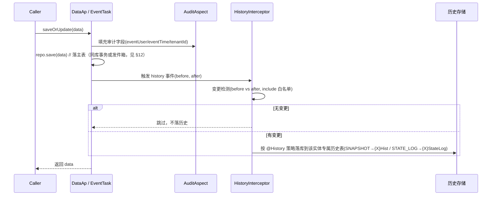

`HistoryInterceptor` 落库核心（策略路由 + 变更集）：

```java
@Component
public class HistoryInterceptor {
    // 写操作后自动调用
    public void record(Object before, Object after, String opType) {
        History meta = after.getClass().getAnnotation(History.class);
        if (meta == null || meta.value() == HistoryStrategy.NONE) return;

        Map<String, FieldDiff> diff = DiffUtils.diff(before, after, meta.include());
        if (diff.isEmpty()) return;                 // 变更检测闸门

        switch (meta.value()) {
            // 落该实体专属的整行快照历史表 {X}Hist（与主表同构）
            case SNAPSHOT  -> histRepo.save(toHist(after, opType, diff));
            // 落该实体专属的状态变迁流水表 {X}StateLog
            case STATE_LOG -> stateLogRepo.save(toStateLog(after, diff));
            case NONE      -> { /* 不记录 */ }
        }
    }
}
```

#### 业务落地：以「设备」为例（仅需声明注解）

```java
// 1) 设备定义（低频，整行快照历史）—— 仅声明 @History，无需 Task 子类
@Entity @Table(name = "equipment",
        uniqueConstraints = @UniqueConstraint(columnNames = {"code", "tenant_id", "deleted"}))
@History(HistoryStrategy.SNAPSHOT)              // 整行快照 → 专属历史表 equipment_def_hist
public class EquipmentDef extends BaseDefData implements Historizable {
    private String code;     // 设备编码（业务主键）
    private String model;    // 型号
    private String spec;     // 规格
    private String location; // 安装位置
}

// 2) 设备历史表（实体专属，与主表同构）—— 形态 A（推荐）
//    继承 BaseHistoryData 获得历史公共列（historyId/bizId/opType/opTime/...），
//    业务字段与 EquipmentDef 一一对应；由代码生成器（§6）随主表同步产出，避免手工遗漏。
@Entity @Table(name = "equipment_def_hist")
public class EquipmentDefHist extends BaseHistoryData {
    // —— 以下业务字段与 EquipmentDef 同构（生成器同步维护）——
    private String code;
    private String model;
    private String spec;
    private String location;
    private String description;
    private Long revision;      // 业务版本快照
}

// 3) 形态 B（可选）：历史实体直接继承主表实体，省去重复声明字段
//    注意 JPA 陷阱：必须显式指定 TABLE_PER_CLASS，并把继承来的主键列改作历史行主键。
// @Entity @Table(name = "equipment_def_hist")
// @Inheritance(strategy = InheritanceType.TABLE_PER_CLASS)
// @AttributeOverride(name = "id", column = @Column(name = "history_id"))
// public class EquipmentDefHist extends EquipmentDef implements Historizable {
//     @Column(name = "biz_id") private String bizId;   // 原业务主键（落历史时写入）
//     private String opType;
//     @Column(columnDefinition = "TEXT") private String changeSetJson;
//     // 落库时：hist.setId(idGenerator.nextId()); hist.setBizId(entity.getId());
// }

// 3) 设备状态（高频，状态机 + 变迁流水，绝不落全量快照）
@Entity @Table(name = "equipment_state")
@History(HistoryStrategy.STATE_LOG)
@StateMachine(transitions = {
    @Transition(from = "IDLE",  to = "RUN",   event = "START"),
    @Transition(from = "RUN",   to = "IDLE",  event = "STOP"),
    @Transition(from = "RUN",   to = "DOWN",  event = "FAULT"),
    @Transition(from = "DOWN",  to = "MAINT", event = "REPAIR_START"),
    @Transition(from = "MAINT", to = "IDLE",  event = "REPAIR_DONE"),
    @Transition(from = "IDLE",  to = "MAINT", event = "PM_START")
})
public class EquipmentState extends BaseStateData {
    private String equipmentCode;
    private BigDecimal temperature; // 高频指标 —— 仅进状态流水
    private Integer   outputQty;
}
```

- `equipment` 每次**真正变更**（如改规格）→ 框架自动落**该实体专属的** `equipment_def_hist`（与主表同构，存整行快照 + `changeSetJson` 字段级变更），未变更则不产生历史；审计可用、时间链可回溯。
- `equipment_state` 每次状态切换（RUN→DOWN）→ 经状态机校验后写**该实体专属的** `equipment_state_log` 变迁流水；非法转移被拒绝。
- **新增一张需要历史的业务表 = 新增「主表实体 + 该表专属历史实体 + 两张表的 DDL」**。历史实体与 DDL 由代码生成器（§6）随主表一键产出，避免手工遗漏；schema drift 的治理办法见 §9.8。
- 通用 CRUD 由 `DataAp<EquipmentDef, String>`（见 §21.3）泛型基类自动提供，与历史拦截器天然衔接。

#### 历史查询与回滚 API

```java
public interface HistoryService {
    // 定义类：时间链 + 还原 + 字段级变更
    List<HistoryDTO> listHistory(String entityType, String bizId);
    HistoryDTO findAt(String entityType, String bizId, String historyId);
    void restore(String entityType, String bizId, String historyId);  // 回滚=以历史构造新版本写回
    // 状态类：状态时间线
    List<StateTransitionDTO> stateTimeline(String table, String bizKey,
                                          LocalDateTime from, LocalDateTime to);
}
```

- `restore` 以历史快照**构造新版本写回主表**（产生一条新历史），而非删除历史，保证审计轨迹不可篡改（与 §20 合规一致）。
- `changeSetJson` 支持「哪几个字段变了、旧值→新值」的前端 diff 展示。

#### 性能与治理（关键）

- **变更检测优先**：未变更不落历史，从源头抑制历史污染与写入量。
- **每实体一张历史表的收益**：可按该实体业务字段建索引与检索、可独立按时间分区/归档、故障域隔离在单实体内、保留关系型约束与类型安全。**代价**是历史表数量增多与主表/历史表结构需同步，用下方 §9.7 的两项机制治理。
- **事务解耦**：关键数据历史与业务**同事务**（强一致）；高频状态走**事务发件箱(outbox)+异步**消费，历史写入失败不影响业务状态变更落地（依赖 §12 发件箱 + §13 消息）。
- **物理分离**：`{X}Hist`（审计，全量保留）与 `{X}StateLog`（时序，可采样/归档）分表、可分库；状态流水按月分区 + TTL 归档（见 §20）。历史表可与主表分库，避免历史写入压主库。
- **指标分流**：高频指标放 `BaseStateData`，低频属性放 `BaseDefData`，源头避免历史膨胀。
- **索引**：每张历史表建 `{X}_hist(biz_id, op_time)`（时间链回溯）、`{X}_hist(tenant_id, biz_id)`（租户维度查询）、`{X}_state_log(biz_key, op_time)`（状态时间线）。
- **读写隔离**：历史查询走只读从库 / 归档库（见 §3 读副本）。

#### §9.8 每实体一表的 schema 同步治理（关键）

「每个实体一张专属历史表」的代价是**主表加列时历史表需同步**，否则出现 schema drift（历史表缺列导致旧快照字段丢失）。本框架用两项机制根治，而非回避：

1. **代码生成器统一产出（首选）**：新建业务表时，由代码生成器（§6）根据主表实体**一次性生成** `XxxHist` 实体类 + 两张表的 Flyway DDL；主表字段变更后重新生成即可增量对齐。生成模板内建 `@History` 策略与索引定义，杜绝人工遗漏。
2. **Flyway 主/历同步迁移规范（强制）**：规定任何 `ALTER TABLE {X} ADD COLUMN` 的迁移脚本，**必须在同一迁移文件中**包含对应的 `ALTER TABLE {X}_hist ADD COLUMN`（历史表新增列允许为 NULL，不影响存量历史行）。CI 增加**迁移脚本检查**（检测只改主表未改历史表的变更并告警）。
3. **只增不改原则**：历史表列**只允许增加、不允许删除或改类型**；主表若需删除字段，历史表保留该列（历史快照仍需可读），仅主表下线。
4. **启动自检**：应用启动时 `ddl-auto=validate`（§3）校验实体与库表一致；框架额外提供**历史表列覆盖率自检**（对比主表实体字段与历史表列，缺失即启动告警/失败），把 drift 拦在上线前。

#### 配套能力

- **逻辑删除 + 唯一约束兼容（§9.7）**：`deleted` 字段 + 全局过滤器 / `@Where`，查询自动过滤；唯一约束改为 `(biz_key, tenant_id, deleted)`，删除行 `deleted` 置唯一占位值避免冲突。
- **乐观锁**：`version` 字段防并发覆盖（冲突抛 `OptimisticLockException`，与 §16 配合）。
- **多租户**：`tenantId` 在主表与该实体专属历史表（`{X}Hist` / `{X}StateLog`）统一自动填充 + 查询隔离（见 §10）。
- **状态机校验**：`@StateMachine` 保证状态转移合法，非法转移直接拒绝。
- **通用 CRUD**：`DataAp` / `BaseController` / `BaseService`（见 §21.3），连 Controller 都不用重复写。
- **审计强一致可选**：若团队偏好零代码透明审计，可整体切换为 Hibernate Envers（`@Audited` + `{X}_AUD` + `REVINFO`）——其同样是**每个被审计实体一张专属 `_AUD` 表**，与本框架「每实体一张历史表」的原则一致，可直接替换 `SNAPSHOT` 策略而无需改变表组织方式。

---

## 10. 多租户架构

可商用框架迟早要面对「一套代码服务多个租户」。朴素做法（每个请求手动 `set tenant_id`、SQL 里到处拼 `where tenant_id=?`）会导致**漏拼即越权、难维护、易出重大事故**。本节**先列利弊，再给优化设计**。

#### 利弊分析（常见做法 vs 本框架优化）

| 维度 | 常见做法 | 优点 | 不足 / 风险 | 本框架优化 |
| --- | --- | --- | --- | --- |
| **隔离级别** | 共享库共享表 + `tenant_id` 列（判别式） | 成本低、易实现 | 数据全混，误漏 `where` 即越权；单租户数据膨胀影响他人 | **判别式为默认**；预留 **Schema-per-tenant / DB-per-tenant** 切换开关（大客户独立库） |
| **tenant_id 注入** | 业务代码手动 set | 直观 | 易漏、易错、难审计 | **Hibernate Filter + 拦截器自动注入**（取 `SecurityContext` / 请求头），业务零感知 |
| **查询隔离** | 每个查询手写 `where tenant_id` | — | 漏写即越权；与分页/历史/审计冲突 | **全局 `@Where`/Filter 自动追加**，含历史表、审计表统一隔离 |
| **租户解析** | 从请求随意取 | — | 伪造租户头即可越权 | **租户解析器白名单 + 与 JWT 绑定**（token 内嵌 `tenantId`，拒绝客户端随意指定） |
| **跨租户运维** | 无 | — | 平台方无法查全量 | 提供 **平台超级角色 + 显式 `tenantId` 覆盖参数**（受 `@DataPermission` 管控） |

#### 优化后的架构

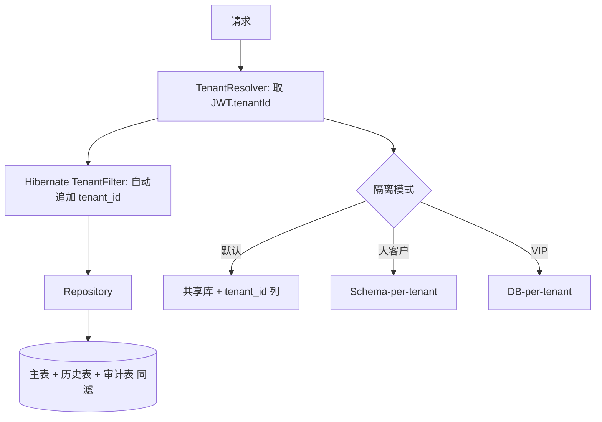

**关键设计点：**

1. **默认判别式隔离**：所有实体继承的 `Auditable` 含 `tenantId`，由 `TenantFilter`/`@Where("tenant_id = :tenantId")` 在查询时**自动追加**，业务代码无需手写；历史表、审计表一并隔离。
2. **tenantId 自动注入**：写操作时由 JPA 拦截器从 `SecurityContext`（JWT 内嵌）取 `tenantId` 自动填充，杜绝遗漏。
3. **租户解析与 JWT 绑定**：`TenantResolver` 优先取 token 内的 `tenantId`，客户端请求头仅作开发期覆盖且受权限校验，防止伪造越权。
4. **隔离级别可切换**：通过 `cim.tenant.mode=shared|schema|db` 切换；大客户/合规要求高者走独立 Schema 或独立数据库，框架层路由切换、业务无感。
5. **平台超级视角**：运维/平台角色可带 `X-Tenant-Override` 显式查全量，但必须经 `@DataPermission` 与审计，所有跨租户操作留痕。
6. **与 i18n 协同**：`sys_i18n` 的 `tenant_id` 覆盖（§7）复用同一 `TenantFilter`。

---

## 11. 缓存架构

Redis 在本文档多处被使用（i18n、令牌版本、分布式锁），但**零散使用 = 缓存与 DB 不一致、缓存穿透/击穿/雪崩、惊群**。作为企业底座必须给出统一缓存架构。本节**先列利弊，再给优化设计**。

#### 利弊分析（常见做法 vs 本框架优化）

| 维度 | 常见做法 | 不足 / 风险 | 本框架优化 |
| --- | --- | --- | --- |
| **缓存层级** | 只用 Redis | 热点 key 高频跨网络，RT 高、Redis 压力集中 | **多级缓存：本地 Caffeine + Redis**，本地挡热点、Redis 挡全局 |
| **一致性** | 写后随手 `del` | 并发下「读旧→删→写新」竞态，缓存脏读 | **Cache-Aside + 版本号/延迟双删 +  canal/发件箱失效事件**（见 §12/§13） |
| **缓存穿透** | 无 | 查不存在的 key 直击 DB | **空值缓存（短 TTL）+ BloomFilter** 拦截无效 key |
| **缓存击穿** | 无 | 热点 key 失效瞬间海量请求压 DB | **互斥锁（Redis SETNX）/ 逻辑过期** 单线程重建 |
| **缓存雪崩** | 固定 TTL | 同批 key 同时过期，DB 被打挂 | **TTL 加随机抖动**；关键热点永不过期 + 主动失效 |
| **序列化** | JDK 原生 | 体积大、版本脆弱、跨语言差 | **JSON（Jackson）/ Kryo**，跨语言可读、体积小 |

#### 优化后的缓存架构

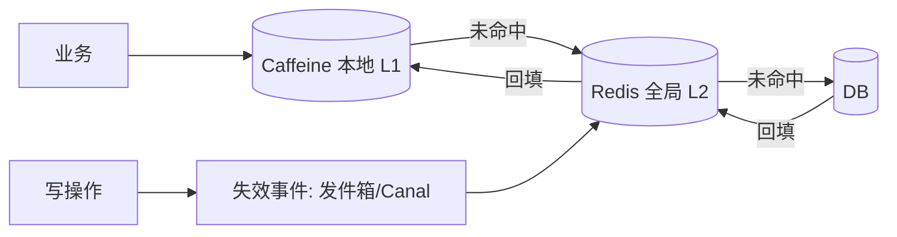

**关键设计点：**

1. **多级缓存**：`@Cacheable` 封装 `CacheManager` 组合（Caffeine 本地 + Redis 全局）；热点只读数据本地纳秒级返回，降低 Redis 压力与 RT。
2. **Cache-Aside 标准读写**：读先 L1→L2→DB 回填；写更新 DB 后**删除缓存**（非更新缓存，避免并发写乱序）。
3. **防穿透**：空结果缓存短 TTL + 可选 BloomFilter；防击穿：重建加分布式锁（Redisson `getLock`）；防雪崩：TTL 加随机抖动。
4. **一致性兜底**：关键业务（如权限、字典）变更除删缓存外，可发**失效事件**（经 §12 发件箱 / §13 MQ）让各节点同步失效，避免多实例缓存不一致。
5. **i18n 缓存（§7）即典型落地**：Redis Hash 存译文 + 版本号，本地可再缓存一层，版本号变化即失效。

```java
@Cacheable(value = "equipment", key = "#id", sync = true) // sync=互斥重建，防击穿
public Equipment load(String id) { return repo.findById(id); }

@CacheEvict(value = "equipment", key = "#entity.id")
@Transactional public Equipment save(Equipment entity) {
    Equipment e = repo.save(entity);
    eventPublisher.publish(new CacheInvalidateEvent("equipment", entity.getId())); // 跨节点失效
    return e;
}
```

---

## 12. 事务与一致性（跨库 / 发件箱）

§3 把多库做成**物理隔离的独立 EMF/事务管理器**——这带来一个必然问题：**跨库写如何保证一致性？** 朴素「一个 `@Transactional` 想包住两个库」在独立 TxManager 下根本不成立。同时 §9 提到历史「高频异步」，也必须有可靠投递机制。本节**先列利弊，再给优化设计**。

#### 利弊分析（常见做法 vs 本框架优化）

| 维度 | 常见做法 | 优点 | 不足 / 风险 | 本框架优化 |
| --- | --- | --- | --- | --- |
| **跨库事务** | JTA / 两阶段提交(2PC) | 强一致 | 性能差、锁资源久、单点协调者、多数云库不支持 | **尽量避免跨库事务**；必须时走 **Saga 补偿（业务层）** 而非 2PC |
| **本地事务 + 副作用** | 事务内直接发 MQ / 写历史 | 简单 | **消息发送可能成功但事务回滚**（或反之）→ 不一致 | **事务发件箱（Outbox）：同事务写「业务表 + outbox 表」，再由中继投递** |
| **历史异步（§9）** | 直接 `@Async` 写历史 | 不阻塞主事务 | 主成功、历史写失败 → 审计丢失 | **历史先落 outbox / 同事务写历史表**，异步仅做「归档/同步到分析库」 |
| **同一库读写** | 一个大事务包一切 | 强一致 | 长事务锁表、拖垮吞吐 | **事务尽量短小**；读用只读事务 / 从库；写仅包必要写操作 |

#### 优化后的设计：事务发件箱（Outbox）

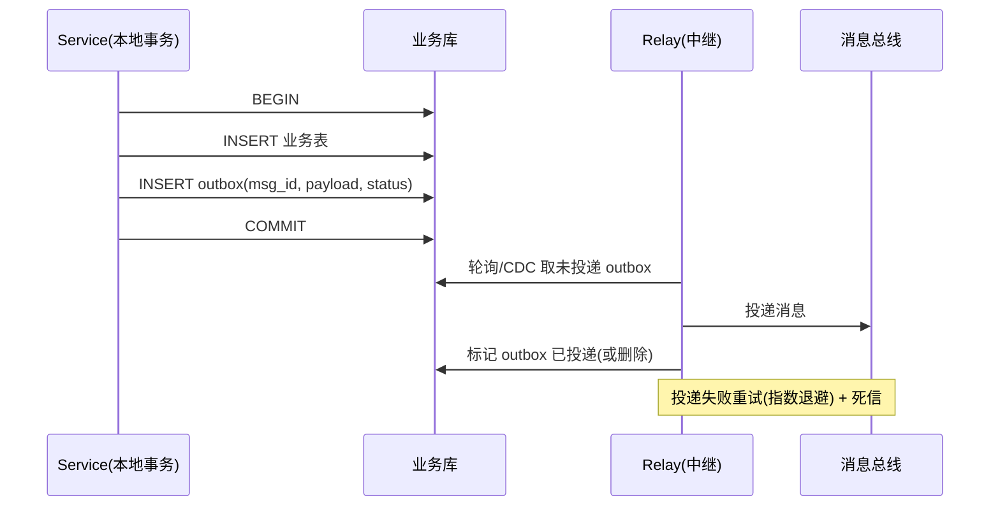

**关键设计点：**

1. **Outbox 表**：`sys_outbox(id, aggregate_type, aggregate_id, event_type, payload_json, status, create_time)`，与业务表在**同一本地事务**写入，保证「业务成功 ⇔ 消息记录存在」。
2. **中继投递**：独立 `Relay` 进程/线程轮询 outbox（或借 CDC/Debezium 捕获 binlog），投递到 MQ 后标记完成；投递至少一次（at-least-once），消费端**幂等**（见 §16）。
3. **历史一致性落地**：`SNAPSHOT`/`STATE_LOG` 历史先**同事务写入该实体专属历史表**（不丢），异步仅负责「同步到只读分析库 / 外部审计系统」，即便同步失败也不影响主业务与本地审计。
4. **跨库写用 Saga**：确需跨 Oracle+MySQL 的业务（如「扣库存+写订单」），拆为本地事务 + 补偿动作，不依赖 2PC；框架提供 `SagaCoordinator` 模板与补偿注册。
5. **事务边界纪律**：应用服务方法即事务边界（§2），只读走 `readOnly` 事务/从库；避免大事务。

---

## 13. 异步 · 事件 · 消息 · 韧性

§8 提到 `ApplicationEvent` 做审计/通知，但企业系统还需**跨服务通信、削峰、失败重试、熔断**。朴素「直接调别人 / `@Async` 无界线程池」会导致**级联雪崩、消息丢失、无法追踪**。本节**先列利弊，再给优化设计**。

#### 利弊分析（常见做法 vs 本框架优化）

| 维度 | 常见做法 | 不足 / 风险 | 本框架优化 |
| --- | --- | --- | --- |
| **领域事件 vs 集成事件** | 混为一谈 | 进程内事件泄漏到外部 / 外部事件耦合领域 | **明确分离**：领域事件 `ApplicationEvent`（进程内）；集成事件经 §12 Outbox → MQ（跨服务） |
| **异步执行** | `@Async` 默认线程池（无界） | 任务堆积 OOM、无超时 | **自定义线程池 + 虚拟线程(Project Loom) + 任务隔离（按业务域独立池）** |
| **消息可靠性** | 直接 `mq.send` | 发送失败即丢 / 重复 | **Outbox + 消费幂等 + 重试 + 死信队列**（见 §12/§16） |
| **服务韧性** | 无 | 下游抖动拖垮上游 | **Resilience4j：熔断 + 舱壁 + 重试(指数退避) + 超时** |
| **消息顺序** | 无序 | 状态流水乱序 | 按 `aggregateId` **分区有序**（Kafka partition key） |

#### 优化后的设计

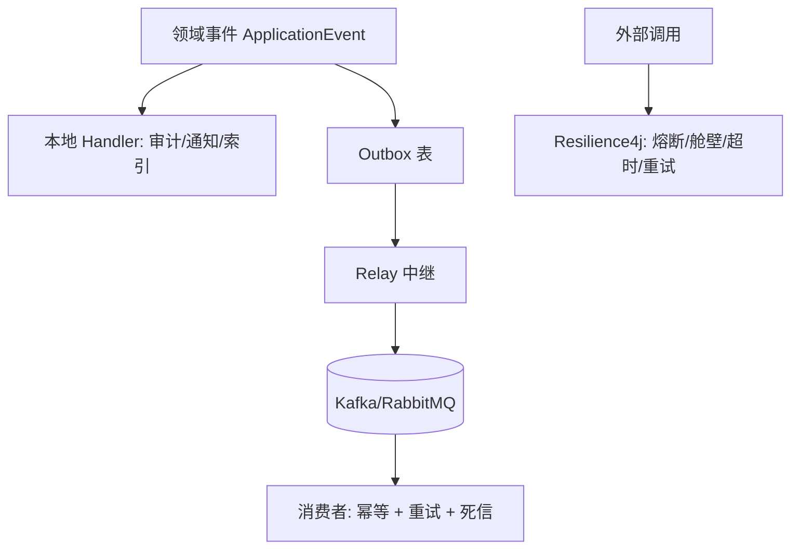

**关键设计点：**

1. **事件分层**：进程内领域事件（`ApplicationEvent`）用于审计、本地索引更新；需要跨服务协作的，一律经 **Outbox → MQ** 成为集成事件，保证可靠投递。
2. **异步隔离**：按业务域配置独立线程池（设备采集、报表、通知互不挤占）；JDK 21 下优先 **虚拟线程** 承载高并发异步任务，避免平台线程耗尽。
3. **韧性四件套（Resilience4j）**：所有外部调用（EAP/SECS/三方/DB 慢查询）包裹 熔断 + 舱壁 + 超时 + 重试（指数退避 + 抖动），防止雪崩。
4. **消费幂等**：MQ 消费端以 `eventId`/`aggregateId+version` 去重（见 §16），配合 Outbox 的 at-least-once 语义做到精确处理。
5. **顺序保障**：状态流水类事件以 `equipmentCode` 为分区键，保证单设备状态有序。

```java
@CircuitBreaker(name = "eap", fallbackMethod = "eapFallback")
@TimeLimiter(name = "eap")
@Retry(name = "eap", fallbackMethod = "eapFallback")
public CompletableFuture<Result> callEap(Command c) { /* 外部 EAP 调用 */ }

// 消费幂等：以 eventId 去重
@KafkaListener
public void on(IntegrationEvent e) {
    if (idempotency.isDone(e.eventId())) return;   // 见 §16
    handle(e); idempotency.mark(e.eventId());
}
```

---

## 14. 可观测性（指标 / 链路 / 日志）

技术栈列了 Micrometer + Prometheus，但**没有设计 = 线上黑盒**。企业框架必须让运维「看得见、查得着、追得到」。本节**先列利弊，再给优化设计**。

#### 利弊分析（常见做法 vs 本框架优化）

| 维度 | 常见做法 | 不足 / 风险 | 本框架优化 |
| --- | --- | --- | --- |
| **日志** | 散打 `log.info` 字符串 | 难检索、无结构、无链路 | **结构化日志（JSON）+ MDC（traceId/tenantId/userId）**，接入 ELK/Loki |
| **链路** | 仅单服务内 traceId | 跨服务断链 | **OpenTelemetry / Micrometer Tracing**，跨 HTTP/MQ 传播，对接 Jaeger/Tempo |
| **指标** | 无 / 随手计时 | 无法量化 SLO、无告警 | **RedMetrics：请求量/错误率/时延(P99)/饱和度**，Prometheus + Grafana |
| **健康检查** | 仅 `/actuator/health` | 不区分就绪/存活 | **Liveness + Readiness 分离**（K8s 探针），依赖（DB/Redis/MQ）健康纳入 |
| **业务可观测** | 无 | 业务异常不可见 | 关键业务埋点（登录失败率、订单量、历史写入量）走 Micrometer |
| **日志脱敏** | 明文打全量 | 泄露 PII（与 §15/§20 冲突） | **敏感字段脱敏**（手机号/密码/ token 掩码）后落盘 |

#### 优化后的设计

```mermaid
flowchart LR
  APP[应用] -->|结构化日志| LOG[(Loki/ELK)]
  APP -->|Metrics| PROM[Prometheus] --> GRAF[Grafana]
  APP -->|Trace| OTEL[OpenTelemetry] --> TEMP[Jaeger/Tempo]
  APP -.|MDC 贯穿| LOG
```

**关键设计点：**

1. **结构化日志 + MDC**：所有日志 JSON 化，`traceId`/`tenantId`/`userId` 经 MDC 在入口过滤器统一注入，贯穿整个请求与异步线程（含虚拟线程继承）。
2. **全链路追踪**：OpenTelemetry 自动埋点 HTTP/JDBC/MQ，跨服务通过请求头（W3C traceparent）传播；与 §4 `Result.traceId`、§5 操作人联动。
3. **指标红线**：暴露 QPS、错误率、P99 时延、线程池/连接池饱和度；Grafana 配 SLO 告警；§4 的异常计数与 §9 历史写入量纳入业务看板。
4. **探针分离**：`/actuator/health/liveness`（进程存活）与 `/readiness`（依赖就绪）分离，供 K8s 精确摘流/重启。
5. **日志脱敏**：`Logback` 加自定义脱敏 converter，PII 字段掩码后再输出，满足 §20 合规。

---

## 15. 安全纵深防御（扩展 §5）

§5 解决了认证主体问题，但**单点认证 ≠ 安全**。生产环境还需 CORS、CSRF、安全头、暴力破解防护、密钥生命周期、依赖供应链安全等。本节**先列利弊，再给优化设计**。

#### 利弊分析（常见做法 vs 本框架优化）

| 维度 | 常见做法 | 不足 / 风险 | 本框架优化 |
| --- | --- | --- | --- |
| **CORS** | `*` 通配 | 任意站点可带凭证调用 | **白名单 origin + 凭证模式禁 `*` + 显式 methods/headers** |
| **CSRF** | 关闭 / 忽略 | Cookie 双通道下可被伪造跨站请求 | **`refresh` Cookie 用 `SameSite=Strict` + 双重提交令牌 / 关键操作二次校验** |
| **安全响应头** | 无 | 被劫持/注入/嵌套 | **CSP / HSTS / X-Content-Type-Options / X-Frame-Options / Referrer-Policy** 全局注入 |
| **暴力破解** | 无限制 | 撞库成功 | **登录失败计数 + 指数退避 + 账户锁定 + 图形/短信验证码**（配合 §16 限流） |
| **密钥管理** | 明文写 yml | 泄露 + 难轮换 | **KMS/Vault 托管 + 定期轮换 + 启停不落盘**；私钥仅认证中心持有（见 §19） |
| **刷新令牌** | 明文存 Cookie | 被窃取重放 | **refresh 加密存储 + 绑定 userAgent/IP 哈希 + 复用即吊销**（§5 已含复用检测） |
| **依赖供应链** | 不扫描 | 引入带 CVE 的库 | **OWASP Dependency-Check / Snyk 接入 CI**，BOM 收敛（§1）+ enforcer |
| **i18n 内容 XSS** | 直出 content | 译文被注入脚本 | **content 输出前统一 HTML 转义 / CSP 兜底**（§7 内容安全） |
| **权限越权** | 仅鉴权不鉴数据 | A 看到 B 的数据 | **功能权限（§5）+ 数据权限（§5 `@DataPermission`）+ 租户隔离（§10）三重叠加** |

#### 优化后的设计

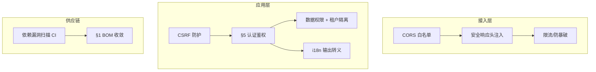

**关键设计点：**

1. **CORS 白名单**：`cors.allowed-origins` 显式列举，凭证模式严禁 `*`；预检缓存合理 TTL。
2. **CSRF 防护**：Web 端 `refresh` Cookie `SameSite=Strict`；关键写操作（改密/转账）要求双重提交令牌或二次认证。
3. **安全头全局过滤器**：`Content-Security-Policy` / `Strict-Transport-Security` / `X-Content-Type-Options: nosniff` / `X-Frame-Options: DENY` / `Referrer-Policy`。
4. **暴力破解防护**：`AuthFailureCache` 按账号/IP 计数，超阈值锁定 + 验证码；与 §16 限流共用滑动窗口组件。
5. **密钥与令牌安全**：JWT 私钥由 KMS/Vault 注入且定期轮换（旧公钥保留短暂过渡期）；`refresh` 加密写 Cookie 并绑定环境指纹；i18n 内容输出统一转义防 XSS。
6. **供应链安全**：CI 强制依赖漏洞扫描 + §1 的 BOM/enforcer 双保险，禁止引入高危 CVE。

---

## 16. 限流 · 幂等 · 并发控制

§6 把「限流/幂等」列为预留，但这对企业框架是**刚需**（防刷、防重、防超卖）。本节**先列利弊，再给优化设计**。

#### 利弊分析（常见做法 vs 本框架优化）

| 维度 | 常见做法 | 不足 / 风险 | 本框架优化 |
| --- | --- | --- | --- |
| **限流** | 无 / 网关层硬编码 | 单实例有效、多实例失效；维度单一 | **注解 `+Redis 滑动窗口`**，支持 用户/IP/接口/租户 多维；网关 + 应用双层 |
| **幂等** | 前端去重 / 靠运气 | 重试/网络重发导致重复写（如重复下单） | **幂等键 `Idempotency-Key` + Redis 去重表**（请求级）+ 业务版本去重（事件级，§13） |
| **并发写** | 仅 `@Version` | 长事务/批量覆盖仍可能丢更新 | **`@Version` 乐观锁 + 冲突重试 + 关键资源分布式锁（Redisson）** |
| **防重提交** | 无 | 用户双击提交两笔 | **表单/按钮级幂等键**，服务端首次写后即拒绝相同键 |

#### 优化后的设计

```java
// 1) 限流注解（滑动窗口，Redis 实现）
@Target(ElementType.METHOD) @Retention(RUNTIME)
public @interface RateLimit {
    int limit() default 100;
    int windowSec() default 60;
    String key() default "ip"; // ip / user / api / tenant
}
// 切面：redis ZSET 滑动窗口计数，超限抛 BizException(429)

// 2) 幂等注解（请求级去重）
@Target(ElementType.METHOD) @Retention(RUNTIME)
public @interface Idempotent {
    String key() default "#request.idempotencyKey"; // SpEL
    int ttlSec() default 300;
}
// 切面：首次执行存 key→result 到 Redis；重复请求直接返回首结果，不重复执行

// 3) 并发写：乐观锁 + 重试
@Retryable(retryFor = OptimisticLockException.class, maxAttempts = 3)
@Transactional
public void updateWithRetry(EquipmentDef d) { repo.save(d); }
```

**关键设计点：**

1. **多维限流**：`@RateLimit` 基于 Redis 滑动窗口，按 IP/用户/接口/租户维度灵活组合；网关层（§23 Nginx/API 网关）再加一层粗粒度防护。
2. **请求幂等**：客户端携带 `Idempotency-Key`，服务端首次执行后缓存结果与状态，重试直接返回，杜绝重复写；支付/下单等关键接口强制开启。
3. **并发控制组合拳**：常规写用 `@Version` 乐观锁；冲突自动重试有限次；高频竞态资源（如库存扣减）用 Redisson 分布式锁串行化。
4. **与登录防护协同**：§15 的暴力破解计数复用本节滑动窗口组件，统一限流基础设施。

---

## 17. API 设计规范（版本化 / 分页 / 契约）

框架要长期演进，API 必然面临**向后兼容、字段扩展、列表查询标准化**。朴素「接口随便改、分页各写各的」会导致**前端大面积崩溃、无法灰度**。本节**先列利弊，再给优化设计**。

#### 利弊分析（常见做法 vs 本框架优化）

| 维度 | 常见做法 | 不足 / 风险 | 本框架优化 |
| --- | --- | --- | --- |
| **API 版本** | 无 / 改 URL 随意 | 破坏旧客户端；无法灰度 | **URI 版本 ` /api/v1/...`** 为主，Header/内容协商为辅；破坏性变更升大版本 |
| **分页排序** | 各接口自定义 `pageNum/pageSize` | 不一致、难统一校验 | **统一 `PageQuery(current, size, sort)` + Spring `Pageable`**，后端投影返回 `Page<T>` |
| **字段扩展** | 直接加字段 | 旧客户端解析异常 | **响应只增字段、不改类型/不改名**；废弃字段标 `@Deprecated` + 文档说明 |
| **契约文档** | 无 / 滞后 | 前后端扯皮 | **SpringDoc OpenAPI 自动生成**，注解补充 `@Schema`；变更即更新 |
| **批量与游标** | 深分页 `offset` | 大数据量越翻越慢 | **深分页改游标/Keyset 分页**（基于 `id/时间` 上一页末值） |

#### 优化后的设计

```java
// 统一分页请求（与 §21.3 BaseController 配套）
public record PageQuery(int current, int size, String sort) {
    public Pageable toPageable() {
        int p = Math.max(current - 1, 0);
        int s = Math.min(size, 500);              // 上限保护
        Sort sortObj = Sort.unsorted();
        if (sort != null && !sort.isBlank())
            sortObj = Sort.by(sort.split(",")).ascending(); // 白名单字段由 @Schema 约束
        return PageRequest.of(p, s, sortObj);
    }
}

// 统一响应分页（Spring Data 标准 Page<T>，弃用 MyBatis-Plus IPage 以统一体系）
@GetMapping("/page")
public Result<Page<EquipmentVO>> page(PageQuery q) {
    return Result.ok(service.page(q.toPageable()));
}
```

**关键设计点：**

1. **URI 版本化**：新模块/破坏性变更走 `/api/v2`，旧版本保留至客户端迁移完毕；非破坏性增强在同版本内只增字段。
2. **统一 `PageQuery` + `Page<T>`**：所有列表接口共用，后端投影避免 `SELECT *` 与 N+1；分页大小上限保护（防恶意大页）。
3. **深分页优化**：超阈值自动切换 Keyset 分页（如 `WHERE id < ? ORDER BY id DESC LIMIT n`），避免 `OFFSET` 全表扫描。
4. **契约即文档**：SpringDoc 注解 `@Tag`/`@Schema`/`@Parameter` 生成 OpenAPI；CI 可做契约变更检测（breaking change 告警）。

---

## 18. 测试策略

技术栈列了 JUnit/Mockito/Testcontainers，但**没有策略 = 测试沦为形式**。企业框架必须保证「分层可测、架构不腐化、多库可验」。本节**先列利弊，再给优化设计**。

#### 利弊分析（常见做法 vs 本框架优化）

| 维度 | 常见做法 | 不足 / 风险 | 本框架优化 |
| --- | --- | --- | --- |
| **测试金字塔** | 堆 UI/接口测试 | 慢、脆、反馈晚 | **单测(基础) > 集成(中) > 契约/E2E(尖)**，单测用纯 `cim-core`（零 Spring） |
| **架构守卫** | 靠 Code Review | 分层/依赖规则随迭代被破 | **ArchUnit** 强制：domain 不依赖 Spring、依赖单向（§1/§2 规则自动化） |
| **多库测试** | mock EntityManager | 方言行为测不到 | **Testcontainers** 起真实 MySQL/Oracle/PG 镜像，验证 §3 方言差异 |
| **历史/审计测试** | 不测 | 变更检测/回滚逻辑回归崩 | 针对 `HistoryInterceptor` 变更闸门、回滚（`restore`）写专项测试 |
| **并发/幂等测试** | 不测 | 乐观锁/幂等线上才暴露 | 用 `@Repeat`/并发线程验证 `@Version` 冲突与 `@Idempotent` 去重 |

#### 优化后的设计

```java
// ArchUnit：把 §1/§2 的架构规则固化成测试，CI 必跑
@AnalyzeClasses(packages = "com.cim")
class ArchitectureTest {
    @ArchTest
    static final ArchRule domain_no_spring =
        classes().that().resideInAPackage("..core..")
                 .should().notDependOnClassesThat().resideInAnyPackage("..spring..","..jpa..");
    @ArchTest
    static final ArchRule dependency_inward =
        classes().that().resideInAPackage("..business..")
                 .should().dependOnClassesThat().resideInAPackage("..core..");
}

// Testcontainers：真实多库验证方言
@Testcontainers
class MultiDbTest {
    @Container static OracleContainer oracle = new OracleContainer("gvenzl/oracle-xe");
    @Container static PostgreSQLContainer<?> pg = new PostgreSQLContainer<>("postgres:15");
    // 验证 §3 的 JSON Converter、分页、NULLS LAST 在三库行为一致
}
```

**关键设计点：**

1. **测试金字塔 + 架构守卫**：`cim-core` 纯单测（无 Spring，快）；集成测试用 `@DataJpaTest` + Testcontainers；ArchUnit 在 CI 固化依赖方向，防止架构腐化。
2. **真实多库验证**：用 Testcontainers 起 MySQL/Oracle/PG，落真实 DDL 跑关键路径，验证 §3 的方言抽象（JSON、分页、NULLS LAST）确实跨库一致。
3. **关键逻辑专项测试**：历史变更检测闸门、回滚、乐观锁冲突重试、幂等去重，必须有回归测试覆盖。
4. **契约测试**：前后端基于 OpenAPI（§17）做契约测试，避免接口隐性破坏。

---

## 19. 配置与密钥管理

朴素「所有配置写 `application.yml` 提交到 Git」会导致**密钥泄露、环境混乱、无法动态调参**。企业框架必须有配置与密钥治理。本节**先列利弊，再给优化设计**。

#### 利弊分析（常见做法 vs 本框架优化）

| 维度 | 常见做法 | 不足 / 风险 | 本框架优化 |
| --- | --- | --- | --- |
| **配置来源** | 写死 yml 进 Git | 改配置要发版；环境差异靠复制 | **配置中心（Nacos/Apollo）+ 本地 yml 兜底**，支持动态生效（呼应 §8 Feature Flag） |
| **密钥** | 明文 yml / 环境变量 | 泄露 + 难轮换 | **KMS / Vault 托管**，启动时拉取注入，私钥仅认证中心持有（呼应 §5/§15） |
| **环境隔离** | 一套配置通吃 | 测试误连生产 | **profile 隔离（dev/test/prod）+ 配置中心 namespace 隔离 + 生产禁本地回退** |
| **敏感配置审计** | 无 | 谁改了密钥未知 | **密钥访问留痕 + 轮换策略（自动/手动）** |

#### 优化后的设计

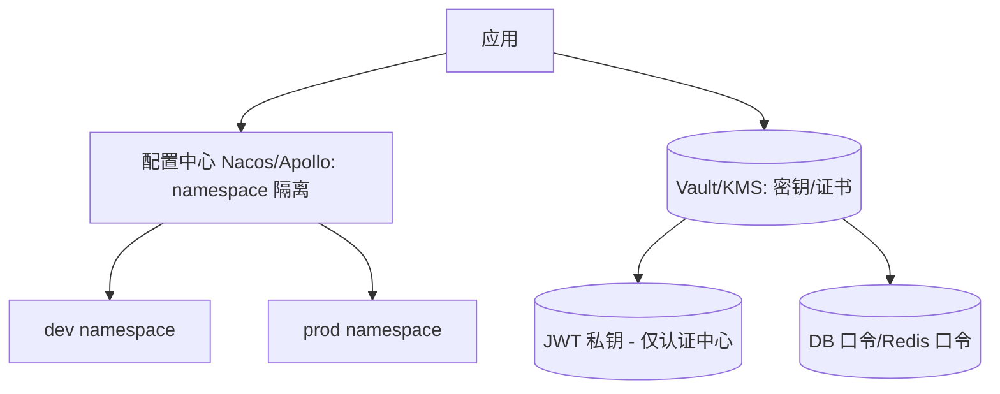

**关键设计点：**

1. **配置中心化**：非敏感配置（开关、阈值、路由）放 Nacos/Apollo，按 `namespace` 隔离多环境，支持运行时动态调参（如限流阈值、Feature Flag）。
2. **密钥外置**：数据库口令、JWT 私钥、Redis 口令等由 Vault/KMS 注入，**不进 Git、不进镜像**；私钥定期轮换，旧公钥保留过渡期（呼应 §15）。
3. **环境隔离纪律**：`prod` 不允许回退到本地 yml；CI 部署时按环境注入对应 namespace，杜绝串环境。
4. **与可插拔联动**：配置即 §8 的「配置外部化 + Feature Flag」落地，能力开关、策略选择全部由配置中心驱动。

---

## 20. 数据生命周期与合规

历史/审计会**无限增长**，且涉及 PII（个人信息）。朴素「只增不删」会遇到**存储爆炸、合规风险（如用户要求删除其数据，但审计不可篡改）**。本节**先列利弊，再给优化设计**。

#### 利弊分析（常见做法 vs 本框架优化）

| 维度 | 常见做法 | 不足 / 风险 | 本框架优化 |
| --- | --- | --- | --- |
| **历史膨胀** | 只增不归档 | 表越来越大、查询变慢、成本飙升 | **分级存储：热（在线）+ 温（归档库）+ 冷（对象存储/OSS）**，按时序分区 + TTL |
| **状态流水** | 与历史同表 | 高频写拖慢审计查询 | **`_state_log` 独立 + 按月分区 + 采样/降精度归档**（§9） |
| **合规擦除** | 直接删行 | 破坏审计不可篡改原则 | **PII 字段匿名化/假名化**（而非删审计），满足「被遗忘权」同时保留轨迹 |
| **数据脱敏** | 查询全量返回 | 越权看到敏感字段 | **响应层 `@Sensitive` 字段脱敏 + 角色分级**（与 §15 协同） |
| **保留策略** | 无 | 审计留存过久/过短都不合规 | **按数据类型配置保留期**（操作日志 N 年、状态流水 M 月），到期自动归档/清理 |

#### 优化后的设计

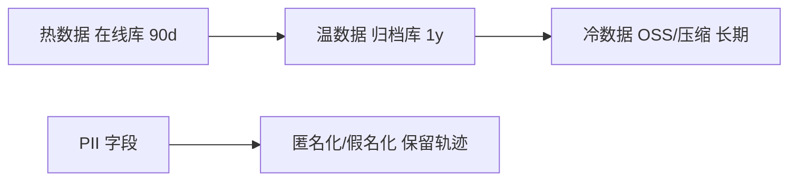

**关键设计点：**

1. **时序归档**：各实体专属历史表 `{X}Hist` / `{X}StateLog` 按 `op_time` 分区（每表独立分区策略，互不影响）；超过热期迁归档库，超冷期压缩入对象存储，查询路由按时间自动选源。
2. **PII 合规处理**：用户要求删除时，对含 PII 的审计/历史行做**匿名化（如姓名→`***`、手机号掩码）**，保留「何时发生了什么」的轨迹但去除可识别信息，兼顾合规与不可篡改。
3. **响应脱敏**：实体字段标 `@Sensitive(level=PHONE|NAME|ID)`，序列化时按当前用户角色脱敏，与 §15 日志脱敏共用规则。
4. **保留期可配**：各类数据保留期由 §19 配置中心管理，到期自动触发归档/清理作业（独立调度，见部署 §23）。

---

## 21. 基础功能实现示例

### 21.1 RBAC 权限模型

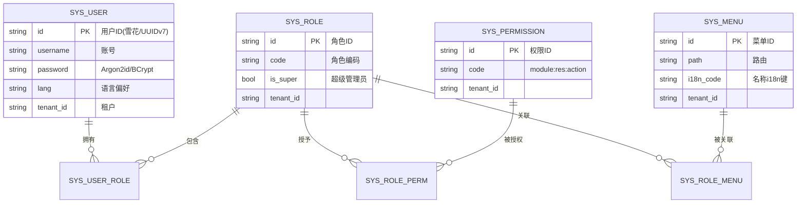

#### 利弊分析（常见做法 vs 本框架优化）

| 维度 | 常见做法 | 不足 / 风险 | 本框架优化 |
| --- | --- | --- | --- |
| **授权层级** | 用户直接绑权限（无角色） | 用户数 × 权限数爆炸、难维护 | **用户 → 角色 → 权限** 三级，角色作授权单位 |
| **权限粒度** | 仅菜单（无 API/按钮权限） | 前端可隐藏但后端 API 仍可越权调用 | **菜单（导航）与权限（后端 API/按钮）分离**，权限码 `module:res:action` |
| **数据权限** | 无 | 同角色可见全量数据 | 叠加 **§5 `@DataPermission` + §10 租户隔离** |
| **权限来源** | 每次请求查库鉴权 | 性能差、DB 压力大 | **登录时加载权限入 `SecurityContext` + token**，变更经 §5 版本号失效后重拉 |
| **超级管理员** | 代码硬编码特判 | 散落多处、难统一 | 角色标记 `is_super` 短路放通，集中处理 |
| **菜单国际化** | 名称硬编码 | 与 §7 全量 DB i18n 矛盾 | 菜单名走 **§7 i18n**（`i18n_code`），用户语言偏好存 `sys_user.lang` |

**关键设计点：**

1. 三级授权（用户—角色—权限），菜单仅作导航、与权限解耦又可通过 `SYS_ROLE_MENU` 关联，支持「按角色配置菜单可见性」。
2. 权限码规范 `module:resource:action`，按钮级亦纳入，配合 §5 `@PreAuthorize("hasAuthority('sys:user:list')")`。
3. 数据权限 + 租户隔离在 API 层叠加（§5/§10），与功能权限正交。
4. 登录一次性加载权限到 `SecurityContext`，前端路由守卫（见[前端文档 §3 认证与路由守卫](../web/README.md#3-认证与路由守卫)）与后端过滤共用同一份；权限变更经 token 版本号（§5）即时失效。
5. `is_super` 角色短路；菜单名与按钮文案走 §7 数据库 i18n，用户语言偏好驱动。

### 21.2 登录认证时序

> 与 §5 优化设计一致：RS256 非对称签发、双令牌分通道存储、刷新轮换 + 复用检测、版本号即时吊销、算法钉死、暴力破解防护（§15/§16）。

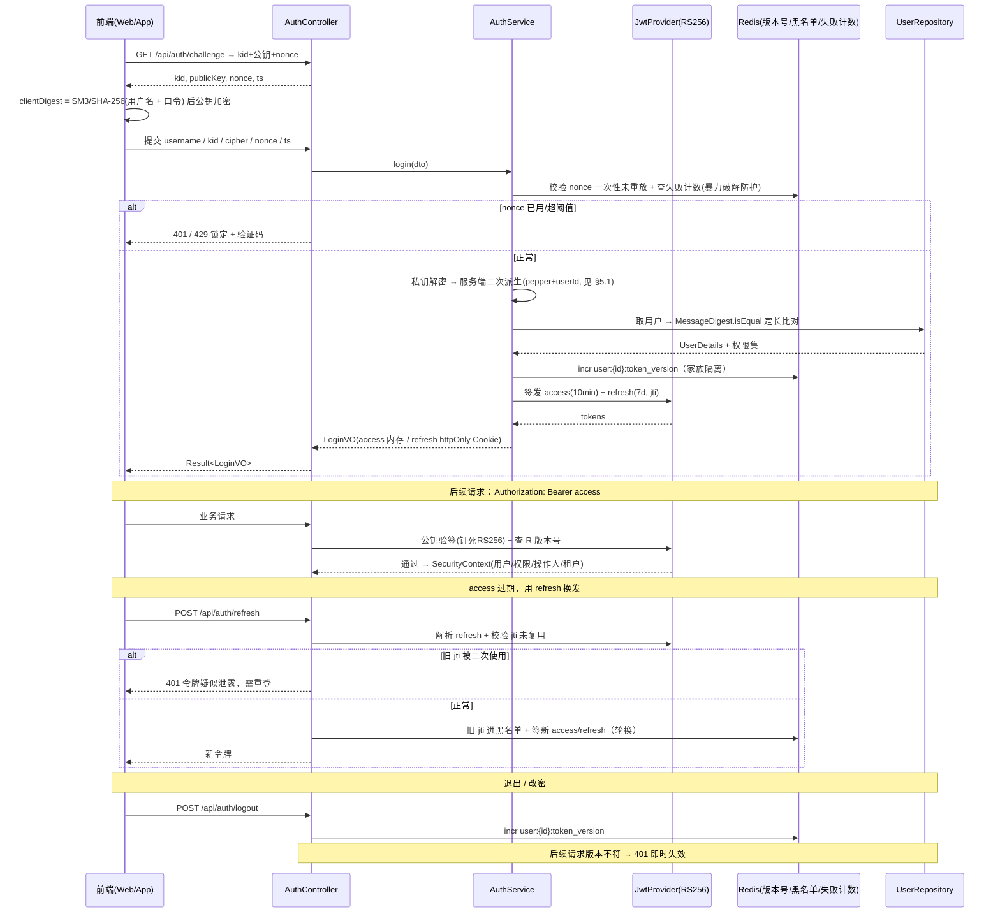

### 21.3 通用 CRUD 基类

后端提供可复用的 `BaseDefData`（继承统一审计基类 `Auditable`，主键用 §3 应用层时间有序 ID）/ `BaseRepository` / `BaseService` / `BaseController`，新增业务表仅需继承即可获得分页、增删改查与历史记录能力：

```java
> 实体基类 `BaseDefData` 的定义（应用层时间有序主键、租户、乐观锁、逻辑删除、审计字段）见 [§9 通用数据模型](#9-通用数据模型审计基类--分级历史参考成熟实践并优化)；下方仅给出服务层与控制器层泛型基类。

// 服务基类（泛型 CRUD，委托 DataAp 触发历史，见 §9）
public abstract class BaseService<T extends BaseDefData, ID> {
    protected abstract DataAp<T, ID> dataAp();   // 泛型模板，写操作自动落历史
    public Page<T> page(Pageable p) { return dataAp().page(p); }
    @Transactional public T save(T t) { return dataAp().insert(t); }
    @Transactional public T update(T t) { return dataAp().update(t); }
    @Transactional public void remove(ID id) { dataAp().delete(id); }
}

// 控制器基类（泛型 CRUD + 统一分页 + 幂等，零重复代码）
public abstract class BaseController<T extends BaseDefData, ID> {
    protected abstract BaseService<T, ID> service();
    @GetMapping("/page") public Result<Page<T>> page(PageQuery q) { return Result.ok(service().page(q.toPageable())); }
    @PostMapping public Result<Void> save(@RequestBody T t) { service().save(t); return Result.ok(null); }
    @PutMapping public Result<Void> update(@RequestBody T t) { service().update(t); return Result.ok(null); }
    @DeleteMapping("/{id}") public Result<Void> remove(@PathVariable ID id) { service().remove(id); return Result.ok(null); }
}
```

> 业务实体继承 `BaseDefData` 即**同时获得通用 CRUD 与历史表自动记录**：写操作经 `DataAp`（§9 泛型模板）→ 落主表后由 `HistoryInterceptor` 经**变更检测**按 `@History` 策略（`SNAPSHOT` → 该实体专属的 `{X}Hist` 整行快照历史表 / `STATE_LOG` → 专属的 `{X}StateLog` 变迁流水表）自动落历史，历史逻辑零手写。主键统一由 `IdGenerator` 注入，与 §3 多库策略及历史 `history_id` 同源；操作人由 §5 的 `SecurityContext`、租户由 §10 的 `TenantResolver` 自动填充，与 §9 审计字段打通。分页统一用 `Page<T>`（已弃用 MyBatis-Plus `IPage` 以保持 JPA 体系一致，见 §17）。

---

## 22. 环境要求与后端快速开始

**环境要求**

- JDK 21+、Maven 3.9+
- Node.js 18+/20+、pnpm 9+
- 至少一种数据库（MySQL 8 / Oracle 19c / PostgreSQL 15）
- Redis 7（缓存、令牌、限流、幂等、锁）
- 消息总线（Kafka/RabbitMQ，启用异步/集成事件时；见 §13）
- 配置中心（Nacos/Apollo，生产；见 §19）+ 密钥管理（Vault/KMS，见 §15/§19）

**后端启动**

```bash
cd server                   # 进入后端工程根（Maven 父 POM 所在目录）

# 1. 配置数据源（复制并修改）
cp cim-bootstrap/src/main/resources/application.yml.example \
   cim-bootstrap/src/main/resources/application.yml

# 2. 编译并启动
mvn clean install -DskipTests
mvn -pl cim-bootstrap spring-boot:run
```

**接口文档**

启动后访问 `http://localhost:8080/swagger-ui.html`（SpringDoc，见 §17 契约规范）。

---

## 23. 部署拓扑与弹性

朴素「一个 jar + 一个库」无法支撑企业高可用。本节给出**可水平扩展、可灰度、可观测**的部署拓扑，呼应 §1「微服务化零改造」与 §14 可观测。

#### 利弊分析（常见做法 vs 本框架优化）

| 维度 | 常见做法 | 不足 / 风险 | 本框架优化 |
| --- | --- | --- | --- |
| **接入层** | 直连应用 | 无统一限流/TLS/静态 | **Nginx / API 网关**：SSL 终止、限流（§16）、路由、灰度 |
| **无状态** | 应用存会话 | 无法水平扩容 | **应用无状态**（令牌在客户端/Redis，见 §5），可随意扩副本 |
| **服务发现** | 硬编码地址 | 扩缩容要改配置 | **注册中心（Nacos）**（与 §19 配置中心同源）+ 客户端负载均衡 |
| **弹性** | 无探针 | K8s 误杀/流量打到有问题的实例 | **Liveness/Readiness 分离**（§14）+ HPA 自动扩缩 |
| **灰度** | 全量发布 | 一次发布全崩 | **按版本/租户灰度**（配合 §17 URI 版本 + §8 Feature Flag） |
| **零停机迁移** | 直接改表 | Oracle 在线 DDL 风险高 | **Flyway 向后兼容迁移（扩-改-缩）+ 蓝绿/滚动**（§3） |
| **调度作业** | @Scheduled 单机 | 多实例重复执行 | **分布式调度（XXL-JOB/Elastic-Job）**，用于 §20 归档/清理作业 |

#### 部署拓扑

```mermaid
flowchart TB
  subgraph Edge[Nginx / API 网关]
    NG[SSL / 限流 / 灰度路由]
  end
  subgraph K8s[Kubernetes]
    APP1[Pod cim-bootstrap #1]
    APP2[Pod cim-bootstrap #2]
    APP3[Pod cim-bootstrap #N]
  end
  subgraph Mid[中间件]
    REDIS[(Redis 集群)]
    MQ[(Kafka)]
    REG[Nacos 注册/配置]
    VAULT[(Vault 密钥)]
  end
  subgraph Data[数据层]
    ORA[("Oracle")] MYSQL[("MySQL")] PG[("PostgreSQL")]
    ARCHIVE[("归档库/对象存储")]
  end
  NG --> APP1 & APP2 & APP3
  APP1 & APP2 & APP3 --> REDIS & MQ & REG & VAULT
  APP1 & APP2 & APP3 --> ORA & MYSQL & PG
  APP1 & APP2 & APP3 --> ARCHIVE
```

**关键设计点：**

1. **应用无状态 + 水平扩容**：令牌/会话在 Redis（§5），应用副本可随时增减；配合 K8s HPA 按 CPU/QPS 自动扩缩。
2. **网关统一治理**：Nginx/API 网关做 SSL 终止、§16 限流、灰度路由（按 §17 版本/§8 Feature Flag）。
3. **可观测接入**：所有 Pod 暴露 `/actuator` 指标（§14）供 Prometheus 抓取，链路经 OTel 上报；日志结构化入 Loki。
4. **零停机发布**：Flyway 迁移遵循向后兼容（先扩列/加表、再改代码、最后缩列），配合滚动/蓝绿；Oracle 大表变更走在线重定义。
5. **调度作业分布式化**：§20 的数据归档/清理/脱敏作业由分布式调度框架执行，避免多副本重复跑。

---

## 24. 日志与审计（操作日志 / 登录日志 / 链路追踪）

「日志」在企业级系统里其实是**三类关注点完全不同的东西**，混为一谈是绝大多数框架的隐性缺陷：要么审计信息只进了应用日志、无法长期留存与检索（等保/合规不过），要么把高并发技术日志塞进数据库把表撑爆，要么含明文口令的参数被原样落库造成二次泄露。本节**先列利弊，再给优化设计**，补齐 §9「实体级数据历史」之外的**行为级审计**。

> §9 回答「这条数据变成什么样了」（数据历史），本节回答「谁、在什么时候、对什么、做了什么操作」（行为审计）。两者互补，**不可互相替代**。

#### 利弊分析（常见做法 vs 本框架优化）

| 维度 | 常见做法 | 不足 / 风险 | 本框架优化 |
| --- | --- | --- | --- |
| **日志分层** | 所有东西都 `log.info` | 审计信息散在日志海里，**查不出、留不住**，合规不过；technical 日志又因混业务而淹没 | **三层分离**：技术日志（ELK/Loki，短期）／操作审计（DB，长期、可检索）／登录日志（DB，安全审计） |
| **采集位置** | 在 Controller 层用 AOP 无脑记所有请求 | 丢失业务语义（只知道调了 `POST /api/xxx`，不知道「审批了工单」）；批量接口产生巨量噪音行 | **标注在 Service 方法**（业务语义边界），由 `@AuditLog` 声明式开启，**默认不记、按需开启** |
| **参数记录** | 原样序列化请求参数 | 口令/令牌/身份证被明文落库，造成**二次泄露**（比日志泄露更持久） | **脱敏后才记录**：与 §15/§20 共用 `@Sensitive` 脱敏规则；默认**不记** result，按需开启 |
| **写入方式** | 同步写 DB（拖慢接口）或纯异步写（丢日志） | 前者成为链路瓶颈，后者异常时审计丢失 | **分级**：关键操作（权限变更/财务/配方下发）**同事务**或走 §12 outbox 保证不丢；一般操作异步批量入库并带降级告警 |
| **登录日志** | 只在成功时记一笔 | 无法追溯暴力破解、撞库、异地登录 | **成功/失败全记**：含 IP、UA、失败原因（不记错误口令本身），失败次数驱动 §15 账号锁定 |
| **保留期** | 一律永久 | 技术日志撑爆存储 | **按类型配置保留期**（技术日志 30–90 天、操作日志 N 年），与 §20 归档/分区策略一致 |
| **排查能力** | 无请求标识 | 跨服务排查靠猜 | `traceId` 全链路贯穿（MDC + §14 OTel），一条 ID 串起技术日志、操作审计、指标、链路 |

#### 优化后的设计

```mermaid
sequenceDiagram
  participant C as 客户端
  participant GF as 网关/过滤器
  participant CT as Controller
  participant AX as 审计切面 @AuditLog
  participant SV as Service（业务语义边界）
  participant DP as 脱敏器
  participant PW as 审计写入器
  participant DB as sys_operation_log / sys_login_log
  participant ELK as 技术日志链路(ELK/Loki)

  C->>GF: 请求（携带/生成 X-Trace-Id）
  GF->>CT: MDC 注入 traceId/userId/tenantId
  CT->>AX: 调用 Service 方法
  AX->>SV: 执行业务（事务内）
  SV-->>AX: 返回 + 业务结果（含 bizId）
  AX->>DP: 参数/结果脱敏（@Sensitive 规则）
  DP-->>AX: 脱敏后快照
  alt 关键操作（critical=true）
    AX->>DB: 同事务/发件箱落审计（必达）
  else 一般操作
    AX->>PW: 投递异步队列（批量入库 + 失败告警）
    PW->>DB: 批量写入
  end
  AX->>ELK: 结构化技术日志（含 traceId）
```

**实体设计（操作日志 / 登录日志）**

```java
/** 操作审计日志：追加不可变，仅查询与归档，禁止 UPDATE/DELETE */
@Entity @Table(name = "sys_operation_log")
public class OperationLog extends BaseEventData {      // 追加型，自身即流水（见 §9）
    private String traceId;          // 链路 ID，与 §14 OTel / 技术日志同一标识
    private String userId;
    private String username;         // 冗余留存，用户注销后仍可追溯
    private String tenantId;
    private String module;           // 模块（system / equipment / recipe …）
    private String bizType;          // 业务对象类型（EquipmentDef）
    private String action;           // 业务动作（CREATE / UPDATE / DELETE / APPROVE / EXPORT）
    private String bizId;            // 业务主键（与 §9 历史表 bizId 同源，可互相跳转）
    private String method;           // 方法全限定名，便于定位
    private String httpMethod;
    private String uri;
    @Column(columnDefinition = "TEXT")
    private String paramsJson;       // 脱敏后的入参快照
    @Column(columnDefinition = "TEXT")
    private String resultJson;       // 脱敏后的出参快照（默认不记，显式开启）
    private Boolean success;
    private String errorCode;        // 失败时记 BizCode（见 §4）
    private Integer costMs;
    private String ip;
    private String userAgent;
}

/** 登录日志：安全审计，成功与失败全记录 */
@Entity @Table(name = "sys_login_log")
public class LoginLog extends BaseEventData {
    private String traceId;
    private String userId;           // 失败且账号不存在时为 null
    private String username;
    private String tenantId;
    private LoginStatus status;      // SUCCESS / FAIL_PASSWORD / FAIL_CAPTCHA / FAIL_LOCKED / FAIL_DISABLED / LOGOUT
    private String failReason;       // 只记原因枚举，**绝不记错误的口令本身**
    private String ip;
    private String location;         // IP 归属地（离线库解析，非实时联网）
    private String userAgent;
    private String deviceType;       // WEB / MOBILE / DEVICE
    private String sessionId;        // 与 §5 令牌族关联，便于追溯吊销
}

/** 声明式审计：标注在 Service 方法（业务语义边界），而非 Controller */
@Target(ElementType.METHOD) @Retention(RetentionPolicy.RUNTIME)
public @interface AuditLog {
    String action();                     // 业务动作，必填（CREATE / APPROVE / EXPORT …）
    String bizType() default "";         // 业务对象类型
    boolean recordParams() default true; // 记录脱敏后入参
    boolean recordResult() default false;// 出参默认不记（易暴增，按需开启）
    boolean critical() default false;    // 关键操作 → 同步/发件箱必达，其余异步
    String bizIdExpr() default "";       // SpEL 从返回值/参数提取 bizId，如 "#result.id"
}
```

> **何时同事务、何时异步**：`@AuditLog(critical = true)` 用于权限变更、配方下发、财务类等高风险操作，经 §12 outbox 保证必达；普通查询/导出类操作异步批量入库，**审计失败不阻塞业务**，但需配置失败率告警（§14）。

**关键设计点**

1. **三层日志各司其职**：技术日志（排障、短期、可丢）／操作日志（合规审计、长期、可检索）／登录日志（安全审计），写入目标、保留期、查询方式全部不同，禁止合并。
2. **采集点收敛到 Service**：Controller 只有 HTTP 语义，Service 才有业务语义；`action` + `bizType` + `bizId` 三元组使审计可被业务人员检索（「查某台设备近一年的配方变更」），而非只有 URI 噪音。
3. **脱敏先于落库**：审计日志通常比技术日志保留更久，若含明文敏感信息，等于制造一个**长期可用的泄露源**；复用 `@Sensitive` 规则保证口径统一（§15/§20）。
4. **失败与成功同记**：登录失败是安全事件的主要输入，`sys_login_log.fail_reason` 驱动 §15 的暴力破解锁定与异常登录告警。
5. **与 §9 数据历史联动**：`OperationLog.bizId` 与历史表 `BaseHistoryData.bizId` 同源，且共享同一 `trxId`/`traceId`——可做到「一次审计查到：谁改的（操作日志）+ 改了哪些字段（历史 `changeSetJson`）+ 当时的完整链路（traceId）」。
6. **存储与量化治理**：两张日志表按 `op_time` **按月分区**，到期分区走 §20 归档（热→温→冷）后删除；索引 `(tenant_id, op_time)`、`(biz_type, biz_id)`、`trace_id`。

---

## 25. 代码生成器设计

§9 确立「**每个有历史记录的实体各自一张专属历史表**」后，历史实体的编写量翻倍，§9.8 也指出 schema drift 必须靠工程手段根治。代码生成器由此从「锦上添花的效率工具」升级为**该方案的落地前提**——没有它，每实体一历史表就是纯粹的人力灾难。本节给出可商用的生成器设计。

#### 利弊分析（常见做法 vs 本框架优化）

| 维度 | 常见做法 | 不足 / 风险 | 本框架优化 |
| --- | --- | --- | --- |
| **产出范围** | 只生成单表 CRUD（Entity + Controller） | 历史实体、历史表 DDL、迁移脚本仍要手写 → **必 drift**（§9.8） | **全链路成对产出**：主表 Entity + 历史 Entity + 主/历 DDL + Flyway 迁移 + DTO + Service + Controller + 前端页面骨架 |
| **历史表支持** | 无 | 与「每实体一历史表」策略直接冲突 | **历史实体为一等产出物**，与主实体同模板批次生成，字段同源、结构同构 |
| **覆盖策略** | 每次重新生成，整文件覆盖 | 人工修改被冲掉，团队不敢再生成 | **一次生成 + 增量合并**：首次生成入 Git，之后仅对**历史实体/DDL**做 AST 级增量追加字段；业务手写区（`/* region biz */`）永不覆盖 |
| **元数据来源** | 手写配置文件 | 与数据库实际结构脱节 | **单一事实源 = 表元数据**（Flyway 迁移后的库 / 或设计为输入的建模元数据），生成物与库结构强一致 |
| **生成质量** | 直接落盘不可控 | 一键生成一堆错代码，回滚困难 | **dry-run 预览 + diff**：先看生成物和 Git 的差异，确认后落盘 |
| **团队定制** | 模板写死在生成器里 | 换个框架/包名就废 | **模板可覆盖**：内置默认模板，项目可用同名模板文件覆盖约定路径 |
| **CI 防线** | 无 | 主表改了忘改历史表，上线才发现 | **CI 检查**：检测到 `ALTER {X}` 的迁移文件未包含 `ALTER {X}_hist` 时**直接构建失败**（§9.8 机制② 的落地） |

#### 优化后的设计

```mermaid
flowchart LR
  META[元数据读取<br/>表/列/索引/注释] --> PLAN[生成计划<br/>主表 + 历史表 成对]
  PLAN --> TPL[模板渲染<br/>Velocity/FreeMarker<br/>可被项目覆盖]
  TPL --> DIFF["dry-run 预览 + Git diff"]
  DIFF -->|确认| EMIT[落盘到源码树<br/>入 Git 由人工接管]
  EMIT --> CI{CI 校验}
  CI -->|"ALTER 主表缺 _hist"| FAIL[构建失败]
  CI -->|通过| OK[产物就绪]
  EMIT -.->|后续字段变更| INCR[AST 增量合并<br/>仅追加历史列]
```

**产出物清单（以 `EquipmentDef` 为例，`{X}` = `equipment_def`）**

| 层次 | 产出文件 | 说明 |
| --- | --- | --- |
| 持久化 | `EquipmentDef.java` | `extends BaseDefData`，`@History(SNAPSHOT)`，应用层 `String id` |
| | `EquipmentDefHist.java` | `extends BaseHistoryData`，业务字段与主表**同构**（§9 形态 A） |
| | `EquipmentDefRepository.java` / `*HistRepository` | JPA Repository + 查询方法骨架 |
| DDL | `V{ver}__create_equipment_def.sql` | **同一迁移文件内含主表 + 历史表两张 DDL**（§9.8 强制成对） |
| 服务 | `EquipmentDefService.java`、DTOs（Create/Update/Query/VO） | MapStruct 转换器；DTO/Entity 严格分离（§2） |
| 接口 | `EquipmentDefController.java` | 继承泛型基类，仅 `@RequestMapping` 前缀 + 审计注解（§17/§24） |
| 前端 | `web/src/pages/equipment-def/`（列表 + 表单 + API 定义） | 与后端同一份元数据产出，字段口径一致 |

**关键设计点**

1. **历史实体是一等公民**：生成器把「主实体 → 历史实体」当作固定产出对，`@History` 策略（§9）决定生成 `SNAPSHOT`（`{X}Hist`）还是 `STATE_LOG`（`{X}StateLog`）；选 `NONE` 则跳过历史产物。
2. **主/历 DDL 同文件**：这是把 §9.8「主/历同步迁移规范」落到工程约束的关键——生成器产出的迁移天然成对，人为主表变更后 CI 也会拦截未同步的历史表变更。
3. **一次生成，人工接管**：产出物落源码树并纳入版本控制，之后由开发者维护；生成器不再整文件覆盖，**避免「生成—手改—再生成覆盖」的死循环**。后续字段变更走「AST 增量合并」（仅向历史实体与历史表**追加列**），符合历史表「只增不改不删」原则。
4. **模板可覆盖 + dry-run**：模板走约定路径优先策略（项目模板 > 内置模板），生成前输出 diff 供人确认，避免「一键污染仓库」。
5. **元数据单一事实源**：以前端/后端共用的建模元数据或迁移后的库结构为准生成，杜绝「生成器配置与实际库结构两张皮」。
6. **CI 守卫**：流水线执行两项检查——① 迁移文件中主表 DDL 与历史表 DDL 是否成对；② 启动时历史表列覆盖率自检（§9.8 机制④）。任一失败则阻断合并。

> 生成器本身设计为 `cim-gen-starter`（§8 可插拔）：引入即具备 `mvn cim:gen` 能力，移除后不影响运行时，`provided` 作用域**不进生产包**。

---

> 本文档为 `cim-ap` 后端企业级基础框架的自包含设计说明。所有横切能力均可通过对应 `cim-*-spring-boot-starter` 启停（§8），多数据库（§3）、多租户（§10）、缓存（§11）、事务/消息（§12/§13）、可观测（§14）、安全（§5/§15）、限流幂等（§16）、API 规范（§17）、测试（§18）、配置密钥（§19）、数据生命周期（§20）、日志与审计（§24）、代码生成器（§25）共同构成可商用底座。后续业务模块均在此基础上按需扩展。
