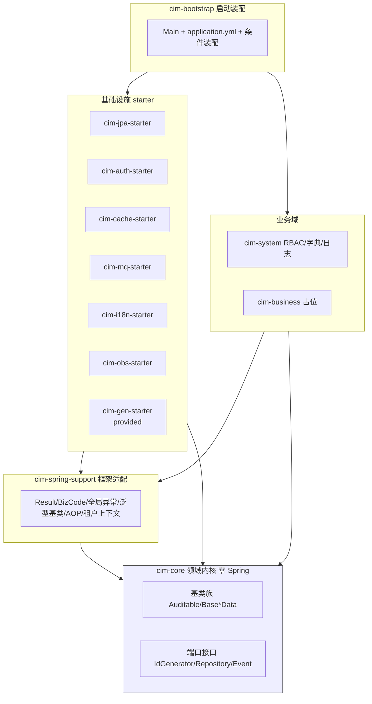
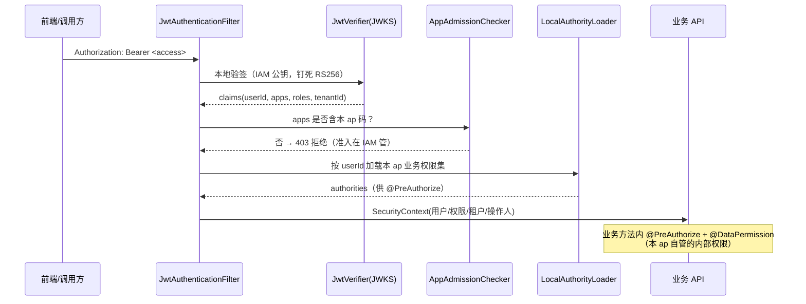

# 后端基础框架（platform/server）详细设计

> 本文件是 [`README.md`](README.md)（架构设计 §1–§25）的**实现级细化**，面向落地编码：给出模块与包结构、逐模块类/接口设计、横切机制、关键契约、数据模型与迁移规范、配置键、与 IAM 的对接边界、质量门禁与关键决策（ADR）。
>
> 定位关系：`README.md` 回答「为什么这样设计（利弊取舍）」，本文件回答「具体怎么实现」。两者冲突时以本文件为准，并回填 README。
>
> 开发排期与任务拆解见 [`plan.md`](plan.md)。


---

## 0. 文档定位与范围

| 项       | 说明                                                                                                            |
| ------- | ------------------------------------------------------------------------------------------------------------- |
| **范围**  | `platform/server` 后端底座：`cim-core` / `cim-spring-support` / 各 `cim-*-starter` / `cim-system` / `cim-bootstrap` |
| **不含**  | `business/{ap}` 业务实现（但含**与 IAM 的对接契约**，见 §8）                                                                  |
| **代码根** | `platform/server/pom.xml`（外层父 POM），12 个模块；详见 [README §1](README.md#1-maven-多模块)                               |
| **包根**  | 统一 `com.cim.*`，模块名与包段一一对应（`cim-jpa-starter` → `com.cim.jpa`）                                                  |
| **产物**  | 每个 starter 打成可被业务 ap 依赖的 jar；`cim-bootstrap` 为可执行 jar                                                         |

**继承的三条硬约束**（来自项目已确认决策，不得违反）：

1. **依赖向内**：业务域 → `cim-core` 接口；基础设施在 starter 中实现端口。`cim-core` 绝不反向依赖业务或基础设施。
2. **IAM 只管准入**：IAM 只判定「用户能否进某 ap」，业务系统内部的菜单/按钮/数据权限由各 ap 自行控制（见 §8）。
3. **每实体一历史表**：有历史的实体各自一张专属历史表（`{X}Hist` / `{X}StateLog`），主/历 DDL 成对迁移。

---

## 1. 总体架构

### 1.1 分层与依赖方向



**依赖规则（由 maven-enforcer 强制）：**

| 模块                            | 允许依赖                                                 | 禁止依赖                             |
| ----------------------------- | ---------------------------------------------------- | -------------------------------- |
| `cim-core`                    | `jakarta.persistence`(spec)、`jakarta.validation`、JDK | Spring、其他 `cim-*`                |
| `cim-spring-support`          | Spring Web/Core、`cim-core`、MapStruct                 | 各 starter、业务域                    |
| `cim-*-starter`               | `cim-spring-support`、`cim-core`、各自技术栈                | 业务域（`cim-system`/`cim-business`） |
| `cim-system` / `cim-business` | `cim-spring-support`、`cim-core`、按需 starter           | 其他业务域循环                          |
| `cim-bootstrap`               | 全部（仅装配）                                              | —                                |

> `cim-core` 的「零 Spring」允许 `jakarta.persistence` 规范注解（`@MappedSuperclass` / `@Id`，见 [README §9](README.md#9-通用数据模型审计基类--分级历史参考成熟实践并优化)）；JPA **实现**（EMF/Repository 实现/Flyway）一律在 `cim-jpa-starter`。这是对 README §1「零 Spring」与 §2「不 import JPA 注解」的调和：**规范注解可入 core，实现与容器依赖不入 core**。

### 1.2 统一包结构约定

```
com.cim.<module>
├── config              # @AutoConfiguration 自动装配入口（starter 专属）
├── <domain>            # 领域/能力语义分包（如 history / tenant / i18n / security）
│   ├── annotation      # 注解
│   ├── aspect          # AOP 切面
│   ├── interceptor     # 拦截器（JPA/Hibernate/MDC）
│   ├── model           # 模型/基类/值对象
│   ├── port            # 端口接口（仅 cim-core）
│   ├── service         # 能力实现
│   └── support         # 工具/辅助
└── META-INF/spring/org.springframework.boot.autoconfigure.AutoConfiguration.imports
```

**命名约定：**

| 类型    | 后缀/前缀                                     | 示例                                          |
| ----- | ----------------------------------------- | ------------------------------------------- |
| 自动装配类 | `*AutoConfiguration`                      | `JpaAutoConfiguration`                      |
| 配置属性  | `*Properties`（`@ConfigurationProperties`） | `CimJpaProperties`                          |
| 端口接口  | 领域名 + 语义                                  | `IdGenerator`、`EventPublisher`              |
| 切面    | `*Aspect`                                 | `HistoryAspect`、`DataPermissionAspect`      |
| 拦截器   | `*Interceptor`                            | `HistoryInterceptor`、`AuditFillInterceptor` |
| 标记/契约 | 语义名                                       | `Auditable`、`Historizable`                  |

---

## 2. 模块详细设计

### 2.1 cim-core（领域内核，零 Spring）

**职责**：放纯领域抽象与端口，保证可单测、可复用、可被业务域与基础设施共同依赖。

**包结构与关键类：**

```
com.cim.core
├── model                          # 基类族（@MappedSuperclass）
│   ├── Auditable                  # 审计字段基类（含 tenantId）
│   ├── BaseDefData                # 定义表基类（id/tenantId/description/@Version/deleted）
│   ├── BaseStateData              # 状态表基类（currentState/stateSince）
│   ├── BaseEventData              # 事件表基类（bizKey/eventType/payload）
│   ├── BaseRevisionData           # 版本基类（revision/active|frozen|archive）
│   └── BaseHistoryData            # 历史表基类（historyId/bizId/opType/opTime/operator/trxId/revision/changeSetJson）
├── history
│   ├── History                    # @History 注解
│   ├── HistoryStrategy            # SNAPSHOT / STATE_LOG / NONE
│   └── Historizable               # 历史表标记接口
├── port
│   ├── IdGenerator                # 时间有序 ID 端口（雪花/UUIDv7）
│   ├── CurrentUserPort            # 当前操作人端口（实现取 SecurityContext）
│   ├── TenantPort                 # 当前租户端口
│   └── EventPublisher             # 领域事件发布端口
├── shared
│   ├── ChangeSet                  # 变更集值对象（字段级 diff）
│   └── PageResult<T>              # 分页值对象（框架无关）
└── event
    └── DomainEvent                # 领域事件基类（进程内）
```

**关键设计：**

- `Auditable` 全部字段用 `LocalDateTime`（对齐开发规范，弃用 `Date`）；主键统一 `String id`（应用层时间有序 ID）。
- `BaseHistoryData` **不含任何业务字段**；业务字段由各实体历史表自己持有（与主表同构）。
- 端口只用接口表达，实现分别在 `cim-jpa-starter`（IdGenerator）、`cim-auth-starter`（CurrentUserPort）等注入。
- 依赖：仅 JDK + `jakarta.persistence`/`jakarta.validation` 规范注解。

### 2.2 cim-spring-support（框架适配）

**职责**：承载「框架无关逻辑下沉」后的 Spring 适配件——统一响应、全局异常、泛型基类、AOP 基础设施、租户上下文、MDC 链路。

**包结构与关键类：**

```
com.cim.spring.support
├── web
│   ├── Result<T>                  # 统一响应（code/msg/data/errors/traceId/timestamp）
│   ├── BizCode                    # 错误码枚举（code + HttpStatus + i18nKey，模块分段）
│   ├── BizException               # 业务异常（携带 i18n 参数）
│   ├── ValidationException        # 参数异常
│   ├── SystemException            # 系统异常（不泄露细节）
│   ├── GlobalExceptionHandler     # @RestControllerAdvice（字段级 errors + traceId）
│   ├── PageQuery                  # 标准分页/排序入参（→ Spring Data Pageable）
│   ├── PageResults                # Spring Data Page → core PageResult 转换
│   └── BaseController<T,ID>       # 泛型 CRUD 控制器基类
├── service
│   └── CrudService<T,ID>          # 通用 CRUD 契约（面向接口，不含 JPA）
├── tenant
│   ├── TenantContext              # ThreadLocal 租户上下文（实现 core TenantPort）
│   ├── TenantResolver             # 租户解析策略接口（Header/域名/用户）
│   ├── HeaderTenantResolver       # 默认实现（请求头）
│   ├── TenantFilter               # 请求入口写入/清理上下文
│   └── TenantProperties           # cim.tenant.*
├── trace
│   ├── TraceContext               # MDC traceId 读写
│   └── TraceIdFilter              # 注入/透传/清理
├── security
│   └── AnonymousCurrentUserPort   # 未接入认证时的兜底操作人
├── event
│   └── SpringEventPublisher       # EventPublisher 的 ApplicationEvent 桥接
├── i18n
│   ├── MessageResolver            # 消息解析端口
│   └── DefaultMessageResolver     # 降级实现（i18n starter 覆盖）
├── util
│   └── JsonUtils                  # 框架内部 JSON（历史变更集/事件载荷）
└── config
    └── SpringSupportAutoConfiguration
```

**关键设计：**

- `Result<T>` / `BizCode` / `GlobalExceptionHandler` 见 [README §4](README.md#4-统一响应与全局异常)；消息经 `MessageResolver` 解析，`cim-i18n-starter` 提供 DB 实现，缺席时降级 `DefaultMessageResolver`。
- `BaseController` + `CrudService` 组成泛型 CRUD 骨架（见 [README §21.3](README.md#213-通用-crud-基类)），业务仅继承；**JPA 侧的 `BaseRepository` / `AbstractJpaService` 因需 Spring Data JPA 依赖，落地在 `cim-jpa-starter`**（本模块不含 JPA，仅依赖 `spring-data-commons` 的分页抽象）。
- `TenantContext` 由 `TenantResolver` 写入，供 JPA 租户过滤器（`cim-jpa-starter`）与审计填充读取。
- 依赖：Spring Web/Core、`spring-data-commons`、`cim-core`、Jackson。

### 2.3 cim-jpa-starter（持久化）

**职责**：多数据库支持、应用层主键、审计填充、分级历史、多租户隔离、JSON 转换、Flyway 多目录。

**包结构与关键类：**

```
com.cim.jpa
├── config
│   ├── CimJpaProperties           # cim.jpa.*（id / history / naming）
│   ├── JpaAutoConfiguration       # 自动装配入口
│   ├── LowercaseSnakeNamingStrategy  # 统一小写蛇形 PhysicalNamingStrategy
│   └── MultiDataSourceConfig      # 【M1 后续】每库独立 EMF + TxManager + Hikari
│   └── FlywayConfig               # 【M1 后续】per-DB location 迁移
├── id
│   ├── Snowflake                  # 雪花算法（时钟回拨容忍 + 抛异常）
│   ├── ClockBackwardsException    # 时钟回拨异常
│   ├── SnowflakeIdGenerator       # 雪花实现（回拨降级 UUIDv7 + 告警）
│   ├── UuidV7 / UuidV7IdGenerator # UUIDv7 实现
│   └── IdMode                     # SNOWFLAKE | UUIDV7
├── audit
│   ├── SpringEntityLifecycleCallback  # 注入主键 + 填充审计/租户（实现 core 回调）
│   └── LifecycleCallbackRegistrar     # 把回调注册进 cim-core
├── convert
│   ├── AbstractJsonConverter<T>   # AttributeConverter<T,String>（TEXT/CLOB）
│   └── StringMapJsonConverter     # Map<String,Object> 示例
├── db
│   ├── DbCapability               # product / nullsLastByDefault / jsonFn / limit
│   └── DbCapabilities             # 按产品名解析
├── support
│   ├── BeanProperties             # 反射读写 id / historyId
│   ├── BaseRepository<T,ID>       # JpaRepository + SpecificationExecutor
│   └── AbstractJpaService<T>      # 实现 CrudService，写操作触发历史（主键固定 String）
└── history
    ├── OpType                     # I / U / D
    ├── ChangeDetector             # 字段级 diff（include 白名单 / exclude 黑名单）
    ├── HistoryMapper              # 按约定解析历史类 + 同构字段拷贝
    └── HistoryRecorder            # 落 {X}Hist / {X}StateLog（未变更不落）
```

**关键设计：**

- **多库物理隔离**：每个数据库一个 `LocalContainerEntityManagerFactoryBean` + 独立 `PlatformTransactionManager` + 独立 `HikariDataSource` + 独立 `hibernate.dialect`；`AbstractRoutingDataSource` 仅用于同方言读写分离。
- **主键**：`IdGenerator`（[README §3](README.md#3-多数据库支持oraclemysqlpostgresql)）在 `@PrePersist` 注入 `String id`；时钟回拨降级 UUIDv7。
- **回调桥接（实现要点）**：基类族的 `@PrePersist`/`@PreUpdate` 定义在 `cim-core`（零 Spring），通过 `EntityLifecycleCallbacks` **静态持有者**把控制权交给 `cim-jpa-starter` 的 `SpringEntityLifecycleCallback`（启动时由 `LifecycleCallbackRegistrar` 注册）。这样既保持核心零 Spring 依赖，又能让 JPA 回调访问 Spring 管理的 `IdGenerator`/`CurrentUserPort`/`TenantPort`。
- **历史（落地要点）**：由服务基类 `AbstractJpaService` 在写操作后调用 `HistoryRecorder` 触发（即 README §21.3 所述「经 DataAp 触发历史」）——`update` 先用 `ChangeDetector` 对「库中旧值 vs 入参新值」做字段级 diff，**未变更则不落历史**；`HistoryMapper` 按约定（`{X}Hist` / `{X}StateLog`，同包同构）解析并拷贝业务字段。落库目标由 `@History` 策略决定（`SNAPSHOT`→`{X}Hist`，`STATE_LOG`→`{X}StateLog`，`NONE`→跳过）。**取舍**：经 `AbstractJpaService` 的写入自动落历史；绕过服务直接 `repository.save()` 则不落（历史以服务为统一入口，代码生成器产出的服务天然继承基类）。关键数据同事务、高频数据走发件箱异步（[README §12](README.md#12-事务与一致性跨库--发件箱)）。
- **租户**：基于 `TenantContext` 开启 Hibernate Filter，自动追加 `tenant_id` 条件，业务零感知。
- **迁移**：`db/migration/{mysql,oracle,pg}` 各自增量；`ddl-auto=validate`；**主/历 DDL 成对**（见 §6.2）。
- 依赖：Spring Data JPA、Hibernate、Flyway、`cim-spring-support`、`cim-core`。

### 2.4 cim-auth-starter（认证与鉴权 · 资源服务器侧）

> ⚠️ **边界（重要）**：本 starter 只做**验证侧**——令牌验签、准入判定、业务 RBAC 鉴权、数据权限。**登录、口令派生、令牌签发/刷新/吊销、JWKS 发布、ap 准入注册**属于 `business/iam-ap/server`。参见 §8。

**包结构与关键类：**

```
com.cim.auth
├── config
│   ├── CimAuthProperties          # cim.auth.*（jwks-uri / app-code / 开关）
│   ├── SecurityAutoConfiguration  # SecurityFilterChain + 无状态会话
│   └── MethodSecurityConfig       # @EnableMethodSecurity
├── token
│   ├── JwksKeyProvider            # 从 IAM JWKS 拉取并缓存公钥（按 kid 轮换）
│   ├── JwtVerifier                # RS256 钉死验签（拒绝 alg 变更）
│   └── TokenClaims                # sub/userId/apps/roles/tenantId/ver
├── admission
│   ├── AppAdmissionChecker        # 查 apps claim 是否含本 ap 码 → 否则 403
│   └── AdmissionProperties
├── filter
│   └── JwtAuthenticationFilter    # 验签 → 准入 → 注入 SecurityContext
├── principal
│   └── CimUserPrincipal           # 用户/权限集/租户/操作人 → 供审计取用
├── rbac
│   ├── PermissionEvaluator        # 业务权限码校验（module:res:action）
│   └── LocalAuthorityLoader       # 从本 ap 的 RBAC（cim-system）加载权限集
├── datapermission
│   ├── DataPermission             # @DataPermission 注解
│   ├── DataPermissionAspect       # 织入 Specification（参数绑定，零拼接）
│   └── Scope                      # FACTORY / DEPT / SELF / TENANT
└── support
    └── SecurityContextPortAdapter # 实现 cim-core 的 CurrentUserPort
```

**访问链路（本 ap 一次请求）：**



**关键设计：**

- **准入与业务权限分离**：`apps` claim 决定「能否进」，本 ap 的 RBAC 决定「进来后能做什么」。
- **JWKS 本地验签**：不每请求回查 IAM；公钥按 `kid` 缓存并支持轮换。
- **操作人零侵入**：`JwtAuthenticationFilter` 注入的 principal 供 `cim-jpa-starter` 审计填充读取（写库时自动带 `createUser/eventUser`）。
- 依赖：Spring Security、JJWT/Nimbus、Redis（可选，令牌版本/黑名单兜底）、`cim-spring-support`、`cim-core`。

### 2.5 cim-cache-starter（缓存）

```
com.cim.cache
├── config/{CimCacheProperties, CacheAutoConfiguration}
├── multi/{MultiLevelCache, LocalCaffeineCache, RedisCache}
├── guard/{NullValueGuard, MutexRebuild, TtlJitter}   # 防穿透/击穿/雪崩
└── support/{CacheKeyGenerator, @CacheableCim}
```

多级缓存（本地 Caffeine + Redis），防穿透（空值占位）、防击穿（互斥重建）、防雪崩（TTL 抖动）。见 [README §11](README.md#11-缓存架构)。

### 2.6 cim-mq-starter（消息与发件箱）

```
com.cim.mq
├── config/{CimMqProperties, MqAutoConfiguration}
├── event/{DomainEventPublisher, IntegrationEvent}
├── outbox/{OutboxEntity, OutboxRelay, OutboxProperties}   # 事务发件箱中继
├── producer/{MessageProducer, 实现 Kafka/Rabbit 策略}
└── resilience/{RetryTemplate, DeadLetterHandler, CircuitBreaker}
```

- **领域事件**（进程内，`ApplicationEvent`）与**集成事件**（跨服务，MQ）分离；集成事件经**发件箱中继**保证与本地事务一致（[README §12](README.md#12-事务与一致性跨库--发件箱) / [§13](README.md#13-异步--事件--消息--韧性)）。
- 韧性：重试、死信、熔断、幂等消费。

### 2.7 cim-i18n-starter（国际化）

```
com.cim.i18n
├── config/{CimI18nProperties, I18nAutoConfiguration}
├── model/{SysLocale, SysI18n}        # locale/i18n 两表（scope: SYSTEM/USER）
├── source/{DatabaseMessageSource, I18nCache}   # DB 驱动 + Redis 缓存
├── seed/{I18nSeedLoader}             # 启动种子写入系统级文案
└── web/{LocaleResolverCim, LocaleHeaderFilter}
```

- 全量文案入库（热更新，免发版）；`SYSTEM` 系统级种子写入、`USER` 用户级后台维护。
- Spring `MessageSource` 由 DB 版实现，`@Valid`/异常消息零改造命中 DB（[README §7](README.md#7-国际化全量数据库驱动--系统级--用户级)）。

### 2.8 cim-obs-starter（可观测）

```
com.cim.obs
├── config/CimObsProperties            # cim.obs.*（enabled / metrics / logging / trace）
├── config/ObsAutoConfiguration        # 指标门面 + 公共标签 MeterFilter（条件装配）
├── metrics/MetricsRegistry            # 业务指标门面（自动加 cim. 前缀 + 公共标签）
├── logging/SensitiveDataMasker        # 手机号/邮箱/身份证/银行卡/口令 脱敏（静态）
├── logging/MaskedMessageConverter     # Logback 转换器（%maskedMsg 脱敏落盘）
└── trace/OtelTracingConfig            # OTel 链路桥接（条件激活，缺依赖时整体不加载）
```

指标（Prometheus）/链路（OTel）/结构化日志（见 [README §14](README.md#14-可观测性指标--链路--日志)），日志按三层分离（技术/操作/登录，见 [§24](README.md#24-日志与审计操作日志--登录日志--链路追踪)）并脱敏。

**T4.4 落地要点**：
- 指标：`MetricsRegistry` 封装 `MeterRegistry`，统一 `cim.` 前缀；`commonTags` 经 `MeterFilter` 注入（真实运行态由 actuator 的 `MeterRegistryConfigurer` 套用到所有注册表）。`/actuator/prometheus` 由 actuator 直接暴露。
- 日志脱敏：`SensitiveDataMasker` 为纯静态工具（手机号/邮箱/身份证/银行卡 + `key=value` 形式口令令牌），可供应用代码与 `MaskedMessageConverter`（Logback `%maskedMsg`）共用，确保「日志无敏感信息」。
- 链路：`OtelTracingConfig` 仅当 `io.micrometer.tracing.Tracer` 在 classpath 时激活；离线沙箱无链路依赖，链路由 `cim-spring-support` 的 `TraceContext`(MDC traceId) 兜底。

### 2.9 cim-gen-starter（代码生成器，`provided`）

```
com.cim.gen
├── meta/{MetadataReader, TableMetadata, ColumnMetadata}   # 元数据单一事实源
├── plan/{GenPlan, PairPlanner}                            # 主表+历史表成对计划
├── tpl/{TemplateEngine, TemplateResolver}                 # Velocity/FreeMarker，项目可覆盖
├── emit/{DiffPrinter, SourceEmitter, AstFieldAppender}    # dry-run + 落盘 + AST 增量
├── mojo/CimGenMojo                                       # mvn cim:gen
└── ci/{HistoryPairCheck, HistoryColumnCoverageCheck}      # CI 守卫
```

- 全链路成对产出：主实体 + 历史实体 + 主/历 DDL + Flyway + DTO + Service + Controller + 前端骨架（[README §25](README.md#25-代码生成器设计)）。
- **一次生成、人工接管**；后续变更走 AST 增量追加；`/* region biz */` 手写区永不覆盖；dry-run 预览 diff。
- **CI 守卫**：迁移中 `ALTER {X}` 必须同步 `{X}_hist`，否则构建失败。

### 2.10 cim-system（系统域 · 业务内置模块）

**职责**：RBAC 与平台内置功能的**数据落地**（本 ap 的内部权限来源）。

```
com.cim.system
├── user/{SysUser, SysUserService, SysUserController, SysUserRepository}
├── role/{SysRole, SysRoleMenu, SysRolePerm, ...}
├── menu/{SysMenu, ...}                 # 菜单名走 i18n_code（§7）
├── permission/{SysPermission, ...}     # 权限码 module:res:action
├── dict/{SysDict, SysDictItem, ...}
├── log/{OperationLog, LoginLog, ...}   # BaseEventData 子类（自身即流水）
└── config/{...}
```

- RBAC 三级：用户→角色→权限；菜单（导航）与权限（API/按钮）分离，`SYS_ROLE_MENU` 关联（[README §21.1](README.md#211-rbac-权限模型)）。
- 提供 `LocalAuthorityLoader`（供 `cim-auth-starter`）与本 ap 的登录用户管理界面后端。
- 依赖：`cim-spring-support`、`cim-core`、`cim-jpa-starter`、`cim-auth-starter`。

### 2.11 cim-business（业务域占位）

按业务域孵化，每个域自包含 `controller→service→repository→entity`（[README §1](README.md#1-maven-多模块)）。当前仅占位标记类；业务实现落在各 `business/{ap}` 工程。

### 2.12 cim-bootstrap（启动装配）

```
com.cim.bootstrap
├── CimApApplication               # @SpringBootApplication + 扫描策略
└── (可选) assembly/                # 按 profile 的额外装配

src/main/resources/
├── application.yml                # 本地（.gitignore，仅 .example 入库）
├── application.yml.example
└── db/migration/{mysql,oracle,pg} # Flyway（P1+）
```

- 只做装配：按需引入 starter 与域模块；不含业务代码。
- 前端构建不在此驱动（一套仓库两套构建体系，CI 并行）。

---

## 3. 横切机制设计

| 机制       | 载体                                       | 切入点                                          | 关键类                                             |
| -------- | ---------------------------------------- | -------------------------------------------- | ----------------------------------------------- |
| 统一响应/异常  | `cim-spring-support`                     | `@RestControllerAdvice`                      | `Result`、`BizCode`、`GlobalExceptionHandler`     |
| 审计填充     | `cim-jpa-starter`                        | `@PrePersist/@PreUpdate` + `CurrentUserPort` | `AuditableEntityListener`                       |
| 分级历史     | `cim-jpa-starter`                        | 写操作拦截 + 变更检测                                 | `HistoryInterceptor`、`ChangeDetector`           |
| 多租户      | `cim-spring-support` + `cim-jpa-starter` | Hibernate Filter                             | `TenantContext`、`TenantFilterAspect`            |
| i18n     | `cim-i18n-starter`                       | `MessageSource`                              | `DatabaseMessageSource`                         |
| 缓存       | `cim-cache-starter`                      | `@CacheableCim` + 多级                         | `MultiLevelCache`                               |
| 消息/发件箱   | `cim-mq-starter`                         | 事件发布 + 中继                                    | `OutboxRelay`                                   |
| 可观测      | `cim-obs-starter`                        | 过滤器/切面                                       | `TraceContextFilter`、`SensitiveDataMasker`      |
| 限流/幂等/并发 | `cim-spring-support`(+Redis)             | `@RateLimit`/`@Idempotent`/`@Version`        | 对应切面（[README §16](README.md#16-限流--幂等--并发控制)）   |
| 认证/鉴权    | `cim-auth-starter`                       | Servlet Filter + 方法安全                        | `JwtAuthenticationFilter`、`PermissionEvaluator` |
| 数据权限     | `cim-auth-starter`                       | `@DataPermission` + Specification            | `DataPermissionAspect`                          |

---

## 4. 关键契约（接口级）

### 4.1 统一响应与错误码

```java
public record Result<T>(int code, String msg, T data,
                        Map<String,String> errors, String traceId, long timestamp) { }

public enum BizCode {
    // 模块分段：1000 用户/权限，2000 业务，3000 集成，9000 系统
    USER_NOT_FOUND(1001, HttpStatus.NOT_FOUND, "biz.user.notFound"),
    PARAM_INVALID(1002, HttpStatus.BAD_REQUEST, "biz.param.invalid"),
    NO_ADMISSION (1403, HttpStatus.FORBIDDEN,   "biz.auth.noAdmission");
    public final int code; public final HttpStatus http; public final String i18nKey;
}
```

### 4.2 主键端口

```java
public interface IdGenerator { String nextId(); }   // 实现：雪花（回拨降级 UUIDv7）/ UUIDv7
```

### 4.3 审计与历史基类

见 [README §9](README.md#9-通用数据模型审计基类--分级历史参考成熟实践并优化)：`Auditable` → `BaseDefData`/`BaseStateData`/`BaseEventData`/`BaseRevisionData`；历史表基类 `BaseHistoryData`（独立 `historyId` 主键，避免复合主键并发冲突）。

### 4.4 注解契约

```java
@History(SNAPSHOT|STATE_LOG|NONE, include={})   // 历史策略（cim-core）
@DataPermission(Scope.FACTORY)                  // 数据权限（cim-auth-starter）
@AuditLog(action=..., module=...)               // 操作审计（cim-spring-support/cim-obs）
@RateLimit(key=..., permits=..., window=...)    // 限流（cim-spring-support）
@Idempotent(key=..., ttl=...)                   // 幂等（cim-spring-support）
```

### 4.5 当前用户/租户端口

```java
public interface CurrentUserPort { String userId(); String username(); Set<String> authorities(); }
public interface TenantPort { String tenantId(); }
// 实现分别在 cim-auth-starter / cim-spring-support，cim-core 仅声明
```

---

## 5. 自动装配与可插拔

- 每个 starter 在自己的 `META-INF/spring/...AutoConfiguration.imports` 注册 `@AutoConfiguration`。
- 统一用 `@ConditionalOnProperty`（`cim.<cap>.enabled`）+ `@ConditionalOnClass` + `@ConditionalOnMissingBean`，缺省即可降级、业务可覆盖（[README §8](README.md#8-可插拔架构高度灵活)）。
- 策略接口（`TenantResolver` / `IdGenerator` / `EventPublisher` / `FileStorage` / `CacheProvider`）通过 `cim.<cap>.mode` 选择实现。
- 事件驱动解耦：审计/通知/日志走 `ApplicationEvent`，监听器可异步、可禁用。

**装配开关一览（默认值即「开箱可用」）：**

| 配置前缀        | 能力        | 默认                           |
| ----------- | --------- | ---------------------------- |
| `cim.jpa`   | 持久化/多库/历史 | 有数据源即启用                      |
| `cim.auth`  | 认证/鉴权     | `enabled=true`               |
| `cim.cache` | 多级缓存      | `enabled=true`（无 Redis 降级本地） |
| `cim.i18n`  | 数据库 i18n  | `enabled=true`               |
| `cim.mq`    | 消息/发件箱    | `enabled=false`（按需开）         |
| `cim.obs`   | 可观测       | `enabled=true`               |
| `cim.gen`   | 代码生成      | `provided`，运行时不存在            |

---

## 6. 数据模型与迁移规范

### 6.1 命名规范

| 对象        | 规范                                                                                        | 示例                    |
| --------- | ----------------------------------------------------------------------------------------- | --------------------- |
| 表名        | 小写蛇形（`PhysicalNamingStrategy` 统一）                                                         | `equipment_def`       |
| 主表        | 业务名                                                                                       | `equipment_def`       |
| 快照历史表     | `{X}Hist`                                                                                 | `equipment_def_hist`  |
| 状态流水表     | `{X}StateLog`                                                                             | `equipment_state_log` |
| 审计列       | `create_time/create_user/event_time/event_user/event_name/event_comment/trx_id/tenant_id` | —                     |
| 历史列       | `history_id/biz_id/op_type/op_time/operator/trx_id/revision/change_set_json/tenant_id`    | —                     |
| 唯一约束（含软删） | `(biz_key, tenant_id, deleted)`                                                           | —                     |

### 6.2 主/历成对迁移（强约束）

- 每次 `CREATE/ALTER {X}` 必须在**同一迁移文件**内含 `{X}Hist`（或 `{X}StateLog`）对应 DDL。
- 由 `cim-gen-starter` 生成时天然成对；人工变更由 CI 守卫拦截（见 §7）。
- Flyway 目录：`platform/server/cim-bootstrap/src/main/resources/db/migration/{mysql,oracle,pg}`；业务 ap 各自维护自己的迁移目录。

### 6.3 三层版本语义

`@Version`（行级乐观锁，不进历史） / `revision`（`BaseRevisionData` 业务版本） / `history`（审计轨迹）—— 三者严格分离（[README §9](README.md#9-通用数据模型审计基类--分级历史参考成熟实践并优化)）。

---

## 7. 质量门禁

| 门禁    | 手段                                           | 触发           |
| ----- | -------------------------------------------- | ------------ |
| 架构守卫  | ArchUnit：依赖方向、`cim-core` 零 Spring、禁止跨层       | 单元测试         |
| 依赖收敛  | maven-enforcer：BOM 版本、依赖树冲突、`provided` 不进生产包 | `mvn verify` |
| 历史成对  | CI 检查 `ALTER {X}` 必含 `{X}_hist`              | 流水线          |
| 历史列覆盖 | 启动自检：历史表列覆盖主表（§9.8 机制④）                      | 应用启动         |
| 契约稳定  | SpringDoc 契约快照 + 兼容性校验                       | CI           |
| 测试金字塔 | 单测（core）→ 切片（starter）→ 集成（Testcontainers 多库） | `mvn verify` |
| 安全    | 依赖漏洞扫描、算法钉死用例、口令派生用例                         | CI           |
| 覆盖率   | `cim-core`/`cim-spring-support` 行覆盖阈值        | JaCoCo       |

---

## 8. 与 IAM 的对接边界（跨 ap 认证准入）

> 承接项目决策：`business/iam-ap` 承载统一登录与跨业务准入；**platform 只做验证与业务鉴权**。本节明确两侧职责。

| 能力                                                                | 归属                                    | 说明                                                         |
| ----------------------------------------------------------------- | ------------------------------------- | ---------------------------------------------------------- |
| 企业内登录（LDAP/AD 对接）                                                 | `business/iam-ap`                     | 员工身份由 AD 托管，IAM 不重建目录                                      |
| 口令前端加密 + 服务端二次派生（[README §5.1](README.md#51-登录口令前端加密传输--服务端二次派生)） | `business/iam-ap`                     | platform 不实现登录口令流程                                         |
| 令牌签发（RS256）/ 刷新轮换 / 即时吊销                                          | `business/iam-ap`                     | 认证中心持私钥；JWT claim 含 `apps`（可进入 ap 列表）、`roles`（ap 内粗角色组，可选） |
| JWKS 公钥发布                                                         | `business/iam-ap`                     | platform 侧按 `kid` 拉取并缓存                                    |
| ap 注册/准入管理                                                        | `business/iam-ap`                     | 新增 mds-ap/mes-ap 时纳入并下发准入                                  |
| **令牌本地验签（RS256 钉死）**                                              | **platform `cim-auth-starter`**       | 用 IAM JWKS 公钥，不每请求回查                                       |
| **准入判定（`apps` claim）**                                            | **platform `cim-auth-starter`**       | 不含本 ap 码 → 403                                             |
| **本 ap 内部权限（菜单/按钮/数据）**                                           | **platform RBAC（`cim-system`）+ 各 ap** | `@PreAuthorize` + `@DataPermission`，各 ap 自管                |

**关键结论：** IAM 的「刀」止于**准入判定**；进入 ap 后的一切权限判定由本 ap 用 `cim-auth-starter` + `cim-system` 完成。platform 的 `cim-auth-starter` 因此不含登录/口令/签发，只含**验证 + 准入 + 业务鉴权**——这是对 [README §5](README.md#5-安全认证jwt--spring-security) 的落地重定位（§5 的登录部分属 `iam-ap`）。

### 8.1 IAM 令牌契约（platform 侧冻结只读）

> **T3.8 交付物**：以下契约由 `business/iam-ap` 签发时填充，platform `cim-auth-starter`（§2.4）仅消费、不修改。
> 任何破坏性变更须经契约评审（全局门禁「契约」），并同步改 `JwtClaimKeys` 与本节。冻结点见 `plan.md` M3 看板。

**(a) 签名算法（钉死）**

- 仅接受 `alg=RS256`。`cim-auth-starter` 在**解析头部阶段**即拒绝非 RS256 的 `alg`（含 `none` / `HS256` 等算法混淆攻击）。
- 公钥来自 IAM 的 **JWKS**（按 `kid` 匹配，本地缓存 + TTL，支持密钥轮换）。私钥仅存于 IAM 认证中心。

**(b) 头部字段**

| 字段    | 必填 | 说明                                   |
| ----- | -- | ------------------------------------ |
| `alg` | 是  | 固定 `RS256`                            |
| `kid` | 是  | JWKS 公钥标识，用于按 `kid` 取对应 RSA 公钥         |
| `typ` | 否  | 建议 `JWT`                             |

**(c) Payload（claim）结构**

| claim 键      | Java 常量（`JwtClaimKeys`）         | 类型          | 必填 | 平台侧语义                                              |
| ----------- | ----------------------------- | ----------- | -- | ------------------------------------------------- |
| `uid`       | `USER_ID`                     | `String`    | 否* | 用户 ID；缺省回退到 `sub`                                  |
| `uname`     | `USERNAME`                    | `String`    | 否* | 用户名；缺省回退到 `sub`                                    |
| `apps`      | `APP_CODES`                   | `Set<String>` | 是  | 可进入的 ap 接入码列表（**准入依据**）                           |
| `roles`     | `ROLES`                       | `Set<String>` | 否  | ap 内粗角色组（如 `ADMIN`/`OPERATOR`），可选，业务内部权限建议用 `authorities` |
| `tenantId`  | `TENANT_ID`                   | `String`    | 否  | 租户 ID（多租户隔离 / 数据权限依据）                             |
| `authorities` | `AUTHORITIES`               | `Set<String>` | 否  | 本 ap 业务权限集，格式 `module:res:action`（供 `@PreAuthorize` 鉴权） |
| `ver`       | `VERSION`                     | `Long`      | 否  | 令牌版本号，用于本地吊销 / 权限失效判定（与 IAM 黑名单/版本表比对）              |
| `sub`/`exp`/`iat` | —                     | 标准          | 标准 | 标准 JWT 字段；`exp` 过期自动拒签（→ 401）                       |

\* `uid`/`uname` 缺失时回退 `sub`；两者与 `sub` 同时缺失视为非法令牌。

**(d) JWKS 地址约定**

- IAM 在固定路径发布：`{iam-base-url}/.well-known/jwks.json`（遵循 RFC 7517/8414 风格）。
- 消费方通过 `cim.auth.jwks-uri` 配置指向该地址（配置键定义见 `CimAuthProperties` javadoc 与 `cim-bootstrap/application.yml.example`）。
- 公钥按 `kid` 缓存，`cim.auth.jwks-cache-minutes`（默认 60）到期重新拉取以支持轮换。

**(e) ap 接入码（app-code）约定**

- 每个业务 ap 有唯一接入码：当前 `mds-ap`、`mes-ap`；IAM 侧 `apps` 注册表集中维护。
- 消费方通过 `cim.auth.admission.app-code` 声明本 ap 码；`cim-auth-starter` 校验令牌 `apps` claim 是否含该码，**不含 → 403**。
- `cim.auth.admission.enabled=false` 时跳过准入（仅本地调试用）。

**(f) 平台侧权限映射**

- `roles` → `CimUserPrincipal.getAuthorities()` 之 `ROLE_*` 前缀项（弹簧安全角色）。
- `authorities` → `CimPermissionEvaluator.hasPermission(...)` 的业务权限判定源（超管 `SUPER_ADMIN`/`ROLE_SUPER` 短路）。
- `tenantId` → 数据权限 `Scope.TENANT` 过滤依据；`ver` → 本地吊销/失效判定（M6 由 `cim-system` 提供真实版本比对）。

---

## 9. 关键设计决策记录（ADR 摘要）

| #     | 决策                                 | 理由                     | 影响        |
| ----- | ---------------------------------- | ---------------------- | --------- |
| ADR-1 | 模块按业务域自包含拆分，而非按技术层                 | 域可独立测试、微服务化零改造         | §1 模块清单   |
| ADR-2 | `cim-core` 零 Spring，仅允许 JPA 规范注解   | 可单测、可复用、依赖向内           | §2.1      |
| ADR-3 | 应用层时间有序主键（雪花/UUIDv7）               | 跨库统一、分布式友好、与历史同源       | §4.2、§6   |
| ADR-4 | 每实体一张专属历史表 + 变更检测闸门                | 可按业务字段检索、避免历史污染        | §2.3、§6.2 |
| ADR-5 | 每库独立 EMF/TxManager/Dialect         | 异构库物理隔离，避免方言混用翻车       | §2.3      |
| ADR-6 | 横切能力 starter 化 + 条件装配              | 引入即具备、移除即降级            | §5        |
| ADR-7 | **platform 侧认证只做「验签 + 准入 + 业务鉴权」** | IAM 只管准入，业务内部权限各 ap 自管 | §2.4、§8   |
| ADR-8 | 主/历 DDL 成对 + CI 守卫                 | 根治 schema drift        | §6.2、§7   |

---

> 关联文档：[架构设计 README](README.md) · [开发计划](plan.md) · [仓库落地路线](../../repo/roadmap.md)
