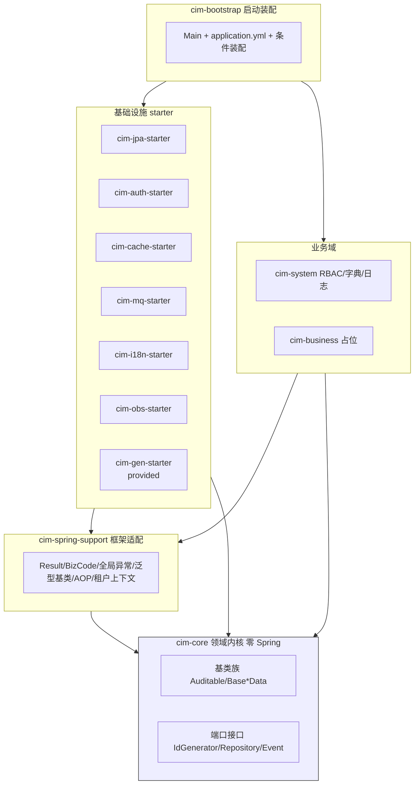
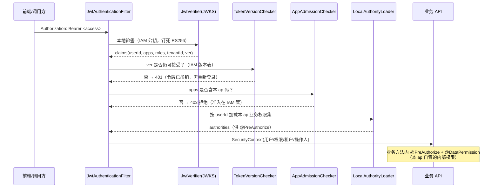

# 后端基础框架（platform/server）详细设计

> 本文件是 [`README.md`](README.md)（架构设计 §1–§25）的**实现级细化**，面向落地编码：给出模块与包结构、逐模块类/接口设计、横切机制、关键契约、数据模型与迁移规范、配置键、与 IAM 的对接边界、质量门禁与关键决策（ADR）。
>
> 定位关系：`README.md` 回答「为什么这样设计（利弊取舍）」，本文件回答「具体怎么实现」。两者冲突时以本文件为准，并回填 README。
>
> 开发排期与任务拆解见 [`plan.md`](plan.md)。


---

## 0. 文档定位与范围

| 项       | 说明                                                                                                            |
| ------- | ------------------------------------------------------------------------------------------------------------- |
| **范围**  | `platform/server` 后端底座：`cim-core` / `cim-spring-support` / 各 `cim-*-starter` / `cim-system` / `cim-bootstrap` |
| **不含**  | `business/{ap}` 业务实现（但含**与 IAM 的对接契约**，见 §8）                                                                  |
| **代码根** | `platform/server/pom.xml`（外层父 POM），12 个模块；详见 [README §1](README.md#1-maven-多模块)                               |
| **包根**  | 统一 `com.cim.*`，模块名与包段一一对应（`cim-jpa-starter` → `com.cim.jpa`）                                                  |
| **产物**  | 每个 starter 打成可被业务 ap 依赖的 jar；`cim-bootstrap` 为可执行 jar                                                         |

**继承的三条硬约束**（来自项目已确认决策，不得违反）：

1. **依赖向内**：业务域 → `cim-core` 接口；基础设施在 starter 中实现端口。`cim-core` 绝不反向依赖业务或基础设施。
2. **IAM 只管准入**：IAM 只判定「用户能否进某 ap」，业务系统内部的菜单/按钮/数据权限由各 ap 自行控制（见 §8）。
3. **每实体一历史表**：有历史的实体各自一张专属历史表（`{X}Hist` / `{X}StateLog`），主/历 DDL 成对迁移。

---

## 1. 总体架构

### 1.1 分层与依赖方向


```mermaid
flowchart TB
  subgraph boot[cim-bootstrap 启动装配]
    MAIN[Main + application.yml + 条件装配]
  end
  subgraph infra[基础设施 starter]
    JPA[cim-jpa-starter] 
    AUTH[cim-auth-starter]
    CACHE[cim-cache-starter]
    MQ[cim-mq-starter]
    I18N[cim-i18n-starter]
    OBS[cim-obs-starter]
    GEN[cim-gen-starter<br/>provided]
  end
  subgraph supt[cim-spring-support 框架适配]
    WEB[Result/BizCode/全局异常/泛型基类/AOP/租户上下文]
  end
  subgraph dom[cim-core 领域内核 零 Spring]
    MODEL[基类族 Auditable/Base*Data]
    PORT[端口接口 IdGenerator/Repository/Event]
  end
  subgraph biz[业务域]
    SYS[cim-system RBAC/字典/日志]
    BIZ[cim-business 占位]
  end
  boot --> infra
  boot --> biz
  infra --> supt
  supt --> dom
  biz --> supt
  biz --> dom
  infra --> dom
  style dom fill:#eef,stroke:#333
```

**依赖规则（由 maven-enforcer 强制）：**

| 模块                            | 允许依赖                                                 | 禁止依赖                             |
| ----------------------------- | ---------------------------------------------------- | -------------------------------- |
| `cim-core`                    | `jakarta.persistence`(spec)、`jakarta.validation`、JDK | Spring、其他 `cim-*`                |
| `cim-spring-support`          | Spring Web/Core、`cim-core`、MapStruct                 | 各 starter、业务域                    |
| `cim-*-starter`               | `cim-spring-support`、`cim-core`、各自技术栈                | 业务域（`cim-system`/`cim-business`） |
| `cim-system` / `cim-business` | `cim-spring-support`、`cim-core`、按需 starter           | 其他业务域循环                          |
| `cim-bootstrap`               | 全部（仅装配）                                              | —                                |

> `cim-core` 的「零 Spring」允许 `jakarta.persistence` 规范注解（`@MappedSuperclass` / `@Id`，见 [README §9](README.md#9-通用数据模型审计基类--分级历史参考成熟实践并优化)）；JPA **实现**（EMF/Repository 实现/Flyway）一律在 `cim-jpa-starter`。这是对 README §1「零 Spring」与 §2「不 import JPA 注解」的调和：**规范注解可入 core，实现与容器依赖不入 core**。

### 1.2 统一包结构约定

```
com.cim.<module>
├── config              # @AutoConfiguration 自动装配入口（starter 专属）
├── <domain>            # 领域/能力语义分包（如 history / tenant / i18n / security）
│   ├── annotation      # 注解
│   ├── aspect          # AOP 切面
│   ├── interceptor     # 拦截器（JPA/Hibernate/MDC）
│   ├── model           # 模型/基类/值对象
│   ├── port            # 端口接口（仅 cim-core）
│   ├── service         # 能力实现
│   └── support         # 工具/辅助
└── META-INF/spring/org.springframework.boot.autoconfigure.AutoConfiguration.imports
```

**命名约定：**

| 类型    | 后缀/前缀                                     | 示例                                          |
| ----- | ----------------------------------------- | ------------------------------------------- |
| 自动装配类 | `*AutoConfiguration`                      | `JpaAutoConfiguration`                      |
| 配置属性  | `*Properties`（`@ConfigurationProperties`） | `CimJpaProperties`                          |
| 端口接口  | 领域名 + 语义                                  | `IdGenerator`、`EventPublisher`              |
| 切面    | `*Aspect`                                 | `HistoryAspect`、`DataPermissionAspect`      |
| 拦截器   | `*Interceptor`                            | `HistoryInterceptor`、`AuditFillInterceptor` |
| 标记/契约 | 语义名                                       | `Auditable`、`Historizable`                  |

---

## 2. 模块详细设计

### 2.1 cim-core（领域内核，零 Spring）

**职责**：放纯领域抽象与端口，保证可单测、可复用、可被业务域与基础设施共同依赖。

**包结构与关键类：**

```
com.cim.core
├── model                          # 基类族（@MappedSuperclass）
│   ├── Auditable                  # 审计字段基类（含 tenantId）
│   ├── BaseDefData                # 定义表基类（id/tenantId/description/@Version/deleted）
│   ├── BaseStateData              # 状态表基类（currentState/stateSince）
│   ├── BaseEventData              # 事件表基类（bizKey/eventType/payload）
│   ├── BaseRevisionData           # 版本基类（revision/active|frozen|archive）
│   └── BaseHistoryData            # 历史表基类（historyId/bizId/opType/opTime/operator/trxId/revision/changeSetJson）
├── history
│   ├── History                    # @History 注解
│   ├── HistoryStrategy            # SNAPSHOT / STATE_LOG / NONE
│   └── Historizable               # 历史表标记接口
├── port
│   ├── IdGenerator                # 时间有序 ID 端口（雪花/UUIDv7）
│   ├── CurrentUserPort            # 当前操作人端口（实现取 SecurityContext）
│   ├── TenantPort                 # 当前租户端口
│   └── EventPublisher             # 领域事件发布端口
├── shared
│   ├── ChangeSet                  # 变更集值对象（字段级 diff）
│   └── PageResult<T>              # 分页值对象（框架无关）
└── event
    └── DomainEvent                # 领域事件基类（进程内）
```

**关键设计：**

- `Auditable` 全部字段用 `LocalDateTime`（对齐开发规范，弃用 `Date`）；主键统一 `String id`（应用层时间有序 ID）。
- `BaseHistoryData` **不含任何业务字段**；业务字段由各实体历史表自己持有（与主表同构）。
- 端口只用接口表达，实现分别在 `cim-jpa-starter`（IdGenerator）、`cim-auth-starter`（CurrentUserPort）等注入。
- 依赖：仅 JDK + `jakarta.persistence`/`jakarta.validation` 规范注解。

### 2.2 cim-spring-support（框架适配）

**职责**：承载「框架无关逻辑下沉」后的 Spring 适配件——统一响应、全局异常、泛型基类、AOP 基础设施、租户上下文、MDC 链路。

**包结构与关键类：**

```
com.cim.spring.support
├── web
│   ├── Result<T>                  # 统一响应（code/msg/data/errors/traceId/timestamp）
│   ├── BizCode                    # 错误码枚举（code + HttpStatus + i18nKey，模块分段）
│   ├── BizException               # 业务异常（携带 i18n 参数）
│   ├── ValidationException        # 参数异常
│   ├── SystemException            # 系统异常（不泄露细节）
│   ├── GlobalExceptionHandler     # @RestControllerAdvice（字段级 errors + traceId）
│   ├── PageQuery                  # 标准分页/排序入参（→ Spring Data Pageable）
│   ├── PageResults                # Spring Data Page → core PageResult 转换
│   └── BaseController<T,ID>       # 泛型 CRUD 控制器基类
├── service
│   └── CrudService<T,ID>          # 通用 CRUD 契约（面向接口，不含 JPA）
├── tenant
│   ├── TenantContext              # ThreadLocal 租户上下文（实现 core TenantPort）
│   ├── TenantResolver             # 租户解析策略接口（Header/域名/用户）
│   ├── HeaderTenantResolver       # 默认实现（请求头）
│   ├── TenantFilter               # 请求入口写入/清理上下文
│   └── TenantProperties           # cim.tenant.*
├── trace
│   ├── TraceContext               # MDC traceId 读写
│   └── TraceIdFilter              # 注入/透传/清理
├── security
│   └── AnonymousCurrentUserPort   # 未接入认证时的兜底操作人
├── event
│   └── SpringEventPublisher       # EventPublisher 的 ApplicationEvent 桥接
├── i18n
│   ├── MessageResolver            # 消息解析端口
│   └── DefaultMessageResolver     # 降级实现（i18n starter 覆盖）
├── util
│   └── JsonUtils                  # 框架内部 JSON（历史变更集/事件载荷）
└── config
    └── SpringSupportAutoConfiguration
```

**关键设计：**

- `Result<T>` / `BizCode` / `GlobalExceptionHandler` 见 [README §4](README.md#4-统一响应与全局异常)；消息经 `MessageResolver` 解析，`cim-i18n-starter` 提供 DB 实现，缺席时降级 `DefaultMessageResolver`。
- **异常分层映射**：业务异常 → 对应 `BizCode` 的 HTTP 状态（如 `DATA_NOT_FOUND` → 404）；校验异常 → 400 + 字段级 `errors`；**未匹配路由 → 404**（`NoResourceFoundException`/`NoHandlerFoundException` 有专用处理器，避免被 `Exception` 兜底成 500）；其余 → 500 + `traceId` + 通用语（不泄露细节）。
- **编译期要求**：`@PathVariable`/`@RequestParam` 未显式命名时依赖方法参数名，故父 POM 必须开 `-parameters`（ADR-9）——缺失会在运行期才爆发为 500。
- `BaseController` + `CrudService` 组成泛型 CRUD 骨架（见 [README §21.3](README.md#213-通用-crud-基类)），业务仅继承；**JPA 侧的 `BaseRepository` / `AbstractJpaService` 因需 Spring Data JPA 依赖，落地在 `cim-jpa-starter`**（本模块不含 JPA，仅依赖 `spring-data-commons` 的分页抽象）。
- `TenantContext` 由 `TenantResolver` 写入，供 JPA 租户过滤器（`cim-jpa-starter`）与审计填充读取。
- 依赖：Spring Web/Core、`spring-data-commons`、`cim-core`、Jackson。

### 2.3 cim-jpa-starter（持久化）

**职责**：多数据库支持、应用层主键、审计填充、分级历史、多租户隔离、JSON 转换、Flyway 多目录。

**包结构与关键类：**

```
com.cim.jpa
├── config
│   ├── CimJpaProperties           # cim.jpa.*（id / history / naming / datasources / flyway）
│   ├── JpaAutoConfiguration       # 自动装配入口（主键/回调/命名/DbCapability/租户启用器）
│   ├── CimMultiDataSourceAutoConfiguration  # 【T1.1 ✅】每库独立 EMF+TxManager+Hikari（动态注册）
│   ├── CimFlywayAutoConfiguration # 【T1.5 ✅】按库型选 db/migration/{vendor}
│   └── LowercaseSnakeNamingStrategy  # 统一小写蛇形 PhysicalNamingStrategy
├── tenant
│   └── TenantFilterApplier        # 【T2.6 ✅】按 TenantContext 启用 Hibernate 租户过滤器
├── id
│   ├── Snowflake                  # 雪花算法（时钟回拨容忍 + 抛异常）
│   ├── ClockBackwardsException    # 时钟回拨异常
│   ├── SnowflakeIdGenerator       # 雪花实现（回拨降级 UUIDv7 + 告警）
│   ├── UuidV7 / UuidV7IdGenerator # UUIDv7 实现
│   └── IdMode                     # SNOWFLAKE | UUIDV7
├── audit
│   ├── SpringEntityLifecycleCallback  # 注入主键 + 填充审计/租户（实现 core 回调）
│   └── LifecycleCallbackRegistrar     # 把回调注册进 cim-core
├── convert
│   ├── AbstractJsonConverter<T>   # AttributeConverter<T,String>（TEXT/CLOB）
│   └── StringMapJsonConverter     # Map<String,Object> 示例
├── db
│   ├── DbCapability               # product / nullsLastByDefault / jsonFn / limit
│   └── DbCapabilities             # 按产品名解析
├── support
│   ├── BeanProperties             # 反射读写 id / historyId
│   ├── BaseRepository<T,ID>       # JpaRepository + SpecificationExecutor
│   └── AbstractJpaService<T>      # 实现 CrudService，写操作触发历史（主键固定 String）
└── history
    ├── OpType                     # I / U / D
    ├── ChangeDetector             # 字段级 diff（include 白名单 / exclude 黑名单）
    ├── HistoryMapper              # 按约定解析历史类 + 同构字段拷贝
    └── HistoryRecorder            # 落 {X}Hist / {X}StateLog（未变更不落）
```

**关键设计：**

- **多库物理隔离（T1.1 落地）**：每个数据库一个 `LocalContainerEntityManagerFactoryBean` + 独立 `PlatformTransactionManager` + 独立 `HikariDataSource` + 独立 `hibernate.dialect`；`AbstractRoutingDataSource` 仅用于同方言读写分离。落地为 `CimMultiDataSourceAutoConfiguration`：读 `cim.jpa.datasources.<name>.*` 后经 `CimDataSourceRegistrar`（`ImportBeanDefinitionRegistrar`）动态注册 `{name}DataSource` / `{name}EntityManagerFactory` / `{name}TransactionManager`，与 Boot 主数据源并行；未配置则空操作。
- **主键**：`IdGenerator`（[README §3](README.md#3-多数据库支持oraclemysqlpostgresql)）在 `@PrePersist` 注入 `String id`；时钟回拨降级 UUIDv7。
- **回调桥接（实现要点）**：基类族的 `@PrePersist`/`@PreUpdate` 定义在 `cim-core`（零 Spring），通过 `EntityLifecycleCallbacks` **静态持有者**把控制权交给 `cim-jpa-starter` 的 `SpringEntityLifecycleCallback`（启动时由 `LifecycleCallbackRegistrar` 注册）。这样既保持核心零 Spring 依赖，又能让 JPA 回调访问 Spring 管理的 `IdGenerator`/`CurrentUserPort`/`TenantPort`。
- **历史（落地要点）**：由服务基类 `AbstractJpaService` 在写操作后调用 `HistoryRecorder` 触发（即 README §21.3 所述「经 DataAp 触发历史」）——`update` 先用 `ChangeDetector` 对「库中旧值 vs 入参新值」做字段级 diff，**未变更则不落历史**；`HistoryMapper` 按约定（`{X}Hist` / `{X}StateLog`，同包同构）解析并拷贝业务字段。落库目标由 `@History` 策略决定（`SNAPSHOT`→`{X}Hist`，`STATE_LOG`→`{X}StateLog`，`NONE`→跳过）。**取舍**：经 `AbstractJpaService` 的写入自动落历史；绕过服务直接 `repository.save()` 则不落（历史以服务为统一入口，代码生成器产出的服务天然继承基类）。关键数据同事务、高频数据走发件箱异步（[README §12](README.md#12-事务与一致性跨库--发件箱)）。
- **租户（T2.6 落地）**：基于 `TenantContext` 开启 Hibernate Filter 自动追加 `tenant_id` 条件，业务零感知。落地为 `TenantFilterApplier`（框架 Bean），由 `AbstractJpaService` 在每个读写方法入口按 `TenantContext.get()` 启用名为 `cimTenantFilter` 的过滤器并注入参数；上下文为空（超管跨租户）时不启用（风险 R6）。**约定**：`@FilterDef`（`cimTenantFilter`，参数 `tenantId`）全局唯一，放在实体包的 `package-info.java`；各租户化实体仅标注 `@Filter(name="cimTenantFilter", condition="tenant_id = :tenantId")`。注：Hibernate **不解析元注解**，故 `@FilterDef`/`@Filter`/`@SQLRestriction` 须直接标注（不能封装成 `@CimTenantFilter` 之类的元注解）。
- **软删唯一约束（T2.5 落地）**：逻辑删除以 `deleted` 布尔列表示；**唯一约束须含 `deleted` 列**（如 `(biz_key, tenant_id, deleted)`），使「一删一活可并存」（同键仅允许一条有效 + 一条已删）。查询侧以 `@SQLRestriction("deleted = false")` 直接标注实体（同上，不可用元注解），使逻辑删除行对业务查询不可见；`AbstractJpaService.remove` 置 `deleted=true` 完成软删。
- **三层版本语义（T2.7 落地）**：① `@Version`（行级乐观锁，Hibernate 自动 +1，不进历史，落在 `BaseDefData`/`BaseStateData`）；② `revision`（业务版本，由发布/归档等业务动作驱动，落在 `BaseRevisionData`）；③ 历史表（`{X}Hist`/`{X}StateLog`，独立变更流水）。三者相互独立、各自演进，已由 H2 用例验证。
- **迁移（T1.5 落地）**：`db/migration/{mysql,oracle,postgresql,dm,h2}` + `common` 多目录（达梦 DM 见 `dm/` 目录，与 Oracle 兼容可复用其脚本）；`CimFlywayAutoConfiguration` 在 `cim.jpa.flyway.enabled=true` 时按当前库产品名选择 `common` + `{vendor}` 目录；生产配合 `ddl-auto=validate`、**主/历 DDL 成对**（见 §6.2）。
  - **域模块自带迁移**（`cim-system` 起）：模块把 DDL 发布在 `classpath:db/migration/system/{vendor}`，并由模块自己的 `FlywayConfigurationCustomizer`**追加**到 locations。追加语义依赖 cim-jpa 侧 customizer 声明 `@Order(HIGHEST_PRECEDENCE)`（它整体改写 locations，必须最先执行）。模块 DDL 由实体元数据导出（见 `db/migration/system/README.md`），不手写。
- 依赖：Spring Data JPA、Hibernate、Flyway、`cim-spring-support`、`cim-core`。

### 2.4 cim-auth-starter（认证与鉴权 · 资源服务器侧）

> ⚠️ **边界（重要）**：本 starter 只做**验证侧**——令牌验签、准入判定、业务 RBAC 鉴权、数据权限。**登录、口令派生、令牌签发/刷新/吊销、JWKS 发布、ap 准入注册**属于 `business/iam-ap/server`。参见 §8。

**包结构与关键类：**

```
com.cim.auth
├── config
│   ├── CimAuthProperties          # cim.auth.*（jwks-uri / app-code / 开关）
│   ├── SecurityAutoConfiguration  # SecurityFilterChain + 无状态会话
│   └── MethodSecurityConfig       # @EnableMethodSecurity
├── token
│   ├── JwksKeyProvider            # 从 IAM JWKS 拉取并缓存公钥（按 kid 轮换）
│   ├── JwtVerifier                # RS256 钉死验签（拒绝 alg 变更）
│   ├── TokenVersionChecker        # ver 版本失效判定（SPI；默认 acceptAll，IAM 侧实现覆盖）
│   └── TokenClaims                # sub/userId/apps/roles/tenantId/ver
├── admission
│   ├── AppAdmissionChecker        # 查 apps claim 是否含本 ap 码 → 否则 403
│   └── AdmissionProperties
├── filter
│   └── JwtAuthenticationFilter    # 验签 → ver 版本失效 → 准入 → 注入 SecurityContext
├── principal
│   └── CimUserPrincipal           # 用户/权限集/租户/操作人 → 供审计取用
├── rbac
│   ├── PermissionEvaluator        # 业务权限码校验（module:res:action）
│   └── LocalAuthorityLoader       # 从本 ap 的 RBAC（cim-system）加载权限集
├── datapermission
│   ├── DataPermission             # @DataPermission 注解
│   ├── DataPermissionAspect       # 织入 Specification（参数绑定，零拼接）
│   └── Scope                      # FACTORY / DEPT / SELF / TENANT
└── support
    └── SecurityContextPortAdapter # 实现 cim-core 的 CurrentUserPort
```

**访问链路（本 ap 一次请求）：**


```mermaid
sequenceDiagram
  participant C as 前端/调用方
  participant F as JwtAuthenticationFilter
  participant J as JwtVerifier(JWKS)
  participant V as TokenVersionChecker
  participant A as AppAdmissionChecker
  participant L as LocalAuthorityLoader
  participant S as 业务 API
  C->>F: Authorization: Bearer <access>
  F->>J: 本地验签（IAM 公钥，钉死 RS256）
  J-->>F: claims(userId, apps, roles, tenantId, ver)
  F->>V: ver 是否仍可接受？（IAM 版本表）
  V-->>F: 否 → 401（令牌已吊销，需重新登录）
  F->>A: apps 是否含本 ap 码？
  A-->>F: 否 → 403 拒绝（准入在 IAM 管）
  F->>L: 按 userId 加载本 ap 业务权限集
  L-->>F: authorities（供 @PreAuthorize）
  F->>S: SecurityContext(用户/权限/租户/操作人)
  Note over S: 业务方法内 @PreAuthorize + @DataPermission<br/>（本 ap 自管的内部权限）
```

**关键设计：**

- **准入与业务权限分离**：`apps` claim 决定「能否进」，本 ap 的 RBAC 决定「进来后能做什么」。
- **JWKS 本地验签**：不每请求回查 IAM；公钥按 `kid` 缓存并支持轮换。
- **令牌版本失效（验证侧）**：`TokenVersionChecker` 用令牌 `ver` claim 判定是否已被吊销——IAM 在改权限 / 改密 / 强制下线后 bump 版本，旧令牌即 401。platform 默认 `acceptAll()` 保持既有行为；版本存储/递增在 IAM（§8.1(g)）。
- **操作人零侵入**：`JwtAuthenticationFilter` 注入的 principal 供 `cim-jpa-starter` 审计填充读取（写库时自动带 `createUser/eventUser`）。
- 依赖：Spring Security、JJWT/Nimbus、Redis（可选，令牌版本/黑名单兜底）、`cim-spring-support`、`cim-core`。

### 2.5 cim-cache-starter（缓存）

```
com.cim.cache
├── config/{CimCacheProperties, CacheAutoConfiguration}      # 配置 + 自动装配（条件装配，无 Redis 降级本地）
├── multi/
│   ├── CacheStore           # 单级存储抽象（L1/L2 共用）
│   ├── CachedValue          # 缓存值信封（value + nullValue 占位标记，区分「查无」与「未命中」）
│   ├── MultiLevelCache      # 核心：L1→L2→DB 读穿 + 互斥重建 + writeBoth 双写容错
│   ├── LocalCaffeineCache   # L1 本地（Caffeine，纳秒级）
│   └── RedisCache           # L2 全局（RedisTemplate，异常吞没降级）
├── guard/                   # 三守卫 + 可选 BloomFilter 增强
│   ├── NullValueGuard       # 防穿透：空结果短 TTL 占位
│   ├── TtlJitter            # 防雪崩：L2 TTL 加 ±percent 随机抖动（maxJitter 封顶）
│   ├── LockProvider         # 互斥重建锁抽象
│   ├── LocalLockProvider    #   ├ 进程内 ReentrantLock.tryLock
│   ├── RedisLockProvider    #   └ 分布式 SETNX（异常降级放行）
│   ├── MutexRebuild         # 防击穿：double-check + 重试等待 + 兜底回源
│   ├── SimpleBloomFilter    # 防穿透增强：BitSet + 双哈希（零额外依赖，无假阴性）
│   └── BloomFilterGuard     # 回源前咨询 BloomFilter；确定不存在则直接短路
├── cluster/                 # 跨节点失效（多实例最终一致）
│   ├── CacheInvalidationEvent          # 失效事件（namespace/key/allEntries）
│   ├── CacheInvalidationBroadcaster    # 广播抽象 + CHANNEL 常量
│   ├── RedisCacheInvalidationBroadcaster # 默认实现：Redis pub/sub
│   └── RedisInvalidationSubscriber     # 订阅端：收到事件清本节点 L1
└── support/
    ├── CacheKeyGenerator    # SpEL 键生成（#p0/#args[i]；格式 {prefix}:{ns}:{key}）
    ├── CacheableCim         # 读缓存注解（value/key/ttl/sync）
    ├── CacheEvictCim        # 写后失效注解（value/key/allEntries）
    ├── BloomFilterProvider  # BloomFilter SPI（业务灌入有效 key 集合）
    ├── CacheableCimAspect   # @Around 拦截，委托 MultiLevelCache.get
    └── CacheEvictCimAspect  # @AfterReturning 拦截，写成功后才失效（Cache-Aside）+ 广播失效事件
```

多级缓存（本地 Caffeine + 可选 Redis），内建三守卫：防穿透（`NullValueGuard` 空值占位）、防击穿（`MutexRebuild` + `LockProvider` 单线程重建）、防雪崩（`TtlJitter` 对 L2 TTL 抖动）。无 Redis / 不可达 / `cim.cache.redis.enabled=false` 时自动降级为仅本地 Caffeine（仍保留三守卫）。见 [README §11](README.md#11-缓存架构)。

**可选增强与跨节点一致（均已在代码落地并有真集成测试）：**

- **BloomFilter 防穿透**（`cim.cache.bloom.enabled=true` 且业务提供 `BloomFilterProvider` Bean 时生效）：回源前若判定 key 确定不存在，直接返回空、绝不查 DB。**要点**：BloomFilter 的语义是「宁可误伤未灌入的有效 key」——故业务必须在启动时**全量灌入**有效 key；且写路径（`@CacheEvictCim` 保存实体后）会调 `MultiLevelCache.recordValidKey(key)` 补录，否则新增实体会被误判穿透。短路时**不写空值占位**（BloomFilter 本身即「不存在的廉价索引」，写占位反而会掩盖后续补录的 key）。
- **跨节点失效**（`cim.cache.cluster.invalidation-enabled`，默认开）：`@CacheEvictCim` 成功后在本地失效的基础上，经 `CacheInvalidationBroadcaster`（默认 Redis pub/sub，L2 已存在则零额外基础设施）广播事件；各节点 `RedisInvalidationSubscriber` 收到后清本节点 **L1**，实现多实例最终一致。需「持久化/可靠投递」的关键失效（权限、字典）可另实现经 §12 发件箱 / §13 MQ 的 broadcaster 变体（绑定同一 `CHANNEL` 即可替换）。

> 注：`CacheKeyGenerator` 的键表达式仅支持位置变量 `#p0`、`#args[i]`、属性 `#args[0].id`；**不支持形参名 `#id`/`#entity.id`**（需编译期 `-parameters`）。未指定 key 时按参数字符串拼接兜底。

### 2.6 cim-mq-starter（消息与发件箱）

> **设计目标**：一套**供应商中立（vendor-neutral）** 的消息 API，屏蔽 Kafka / Pulsar / RabbitMQ 差异；新增任意 MQ（RocketMQ、ActiveMQ、Redis Streams、AWS SQS……）只需实现一个 `MqProvider` SPI，核心代码零改动。发件箱（§12）+ 消费幂等（§16）+ 重试/死信（§13）兜底，系统性解决**消息丢失、重复、乱序**三难题。

#### 2.6.1 分层与「扩展点」在哪里

```
com.cim.mq
├── core/                         # 供应商中立 API 与契约（不依赖任何 MQ SDK）
│   ├── IntegrationEvent          # 集成事件信封：id / type / aggregateId / version
│   │                            #   / payload / occurredAt / headers(traceId,tenantId)
│   ├── MqProducer                # 发送契约：send(event, routingKey)
│   ├── MqConsumer                # 订阅契约：start(handler) + 手动 ack
│   ├── MqAdmin                   # 主题/队列声明、存活探针
│   ├── MqTemplate                # 应用侧唯一门面：send / sendOrdered(event,key) / registerListener
│   ├── ResilientMessageHandler   # 弹性消费：幂等 + 重试 + 死信（包裹用户 handler）
│   └── exception/                # MqSendException / MqConsumeException
├── spi/                          # ★ 扩展点（新增 MQ 的唯一入口）
│   ├── MqProvider                # SPI 根接口：createProducer/Consumer/Admin + metadata
│   ├── ProviderFeatures          # 能力声明：transactional / orderedByKey / delay
│   │                            #   / deadLetter / exactlyOnce（驱动默认值与校验）
│   └── MqProviderFactory         # 按 cim.mq.type 选择实现（ServiceLoader + 注册表）
├── provider/                     # 各 MQ 适配（各自独立模块/依赖，互不传染）
│   ├── kafka/                    # KafkaMqProvider + KafkaProducer/Consumer/Admin
│   ├── pulsar/                   # PulsarMqProvider ...
│   └── rabbit/                   # RabbitMqProvider ...
├── outbox/                       # OutboxRecord / OutboxStore / JdbcOutboxStore / OutboxRelay
├── serialize/                    # EventSerializer（JSON 默认，可选 AVRO/Protobuf）
├── idempotent/                   # IdempotencyStore(Redis) + EventIdempotencyFilter
├── resilience/                   # RetryPolicy / DeadLetterPolicy / CircuitBreaker
├── observability/                # 指标 + W3C traceparent 跨 MQ 传播
└── autoconfigure/                # CimMqProperties / MqAutoConfiguration
```

**扩展点 = `com.cim.mq.spi.MqProvider`**。新增 MQ 的步骤：
1. 新建 `com.cim.mq.provider.<x>/`，实现 `MqProvider`（含 Producer/Consumer/Admin 三个适配类），把该 MQ 的概念（topic/partition/queue/exchange、ack 模式、有序语义）翻译为 `core` 的中立契约。
2. 在 `META-INF/services/com.cim.mq.spi.MqProvider` 注册（ServiceLoader），或经 `MqProviderFactory` 注册表登记；`cim.mq.type=x` 即被选中。
3. 在 `ProviderFeatures` 声明该 MQ 的真实能力（如 Rabbit 的 `orderedByKey=false`，由框架在启动时给出明确约束/告警）。

核心（`core`/`outbox`/`idempotent`/`resilience`）**永不 import 任何 MQ 厂商 SDK**，因此加一种 MQ 不会动到另一家的代码——这就是「易扩展」的落点。

#### 2.6.2 三难题的系统性解法（与 §12/§13/§16 协同）

| 问题 | 根因 | 解法（本框架） | 各 MQ 的关键落点 |
| --- | --- | --- | --- |
| **丢失** | 业务提交但 MQ 未发 / broker 未持久化 / 消费提前 ack | **发件箱(at-least-once) + 强制 ack + 持久化 + 重试** | Kafka `acks=all`+`min.insync.replicas`；Pulsar `durable`+`QoS`；Rabbit `deliveryMode=persistent`+`publisher confirm` |
| **重复** | at-least-once 必然允许重发/重处理 | **消费幂等**（事件级去重）+ 生产端幂等发送 | 消费：`eventId`/`(aggregateId,version)` 去重（§16）；生产：Kafka `enable.idempotence`、Pulsar 序列号去重、Rabbit 靠 outbox+消费去重 |
| **顺序** | 分区/队列打散 | **按 key 分区有序**（`MqTemplate.sendOrdered(event, key)`） | Kafka 按 `aggregateId` 作 partition key；Pulsar 按 key 路由（每 key 保序）；Rabbit 用 consistent-hash exchange 把同 key 落到同队列（单队列内有序） |

- **丢失**：业务与 `outbox` 同本地事务写入（§12）→ `OutboxRelay` 轮询/CDC 投递（at-least-once）→ Producer 侧等 broker **确认 ack** 才标记完成，失败指数退避重试 → 消费侧**处理成功后才手动 ack**（Kafka `enable.auto.commit=false`、Pulsar `ackTimeout`+nack、Rabbit `basic.ack` 后置）。三段叠加做到「不丢」。
- **重复**：「不丢」靠 at-least-once，必然带来重复 → 必须靠消费幂等收口。消费前置 `EventIdempotencyFilter`：以 `IntegrationEvent.id`（即 outbox 的 `msg_id`）查 `IdempotencyStore`（Redis，带 TTL），命中即跳过；状态类事件改用 `(aggregateId, version)` 乐观去重。二者复用 §16 的幂等基础设施。**「精确一次」= at-least-once 投递 + 幂等消费**。
- **顺序**：`MqTemplate.sendOrdered(event, key)` 透传 `aggregateId` 作为路由键；由 `MqProvider` 翻译成各 MQ 的有序机制（上表）。`ProviderFeatures.orderedByKey=false` 的 MQ（如原生 Rabbit）走 consistent-hash exchange 兜底，并在配置期校验「需要顺序的 topic 不得落到无序 provider」。

#### 2.6.3 与现有契约的关系

- 领域事件（`cim-core` 的 `DomainEvent`/`EventPublisher`，进程内）继续走 `ApplicationEvent`；需要跨服务的，由 `OutboxIntegrationEventPublisher` 落 `outbox` → 经本 starter 投递为**集成事件**。
- 重试/熔断复用 §13 的 Resilience4j；消费幂等复用 §16 的 `@Idempotent`/Redis 去重表；追踪复用 §14 的 OTel，`traceparent` 经 `MqTraceInterceptor` 注入消息头、消费端重建。

> 📘 **使用指南（面向业务 ap 接入）**：如何打包、引入依赖、配置、发送/消费集成事件、切换 MQ、扩展新 MQ 与运维排查，见 [`cim-mq-starter-usage.md`](cim-mq-starter-usage.md)。

### 2.7 cim-i18n-starter（国际化）

```
com.cim.i18n
├── config/{CimI18nProperties, I18nAutoConfiguration}
├── model/{SysLocale, SysI18n}        # locale/i18n 两表（scope: SYSTEM/USER）
├── source/{DatabaseMessageSource, I18nCache}   # DB 驱动 + Redis 缓存
├── seed/{I18nSeedLoader}             # 启动种子写入系统级文案
└── web/{LocaleResolverCim, LocaleHeaderFilter}
```

- 全量文案入库（热更新，免发版）；`SYSTEM` 系统级种子写入、`USER` 用户级后台维护。
- Spring `MessageSource` 由 DB 版实现，`@Valid`/异常消息零改造命中 DB（[README §7](README.md#7-国际化全量数据库驱动--系统级--用户级)）。

### 2.8 cim-obs-starter（可观测）

```
com.cim.obs
├── config/CimObsProperties            # cim.obs.*（enabled / metrics / logging / trace）
├── config/ObsAutoConfiguration        # 指标门面 + 公共标签 MeterFilter（条件装配）
├── metrics/MetricsRegistry            # 业务指标门面（自动加 cim. 前缀 + 公共标签）
├── logging/SensitiveDataMasker        # 手机号/邮箱/身份证/银行卡/口令 脱敏（静态）
├── logging/MaskedMessageConverter     # Logback 转换器（%maskedMsg 脱敏落盘）
└── trace/OtelTracingConfig            # OTel 链路桥接（条件激活，缺依赖时整体不加载）
```

指标（Prometheus）/链路（OTel）/结构化日志（见 [README §14](README.md#14-可观测性指标--链路--日志)），日志按三层分离（技术/操作/登录，见 [§24](README.md#24-日志与审计操作日志--登录日志--链路追踪)）并脱敏。

**T4.4 落地要点**：
- 指标：`MetricsRegistry` 封装 `MeterRegistry`，统一 `cim.` 前缀；`commonTags` 经 `MeterFilter` 注入（真实运行态由 actuator 的 `MeterRegistryConfigurer` 套用到所有注册表）。`/actuator/prometheus` 由 actuator 直接暴露。
- 日志脱敏：`SensitiveDataMasker` 为纯静态工具（手机号/邮箱/身份证/银行卡 + `key=value` 形式口令令牌），可供应用代码与 `MaskedMessageConverter`（Logback `%maskedMsg`）共用，确保「日志无敏感信息」。
- 链路：`OtelTracingConfig` 仅当 `io.micrometer.tracing.Tracer` 在 classpath 时激活；离线沙箱无链路依赖，链路由 `cim-spring-support` 的 `TraceContext`(MDC traceId) 兜底。

### 2.9 cim-gen-starter（代码生成器，`provided`）

```
com.cim.gen
├── meta/{MetadataReader, TableMetadata, ColumnMetadata}   # 元数据单一事实源
├── plan/{GenPlan, PairPlanner}                            # 主表+历史表成对计划
├── tpl/{TemplateEngine, TemplateResolver}                 # Velocity/FreeMarker，项目可覆盖
├── emit/{DiffPrinter, SourceEmitter, AstFieldAppender}    # dry-run + 落盘 + AST 增量
├── mojo/CimGenMojo                                       # mvn cim:gen
└── ci/{HistoryPairCheck, HistoryColumnCoverageCheck}      # CI 守卫
```

- 全链路成对产出：主实体 + 历史实体 + 主/历 DDL + Flyway + DTO + Service + Controller + 前端骨架（[README §25](README.md#25-代码生成器设计)）。
- **一次生成、人工接管**；后续变更走 AST 增量追加；`/* region biz */` 手写区永不覆盖；dry-run 预览 diff。
- **CI 守卫**：迁移中 `ALTER {X}` 必须同步 `{X}_hist`，否则构建失败。

### 2.10 cim-system（系统域 · 业务内置模块）【T6.x 已落地 ✅】

**职责**：RBAC 与平台内置功能的**数据落地**（本 ap 的内部权限来源），并提供
`LocalAuthorityLoader` 的实现端。

```
com.cim.system
├── autoconfigure/{CimSystemConfiguration, CimSystemProperties, CimSystemFlywayConfiguration}
├── rbac/{SysRbacService, DbLocalAuthorityLoader, LocalUserResolver, ResolvedAuthorities, SysMeController}
├── user/{SysUser, SysUserHist, SysUserRepository, SysUserService, SysUserController}
├── role/{SysRole, SysRoleHist, SysRoleRepository, SysRoleService, SysRoleController,
│         SysUserRole, SysRolePerm, SysRoleMenu (+各自 Repository)}
├── menu/{SysMenu, SysMenuHist, MenuType, MenuNode, MenuTrees, SysMenuRepository, SysMenuService, SysMenuController}
├── permission/{SysPermission, SysPermissionHist, SysPermissionRepository, SysPermissionService, SysPermissionController}
├── dict/{SysDict, SysDictItem (+Hist), SysDictRepository, SysDictItemRepository, SysDictService, SysDictItemService, SysDictController}
├── config/{SysConfig, SysConfigHist, SysConfigRepository, SysConfigService, SysConfigController}
├── log/{OperationLog, LoginLog (+Repository/Service), @OperationLogged + OperationLogAspect, SysLogController}
└── support/{EnableStatus, PermissionCodes}
```

- RBAC 三级：用户→角色→权限；菜单（导航）与权限（API/按钮）分离，`SYS_ROLE_MENU` 关联（[README §21.1](README.md#211-rbac-权限模型)）。
  权限码规范 `module:res:action`，常量集中在 `support/PermissionCodes`；服务方法上以
  `@PreAuthorize("hasAuthority('sys:user:list')")` 消费。
- **`sys_user` 是「授权档案」而非账号表**：**不含口令列**。认证（口令 / 令牌签发）属
  `business/iam-ap` + AD/LDAP；本表只回答「这个已认证身份在本 ap 有哪些角色」，对齐键为
  `external_id`（IAM 令牌 `sub`，优先）或 `username`（AD 账号）。
- **`LocalAuthorityLoader` 实现**：`DbLocalAuthorityLoader`（认证链路位置见 §8）。
  `is_super` 角色短路＝下发 `SUPER_ADMIN` **并**展开全量启用权限码——因为 `hasAuthority(...)`
  不认识超管标记，只给标记会让超管过不了方法级鉴权。
  未建档/未授权时按 `cim.system.rbac.fallback-to-claims` 决定回退令牌 claim 还是拒绝（默认拒绝）；
  用户被明确停用时**恒拒绝**。
- **装配方式（重要，与 starter 的分界）**：本模块是**业务域模块**，
  用**组件扫描**生效（宿主 `@SpringBootApplication(scanBasePackages="com.cim")` 即覆盖），
  **不写** `META-INF/spring/...AutoConfiguration.imports`。判据是「加依赖得到一整套后台管理域」
  还是「加依赖得到可插拔横切能力」。
- **模块自带 schema 与扫描根**：`@EntityScan/@EnableJpaRepositories(basePackages="com.cim")`
  由 `CimSystemConfiguration` 声明（宿主无需再配）；迁移脚本随模块发布在
  `db/migration/system/{mysql,postgresql,oracle,dm,h2}`，由 `CimSystemFlywayConfiguration`
  追加为 Flyway location（**追加**语义依赖 cim-jpa 侧 customizer 的 `@Order(HIGHEST_PRECEDENCE)`）。
  DDL 由 `tool/DdlExportTest` 从实体元数据导出，杜绝主/历表漂移（见 `db/migration/system/README.md`）。
- **变更即时生效（T6.5 验收）**：`DbLocalAuthorityLoader` **每请求从库解析、不缓存**，
  故授权变更与用户停用在**同一枚令牌的下一次请求**即生效（无需等令牌过期/重签）。
  这正是 T6.5「变更即时生效」的即时性来源；若将来改为按令牌版本缓存权限，须同时接入
  §2.4 的 `TokenVersionChecker` 作为缓存失效信号（二者成对使用）。
- 依赖：`cim-core`、`cim-spring-support`、`cim-jpa-starter`、`cim-auth-starter`、`spring-boot-starter-web/aop`。
- 验证：`cim-system` 模块测试 16 用例（H2 真跑 Flyway + `ddl-auto=validate`）覆盖
  三级授权、`is_super` 短路、停用拒绝、未建档双策略、**变更即时生效（授权/收权/停用）**、
  菜单树与按钮过滤、方法级越权被拒、自动落历史。

> **与 IAM 的边界（勿混）**：本模块**不做**统一登录、口令校验、令牌签发/吊销、跨 ap 准入。
> 准入与统一登录在 `business/iam-ap`；本 ap 侧只做「验签 + 准入 claim 判定 + 业务鉴权」，
> 详见本文档 §8「IAM 对接边界」与 [README §5 安全认证](README.md#5-安全认证jwt--spring-security)。

### 2.11 cim-business（业务域占位）

按业务域孵化，每个域自包含 `controller→service→repository→entity`（[README §1](README.md#1-maven-多模块)）。当前仅占位标记类；业务实现落在各 `business/{ap}` 工程。

### 2.12 cim-bootstrap（启动装配）

```
com.cim.bootstrap
├── CimApApplication               # @SpringBootApplication(scanBasePackages="com.cim")
└── (可选) assembly/                # 按 profile 的额外装配

src/main/resources/
├── application.yml                # 开发/演示可跑配置（H2 内存库 + Flyway + cim.* 默认值）
├── application.yml.example        # 生产配置模板（MySQL/PG/DM 等）
└── db/migration/{vendor}          # 平台基线迁移（各域模块的迁移由模块自带，见 §2.10）
```

- **唯一可执行模块**：含启动类与 `spring-boot-maven-plugin` 的 `repackage`；其余模块都是被依赖的库 jar。
- **当前装配**：`cim-spring-support` + web + actuator + `cim-jpa-starter` + `cim-auth-starter` + `cim-system`（域模块）。
- **数据源必需**：引入域模块后，实体/仓储与 Flyway 都要落到真实库上；`application.yml` 默认 H2 内存库，
  生产按 `application.yml.example` 切换。启动冒烟由 `BootstrapAssemblyTest` 覆盖
  （上下文加载 + 关键 Bean + 健康端点 + 401/404 语义）。
- 只做装配：按需引入 starter 与域模块；不含业务代码。
- 前端构建不在此驱动（一套仓库两套构建体系，CI 并行）。

---

## 3. 横切机制设计

| 机制       | 载体                                       | 切入点                                          | 关键类                                             |
| -------- | ---------------------------------------- | -------------------------------------------- | ----------------------------------------------- |
| 统一响应/异常  | `cim-spring-support`                     | `@RestControllerAdvice`                      | `Result`、`BizCode`、`GlobalExceptionHandler`     |
| 审计填充     | `cim-jpa-starter`                        | `@PrePersist/@PreUpdate` + `CurrentUserPort` | `AuditableEntityListener`                       |
| 分级历史     | `cim-jpa-starter`                        | 写操作拦截 + 变更检测                                 | `HistoryInterceptor`、`ChangeDetector`           |
| 多租户      | `cim-spring-support` + `cim-jpa-starter` | Hibernate Filter                             | `TenantContext`、`TenantFilterAspect`            |
| i18n     | `cim-i18n-starter`                       | `MessageSource`                              | `DatabaseMessageSource`                         |
| 缓存       | `cim-cache-starter`                      | `@CacheableCim` + 多级                         | `MultiLevelCache`                               |
| 消息/发件箱   | `cim-mq-starter`                         | 事件发布 + 中继                                    | `OutboxRelay`                                   |
| 可观测      | `cim-obs-starter`                        | 过滤器/切面                                       | `TraceContextFilter`、`SensitiveDataMasker`      |
| 限流/幂等/并发 | `cim-spring-support`(+Redis)             | `@RateLimit`/`@Idempotent`/`@Version`        | 对应切面（[README §16](README.md#16-限流--幂等--并发控制)）   |
| 认证/鉴权    | `cim-auth-starter`                       | Servlet Filter + 方法安全                        | `JwtAuthenticationFilter`、`PermissionEvaluator` |
| 数据权限     | `cim-auth-starter`                       | `@DataPermission` + Specification            | `DataPermissionAspect`                          |

---

## 4. 关键契约（接口级）

### 4.1 统一响应与错误码

```java
public record Result<T>(int code, String msg, T data,
                        Map<String,String> errors, String traceId, long timestamp) { }

public enum BizCode {
    // 模块分段：1000 用户/权限，2000 业务，3000 集成，9000 系统
    USER_NOT_FOUND(1001, HttpStatus.NOT_FOUND, "biz.user.notFound"),
    PARAM_INVALID(1002, HttpStatus.BAD_REQUEST, "biz.param.invalid"),
    NO_ADMISSION (1403, HttpStatus.FORBIDDEN,   "biz.auth.noAdmission");
    public final int code; public final HttpStatus http; public final String i18nKey;
}
```

### 4.2 主键端口

```java
public interface IdGenerator { String nextId(); }   // 实现：雪花（回拨降级 UUIDv7）/ UUIDv7
```

### 4.3 审计与历史基类

见 [README §9](README.md#9-通用数据模型审计基类--分级历史参考成熟实践并优化)：`Auditable` → `BaseDefData`/`BaseStateData`/`BaseEventData`/`BaseRevisionData`；历史表基类 `BaseHistoryData`（独立 `historyId` 主键，避免复合主键并发冲突）。

### 4.4 注解契约

```java
@History(SNAPSHOT|STATE_LOG|NONE, include={})   // 历史策略（cim-core）
@DataPermission(Scope.FACTORY)                  // 数据权限（cim-auth-starter）
@AuditLog(action=..., module=...)               // 操作审计（cim-spring-support/cim-obs）
@RateLimit(key=..., permits=..., window=...)    // 限流（cim-spring-support）
@Idempotent(key=..., ttl=...)                   // 幂等（cim-spring-support）
```

### 4.5 当前用户/租户端口

```java
public interface CurrentUserPort { String userId(); String username(); Set<String> authorities(); }
public interface TenantPort { String tenantId(); }
// 实现分别在 cim-auth-starter / cim-spring-support，cim-core 仅声明
```

---

## 5. 自动装配与可插拔

- 每个 starter 在自己的 `META-INF/spring/...AutoConfiguration.imports` 注册 `@AutoConfiguration`。
- 统一用 `@ConditionalOnProperty`（`cim.<cap>.enabled`）+ `@ConditionalOnClass` + `@ConditionalOnMissingBean`，缺省即可降级、业务可覆盖（[README §8](README.md#8-可插拔架构高度灵活)）。
- 策略接口（`TenantResolver` / `IdGenerator` / `EventPublisher` / `FileStorage` / `CacheProvider`）通过 `cim.<cap>.mode` 选择实现。
- 事件驱动解耦：审计/通知/日志走 `ApplicationEvent`，监听器可异步、可禁用。

**装配开关一览（默认值即「开箱可用」）：**

| 配置前缀        | 能力        | 默认                           |
| ----------- | --------- | ---------------------------- |
| `cim.jpa`   | 持久化/多库/历史 | 有数据源即启用                      |
| `cim.auth`  | 认证/鉴权     | `enabled=true`               |
| `cim.cache` | 多级缓存      | `enabled=true`（无 Redis 降级本地） |
| `cim.i18n`  | 数据库 i18n  | `enabled=true`               |
| `cim.mq`    | 消息/发件箱    | `enabled=false`（按需开）         |
| `cim.obs`   | 可观测       | `enabled=true`               |
| `cim.gen`   | 代码生成      | `provided`，运行时不存在            |

---

## 6. 数据模型与迁移规范

### 6.1 命名规范

| 对象        | 规范                                                                                        | 示例                    |
| --------- | ----------------------------------------------------------------------------------------- | --------------------- |
| 表名        | 小写蛇形（`PhysicalNamingStrategy` 统一）                                                         | `equipment_def`       |
| 主表        | 业务名                                                                                       | `equipment_def`       |
| 快照历史表     | `{X}Hist`                                                                                 | `equipment_def_hist`  |
| 状态流水表     | `{X}StateLog`                                                                             | `equipment_state_log` |
| 审计列       | `create_time/create_user/event_time/event_user/event_name/event_comment/trx_id/tenant_id` | —                     |
| 历史列       | `history_id/biz_id/op_type/op_time/operator/trx_id/revision/change_set_json/tenant_id`    | —                     |
| 唯一约束（含软删） | `(biz_key, tenant_id, deleted)`                                                           | —                     |

### 6.2 主/历成对迁移（强约束）

- 每次 `CREATE/ALTER {X}` 必须在**同一迁移文件**内含 `{X}Hist`（或 `{X}StateLog`）对应 DDL。
- 由 `cim-gen-starter` 生成时天然成对；人工变更由 CI 守卫拦截（见 §7）。
- Flyway 目录：`platform/server/cim-bootstrap/src/main/resources/db/migration/{mysql,oracle,postgresql,dm}`；业务 ap 各自维护自己的迁移目录（达梦 DM 与 Oracle 兼容，可复用其脚本或独立 `dm/` 目录）。

### 6.3 三层版本语义

`@Version`（行级乐观锁，不进历史） / `revision`（`BaseRevisionData` 业务版本） / `history`（审计轨迹）—— 三者严格分离（[README §9](README.md#9-通用数据模型审计基类--分级历史参考成熟实践并优化)）。

---

## 7. 质量门禁

| 门禁    | 手段                                           | 触发           |
| ----- | -------------------------------------------- | ------------ |
| 架构守卫  | ArchUnit：依赖方向、`cim-core` 零 Spring、禁止跨层       | 单元测试         |
| 依赖收敛  | maven-enforcer：BOM 版本、依赖树冲突、`provided` 不进生产包 | `mvn verify` |
| 历史成对  | CI 检查 `ALTER {X}` 必含 `{X}_hist`              | 流水线          |
| 历史列覆盖 | 启动自检：历史表列覆盖主表（§9.8 机制④）                      | 应用启动         |
| 契约稳定  | SpringDoc 契约快照 + 兼容性校验                       | CI           |
| 测试金字塔 | 单测（core）→ 切片（starter）→ 集成（Testcontainers 多库） | `mvn verify` |
| 安全    | 依赖漏洞扫描、算法钉死用例、口令派生用例                         | CI           |
| 覆盖率   | `cim-core`/`cim-spring-support` 行覆盖阈值        | JaCoCo       |

---

## 8. 与 IAM 的对接边界（跨 ap 认证准入）

> 承接项目决策：`business/iam-ap` 承载统一登录与跨业务准入；**platform 只做验证与业务鉴权**。本节明确两侧职责。

| 能力                                                                | 归属                                    | 说明                                                         |
| ----------------------------------------------------------------- | ------------------------------------- | ---------------------------------------------------------- |
| 企业内登录（LDAP/AD 对接）                                                 | `business/iam-ap`                     | 员工身份由 AD 托管，IAM 不重建目录（M-login 首批已落地：local 模式 + LDAP/AD 适配器 + 口令两层派生，见 README §4(d)(e)，2026-10-08）                                      |
| 口令前端加密 + 服务端二次派生（[README §5.1](README.md#51-登录口令前端加密传输--服务端二次派生)） | `business/iam-ap`                     | platform 不实现登录口令流程（M-login 首批已落地：本地凭证 + PBKDF2 两层派生，见 README §4(e)，2026-10-08）                                         |
| 令牌签发（RS256）/ 刷新轮换 / 即时吊销                                          | `business/iam-ap`                     | 认证中心持私钥；JWT claim 含 `apps`（可进入 ap 列表）、`roles`（ap 内粗角色组，可选） |
| JWKS 公钥发布                                                         | `business/iam-ap`                     | platform 侧按 `kid` 拉取并缓存                                    |
| ap 注册/准入管理                                                        | `business/iam-ap`                     | 新增 mds-ap/mes-ap 时纳入并下发准入                                  |
| **令牌本地验签（RS256 钉死）**                                              | **platform `cim-auth-starter`**       | 用 IAM JWKS 公钥，不每请求回查                                       |
| **准入判定（`apps` claim）**                                            | **platform `cim-auth-starter`**       | 不含本 ap 码 → 403                                             |
| **本 ap 内部权限（菜单/按钮/数据）**                                           | **platform RBAC（`cim-system`）+ 各 ap** | `@PreAuthorize` + `@DataPermission`，各 ap 自管                |

**关键结论：** IAM 的「刀」止于**准入判定**；进入 ap 后的一切权限判定由本 ap 用 `cim-auth-starter` + `cim-system` 完成。platform 的 `cim-auth-starter` 因此不含登录/口令/签发，只含**验证 + 准入 + 业务鉴权**——这是对 [README §5](README.md#5-安全认证jwt--spring-security) 的落地重定位（§5 的登录部分属 `iam-ap`）。

### 8.1 IAM 令牌契约（platform 侧冻结只读）

> **T3.8 交付物**：以下契约由 `business/iam-ap` 签发时填充，platform `cim-auth-starter`（§2.4）仅消费、不修改。
> 任何破坏性变更须经契约评审（全局门禁「契约」），并同步改 `JwtClaimKeys` 与本节。冻结点见 `plan.md` M3 看板。

**(a) 签名算法（钉死）**

- 仅接受 `alg=RS256`。`cim-auth-starter` 在**解析头部阶段**即拒绝非 RS256 的 `alg`（含 `none` / `HS256` 等算法混淆攻击）。
- 公钥来自 IAM 的 **JWKS**（按 `kid` 匹配，本地缓存 + TTL，支持密钥轮换）。私钥仅存于 IAM 认证中心。

**(b) 头部字段**

| 字段    | 必填 | 说明                                   |
| ----- | -- | ------------------------------------ |
| `alg` | 是  | 固定 `RS256`                            |
| `kid` | 是  | JWKS 公钥标识，用于按 `kid` 取对应 RSA 公钥         |
| `typ` | 否  | 建议 `JWT`                             |

**(c) Payload（claim）结构**

| claim 键      | Java 常量（`JwtClaimKeys`）         | 类型          | 必填 | 平台侧语义                                              |
| ----------- | ----------------------------- | ----------- | -- | ------------------------------------------------- |
| `uid`       | `USER_ID`                     | `String`    | 否* | 用户 ID；缺省回退到 `sub`                                  |
| `uname`     | `USERNAME`                    | `String`    | 否* | 用户名；缺省回退到 `sub`                                    |
| `apps`      | `APP_CODES`                   | `Set<String>` | 是  | 可进入的 ap 接入码列表（**准入依据**）                           |
| `roles`     | `ROLES`                       | `Set<String>` | 否  | ap 内粗角色组（如 `ADMIN`/`OPERATOR`），可选，业务内部权限建议用 `authorities` |
| `tenantId`  | `TENANT_ID`                   | `String`    | 否  | 租户 ID（多租户隔离 / 数据权限依据）                             |
| `authorities` | `AUTHORITIES`               | `Set<String>` | 否  | 本 ap 业务权限集，格式 `module:res:action`（供 `@PreAuthorize` 鉴权） |
| `ver`       | `VERSION`                     | `Long`      | 否  | 令牌版本号，用于本地吊销 / 权限失效判定（与 IAM 黑名单/版本表比对）              |
| `jti`       | `JTI`                         | `String`    | 否  | 令牌唯一标识（UUID）；用于「按 jti 主动吊销 / 登出」（IAM 写入黑名单后，验证端命中即 401，见 §8.1(h)）。旧令牌无 `jti` 时验证端放行（由版本机制兜底） |
| `sub`/`exp`/`iat` | —                     | 标准          | 标准 | 标准 JWT 字段；`exp` 过期自动拒签（→ 401）                       |

\* `uid`/`uname` 缺失时回退 `sub`；两者与 `sub` 同时缺失视为非法令牌。

**(d) JWKS 地址约定**

- IAM 在固定路径发布：`{iam-base-url}/.well-known/jwks.json`（遵循 RFC 7517/8414 风格）。
- 消费方通过 `cim.auth.jwks-uri` 配置指向该地址（配置键定义见 `CimAuthProperties` javadoc 与 `cim-bootstrap/application.yml.example`）。
- 公钥按 `kid` 缓存，`cim.auth.jwks-cache-minutes`（默认 60）到期重新拉取以支持轮换。

**(e) ap 接入码（app-code）约定**

- 每个业务 ap 有唯一接入码：当前 `mds-ap`、`mes-ap`；IAM 侧 `apps` 注册表集中维护。
- 消费方通过 `cim.auth.admission.app-code` 声明本 ap 码；`cim-auth-starter` 校验令牌 `apps` claim 是否含该码，**不含 → 403**。
- `cim.auth.admission.enabled=false` 时跳过准入（仅本地调试用）。

**(f) 平台侧权限映射**

- `roles` → `CimUserPrincipal.getAuthorities()` 之 `ROLE_*` 前缀项（弹簧安全角色）。
- `authorities` → `CimPermissionEvaluator.hasPermission(...)` 的业务权限判定源（超管 `SUPER_ADMIN`/`ROLE_SUPER` 短路）。
- `tenantId` → 数据权限 `Scope.TENANT` 过滤依据；`ver` → 本地失效判定。**注意**：版本号比对属
  `cim-auth-starter`（验证侧），**不在** `cim-system`——`cim-system` 只负责本 ap 内部授权数据，
  签发与吊销归 `business/iam-ap`（见 §8 边界表）。

**(g) 令牌版本失效（`ver`）的落点**

- **验证端**：`cim-auth-starter` 的 `TokenVersionChecker` SPI——在 `JwtAuthenticationFilter` 内于验签之后、准入之前调用；不可接受 → 401。
- **默认实现**：`TokenVersionChecker.acceptAll()`（不校验版本），经 `@ConditionalOnMissingBean` 注册，接入方提供 Bean 即覆盖——与 `LocalAuthorityLoader` 同一套让位机制。
- **存储/递增端**（`business/iam-ap`）：管理动作（改权限/改密/强制下线）后 bump 该用户版本；建议以本地缓存 + TTL 暴露给验证端，避免每请求回查 IAM（§8.1(a)）。
- **与「权限即时生效」的分工**：本 ap 业务权限由 `DbLocalAuthorityLoader` 每请求从库解析（不缓存），故授权变更本就在下一次请求即时生效；版本机制用于**主动作废已签发令牌**，或将来按版本缓存权限时的失效信号。
- **落地状态（2026-10-08）**：存储/递增 + 下发已落在 `business/iam-ap/server` 的 `token` 包（`TokenVersion` 实体 + `TokenVersionService.bump/currentVersion` + `TokenVersionController` 暴露 `GET /api/v1/internal/token-version?uid=` 与 `POST .../bump?uid=`）；验证端桥接 `IamTokenVersionChecker`（位于 `cim-auth-starter`，按 `cim.auth.token-version.iam-base-url` 配置接入，fail-open）已就绪。业务 ap 接入时只需配 `cim.auth.token-version.iam-base-url` 指向 IAM 即可启用版本失效。

**(h) 令牌黑名单（`jti`）的落点**

- **用途**：无状态 JWT 到过期前天然「不死」。版本机制（§8.1(g)）可让某用户**全部**已签发令牌失效（改权限/改密/踢人场景）；但「只杀当前这一条访问令牌」（典型如用户登出当前设备）需要更精细的机制——IAM 把该令牌的 `jti` 写入黑名单，验证侧在版本判定之后、准入之前查询，命中即 401。
- **验证端**：`cim-auth-starter` 的 `TokenBlacklistChecker` SPI（与 `TokenVersionChecker` 同一套「接口 + 默认 `acceptAll()` + `@ConditionalOnMissingBean` 让位」模式）——在 `JwtAuthenticationFilter` 内于验签之后、版本判定之后、`apps` 准入之前调用；不可接受（已拉黑）→ 401。
- **默认实现**：`TokenBlacklistChecker.acceptAll()`（不查黑名单，保持「未接入 IAM 黑名单」时既有行为不变）；`IamTokenBlacklistChecker`（按 `cim.auth.token-blacklist.iam-base-url` 配置接入，GET `{iam-base-url}{endpoint}?jti=` 比对，本地 TTL 缓存，IAM 不可达 fail-open 放行）顶替之。
- **存储/拉黑端**（`business/iam-ap`）：`BlacklistedToken`（`token_blacklist` 表，`jti` 唯一）+ `TokenBlacklistService.revoke/isRevoked` + `TokenBlacklistController.GET /api/v1/internal/token-blacklist?jti=` 返回 `true/false`。`LoginService.logout` 解析当前访问令牌 `jti+uid` → 拉黑该 `jti` + bump 用户版本（兜底）+ 撤销刷新令牌，实现「登出即杀当前会话、并兜底杀其余存量令牌」。
- **与版本机制的关系**：两者互补。黑名单精细（单条令牌），版本粗放（用户级全量）。登出通常同时做「拉黑当前 `jti` + bump 用户版本」。
- **⚠️ 装配顺序约束（2026-10-08 修复）**：`SecurityAutoConfiguration` 中 `iamTokenBlacklistChecker` / `iamTokenVersionChecker`（具体实现，按属性 `cim.auth.token-*.iam-base-url` 启用）必须**声明在**默认 `acceptAll` Bean **之前**，且默认 Bean 仅用 `@ConditionalOnMissingBean` 兜底（不再叠加 `@ConditionalOnProperty(havingValue="", matchIfMissing=true)`）。原因：原默认 Bean 的 `@ConditionalOnProperty(havingValue="", matchIfMissing=true)` 在「属性已配置且为 truthy 值（真实 URL）」时同样成立，会与具体 Bean 同时命中；靠「具体 Bean 先注册 + 默认 Bean 的 `@ConditionalOnMissingBean` 兜底」才能保证「有 IAM 实现则用之、否则放行」。该缺陷曾导致「配了 IAM 黑名单/版本端点却仍走 acceptAll」的隐蔽 bug（端到端测试 `SessionIntegrationTest` 暴露）。
- **⚠️ 缓存 TTL 交互**：`IamTokenBlacklistChecker` 对 `jti` 查询结果做本地 TTL 缓存（默认 5 分钟）。若某令牌在「被拉黑前的瞬间」曾通过校验并被缓存为「未吊销」，则在 TTL 内仍会被判为可接受；这是 fail-open 缓存的固有窗口，生产环境按安全需要调小 `cim.auth.token-blacklist.cache-minutes`（如数秒级）。登出请求本身会先以「未吊销」状态校验当前令牌、再执行拉黑，故此窗口对「登出即时失效」影响有限（版本 bump 仍兜底）。
- **落地状态（2026-10-08）**：存储/拉黑 + 下发已落 `business/iam-ap/server` 的 `token` 包；验证端 `IamTokenBlacklistChecker` 已就绪并修正装配顺序；端到端由 `iam-ap` 的 `SessionIntegrationTest` 验证（真实端口启动 IAM，验证侧 `jwks-uri` 与 `token-blacklist.iam-base-url` 指向 IAM 自身，跑通「登录 → 刷新轮转 → 登出拉黑 → 验证侧 401 拒绝」全链路）。

**(i) 登录失败锁定（暴力破解防护）的落点**
- **用途**：无状态登录若无限次尝试，弱口令账户可被暴力破解。连续失败达阈值即锁定账户一段时间，是标准防护手段。
- **边界归属**：失败计数与锁定状态属于 IAM 的「登录」职责（边界②），由 `business/iam-ap` 持有（`account_lock` 表 + `AccountLockService`）；platform 不直接参与，保持「验证侧只验签/准入」的边界（与 §8.1(g)(h) 同构：存储/判定在 IAM，验证侧按需桥接）。
- **逻辑**：`LoginService.login` 进入即 `isLocked(username)` 预检（已锁定 → 抛 `ACCOUNT_LOCKED`(1004)，不区分用户是否存在）；认证失败 `onFailure(username)`（窗口内累计，达 `maxAttempts` 锁定 `lockMinutes`）；成功 `onSuccess(username)`（清零计数）。**滑动窗口**：`firstFailAt + windowMinutes < now` 时历史失败清零，避免旧失败永久累计。
- **配置**：`cim.iam.auth.lockout.{max-attempts=5, lock-minutes=15, window-minutes=15}`（设值均强制 `>= 1`）。
- **与版本/黑名单的关系（三者正交）**：锁定是「登录入口」防护，作用于认证之前、刷新/登出路径不受影响；版本+黑名单是「已签发令牌」防线上层。锁定防住「未登录暴力破解」，版本+黑名单防住「已签发令牌滥用」。
- **账号枚举权衡**：锁定按「尝试用户名」（统一小写）记录，不区分用户是否存在——避免泄露账号存在性；代价是匿名攻击者可用随机用户名填充 `account_lock` 表（内部 IAM、非公网暴露，风险可接受；如需缓解可仅对「已存在」用户计数）。
- **落地状态（2026-10-08）**：`account_lock` 表（V4 迁移，H2/MySQL 双方言）+ `AccountLockService` + `LoginService` 三处接入 + `BizCode.ACCOUNT_LOCKED`(1004)；测试 `AccountLockServiceTest`×4（窗口内计数/滑动窗口重置/成功清零/剩余次数）+ `LoginLockoutTest`×2（连续错误触发锁定后正确口令仍拒、成功后清零可重试）。

---

## 9. 关键设计决策记录（ADR 摘要）

| #     | 决策                                 | 理由                     | 影响        |
| ----- | ---------------------------------- | ---------------------- | --------- |
| ADR-1 | 模块按业务域自包含拆分，而非按技术层                 | 域可独立测试、微服务化零改造         | §1 模块清单   |
| ADR-2 | `cim-core` 零 Spring，仅允许 JPA 规范注解   | 可单测、可复用、依赖向内           | §2.1      |
| ADR-3 | 应用层时间有序主键（雪花/UUIDv7）               | 跨库统一、分布式友好、与历史同源       | §4.2、§6   |
| ADR-4 | 每实体一张专属历史表 + 变更检测闸门                | 可按业务字段检索、避免历史污染        | §2.3、§6.2 |
| ADR-5 | 每库独立 EMF/TxManager/Dialect         | 异构库物理隔离，避免方言混用翻车       | §2.3      |
| ADR-6 | 横切能力 starter 化 + 条件装配              | 引入即具备、移除即降级            | §5        |
| ADR-7 | **platform 侧认证只做「验签 + 准入 + 业务鉴权」** | IAM 只管准入，业务内部权限各 ap 自管 | §2.4、§8   |
| ADR-8 | 主/历 DDL 成对 + CI 守卫                 | 根治 schema drift        | §6.2、§7   |
| ADR-9 | 编译期保留方法参数名（`-parameters`）           | Spring MVC 解析 `@PathVariable`/`@RequestParam` 必需；缺失在运行期才暴露为 500 | §2.2、父 POM |

> **ADR-9 落地**：父 POM `maven-compiler-plugin` 显式 `<parameters>true</parameters>`
> （等价 `spring-boot-starter-parent` 的 `maven.compiler.parameters=true`）。本项目父 POM 非
> Boot parent，故必须自行声明。**注意**：新增该配置后需 **clean 重建**——Maven 增量编译只看源文件
> 时间戳，不会因 POM 变更重编，否则旧字节码仍缺参数名（表现为接口 500）。

---

> 关联文档：[架构设计 README](README.md) · [开发计划](plan.md) · [仓库落地路线](../../repo/roadmap.md)
