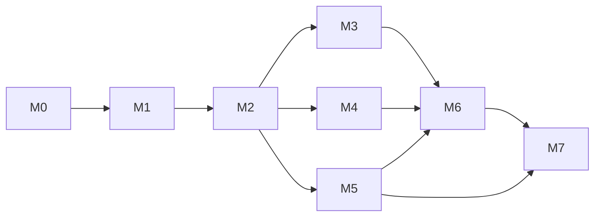

# 后端基础框架（platform/server）开发计划

> 本文件是 [`design.md`](design.md)（详细设计）的**执行计划**：把设计拆成里程碑、任务、依赖与验收标准。
>
> 与 [仓库落地路线](../../repo/roadmap.md) 的 P0–P7 对齐并细化到模块/任务粒度。设计依据见 [README（架构设计）](README.md) 与 [design.md（实现级设计）](design.md)。
>
> 排期用**相对工期**（人日，S=1 人日）表达，不绑定日历；实际节奏按可用人力伸缩。默认「1 名后端主程 + 1 名协助」的假设。

---

## 0. 总览

| 里程碑 | 名称 | 对齐 P 阶段 | 目标 | 依赖 |
| --- | --- | --- | --- | --- |
| **M0** | 骨架收口 | P0 | 父 BOM + core/support/bootstrap 可编译可启动 | — |
| **M1** | 持久化底座 | P1 | 多库 EMF/主键/命名/迁移可跑通 | M0 |
| **M2** | 数据模型与历史 | P2 | 基类族 + 历史拦截器 + 变更检测 | M1 |
| **M3** | 安全与鉴权 | P3 | 验签+准入+RBAC+数据权限（对接 IAM 契约） | M1、M2 |
| **M4** | 横切能力 | P4 | cache/i18n/obs/mq + 响应异常 + 限流幂等 | M2 |
| **M5** | 代码生成器 | P5 | 主/历成对全链路产出 + CI 守卫 | M2、M4 |
| **M6** | 系统域（RBAC 落地） | P3/P4 | 用户/角色/菜单/权限/字典/日志 | M3、M4 |
| **M7** | 质量与生产化 | P7 | 门禁全绿、多库集成测试、可观测落地 | M5、M6 |

> **关键路径**：M0 → M1 → M2 → (M3 ∥ M4) → M5/M6 → M7。M3 与 M4 可并行；M6 依赖 M3+M4；M5 只需 M2（可在 M3/M4 期间并行推进）。

---

## 1. 里程碑详细拆解

### M0 骨架收口（P0）

**目标**：父 BOM 与 `cim-core` / `cim-spring-support` / `cim-bootstrap` 可编译、可启动、可被 CI 构建。

| 任务 | 内容 | 依赖 | 估时 | 验收（DoD） |
| --- | --- | --- | --- | --- |
| T0.1 | 父 POM：BOM 收敛版本 + enforcer 依赖树检查 + 插件管理 | — | 1S | `mvn -f platform/server/pom.xml -N install` 成功；enforcer 生效 |
| T0.2 | `cim-core` 骨架：包结构 + 基类族占位 + 端口接口声明 | T0.1 | 1S | 编译通过；ArchUnit 用例「core 无 Spring」通过 |
| T0.3 | `cim-spring-support` 骨架：`Result`/`BizCode`/`GlobalExceptionHandler`/泛型基类 | T0.1 | 2S | 单测覆盖 Result/BizCode/异常映射 |
| T0.4 | `cim-bootstrap`：Main + `application.yml.example` + Actuator + 无库可启动 | T0.2/T0.3 | 1S | `spring-boot:run` 起来，`/actuator/health` UP |
| T0.5 | CI 骨架：后端 job（`platform/server` 构建）+ 路径过滤 | T0.4 | 1S | 流水线构建绿 |

**里程碑 DoD**：`mvn clean install` 绿；bootstrap 无数据库可启动；CI 后端 job 绿。

---

### M1 持久化底座（P1）

**目标**：多数据库（MySQL/Oracle/PG）可跑通；应用层主键、命名策略、Flyway 多目录就绪。

| 任务 | 内容 | 依赖 | 估时 | 验收 |
| --- | --- | --- | --- | --- |
| T1.1 | `CimJpaProperties` + 每库独立 EMF/TxManager/Hikari | M0 | 3S | 三种库各能连上并校验通过 |
| T1.2 | `NamingStrategy` 统一小写蛇形 | T1.1 | 1S | 三库表/列名一致 |
| T1.3 | `IdGenerator`（雪花）+ 时钟回拨降级 UUIDv7 | T1.1 | 2S | 单测覆盖回拨；`@PrePersist` 注入生效 |
| T1.4 | `JpaJsonConverter`（TEXT/CLOB + Jackson） | T1.1 | 1S | 三库 JSON 往返一致 |
| T1.5 | Flyway 多目录 `db/migration/{mysql,oracle,pg}` + `ddl-auto=validate` | T1.1 | 2S | 三库迁移自动化；validate 不报错 |
| T1.6 | `DbCapability`（nullOrdering/concat/jsonFn/pagination） | T1.5 | 2S | 三库分页/排序一致 |

**里程碑 DoD**：以一张示例表为样本，三种库建表→迁移→读写→分页全绿；主键跨库一致且时间有序。

**风险**：Oracle 授权/环境缺失 → 用 Testcontainers（Oracle XE）/或先用 PG+MySQL，Oracle 用例后置。

---

### M2 数据模型与历史（P2）

**目标**：基类族 + 历史拦截器 + 变更检测 + 多租户过滤全部可用。

| 任务 | 内容 | 依赖 | 估时 | 验收 |
| --- | --- | --- | --- | --- |
| T2.1 | `Auditable` 及 `BaseDefData/StateData/EventData/RevisionData/HistoryData` | M1 | 2S | 编译通过；列命名符合 §6.1 |
| T2.2 | 审计填充 `AuditableEntityListener`（取 `CurrentUserPort`） | T2.1 | 1S | 写操作自动带 createUser/eventUser/trxId |
| T2.3 | `@History` + `HistoryStrategy` + `Historizable` | T2.1 | 1S | 注解可声明 include 白名单 |
| T2.4 | `HistoryInterceptor` + `ChangeDetector` + `HistoryWriter` | T2.3 | 4S | 未变更不落历史；变更落对应 `{X}Hist`/`{X}StateLog` |
| T2.5 | 软删唯一约束 `(biz_key, tenant_id, deleted)` 规范 | T2.1 | 1S | 一删一活可并存 |
| T2.6 | 多租户：`TenantContext` + Hibernate Filter 自动隔离 | M1、T2.2 | 2S | 跨租户不可见；业务零感知 |
| T2.7 | 三层版本语义用例（@Version / revision / history 分离） | T2.4 | 1S | 三类各自独立演进 |

**里程碑 DoD**：新增一张 `BaseDefData` 子表，写操作自动落历史、仅变更落库；租户隔离生效。

**风险**：历史拦截器与 JPA 生命周期耦合易出边界 bug → 单测覆盖「插入/更新/删除/批量/事务回滚」路径。

---

### M3 安全与鉴权（P3，对接 IAM）

**目标**：platform 侧「验签 + 准入 + 业务鉴权 + 数据权限」就绪，与 IAM 契约打通。

| 任务 | 内容 | 依赖 | 估时 | 验收 |
| --- | --- | --- | --- | --- |
| T3.1 | `JwksKeyProvider`（拉取缓存 + kid 轮换） | M1 | 2S | 公钥轮换无需重启 |
| T3.2 | `JwtVerifier`（RS256 钉死，拒绝 alg 变更） | T3.1 | 2S | 算法混淆攻击用例被拒 |
| T3.3 | `JwtAuthenticationFilter`（验签 → 注入 SecurityContext） | T3.2 | 2S | 无令牌 401；解析出 userId/tenantId |
| T3.4 | `AppAdmissionChecker`（`apps` claim 准入） | T3.3 | 1S | 无本 ap 码 → 403 |
| T3.5 | `LocalAuthorityLoader`（本 ap RBAC 权限集，接口先声明） | T3.3 | 1S | `@PreAuthorize` 生效 |
| T3.6 | `@DataPermission` + `DataPermissionAspect`（Specification 参数绑定） | M2、T3.3 | 3S | 作用域过滤生效；无 SQL 拼接 |
| T3.7 | `CurrentUserPort` 适配器（供审计取操作人） | T3.3 | 1S | 审计字段自动带操作人 |
| T3.8 | IAM 契约联调文档（JWKS 地址、claim 结构、ap 码约定） | T3.4 | 1S | 与 `iam-ap` 侧对齐签字 |

**里程碑 DoD**：用一个 IAM 签发的测试令牌，跑通「验签→准入→业务权限→数据权限」全链路；无准入被 403。

**风险**：IAM 未就绪 → platform 先以**本地自签测试令牌 + 假 JWKS** 做契约测试，接口按 §8 边界冻结。

---

### M4 横切能力（P4）

**目标**：响应异常、i18n、缓存、可观测、限流幂等、消息全部就位。

| 任务 | 内容 | 依赖 | 估时 | 验收 |
| --- | --- | --- | --- | --- |
| T4.1 | `Result`/`BizCode`/`GlobalExceptionHandler` 完整化 + 字段级 errors | M0、T2.1 | 2S | 校验错误精确到字段；5xx 不泄露 |
| T4.2 | `cim-i18n-starter`：两表 + `DatabaseMessageSource` + 种子 | M1 | 3S | `@Valid` 消息命中 DB；热更新生效 |
| T4.3 | `cim-cache-starter`：多级缓存 + 防穿透/击穿/雪崩 | M1 | 3S | 三场景单测通过 |
| T4.4 | `cim-obs-starter`：指标/链路/结构化日志 + 脱敏 | M1 | 3S | `/actuator/prometheus` 有指标；日志无敏感信息 |
| T4.5 | 限流/幂等注解 + 切面（Redis 滑动窗口 + 幂等键） | T4.3 | 3S | 并发重复请求仅一次生效 |
| T4.6 | `cim-mq-starter`：领域事件 + 发件箱中继 + 韧性 | M1、T2.4 | 4S | 事务提交后事件必达；重试/死信可观测 |

**里程碑 DoD**：横切能力均可通过配置开关启停；缺席时优雅降级。

---

### M5 代码生成器（P5）

**目标**：`mvn cim:gen` 产出主/历成对全链路代码 + CI 守卫阻断 drift。

| 任务 | 内容 | 依赖 | 估时 | 验收 |
| --- | --- | --- | --- | --- |
| T5.1 | `MetadataReader` + `TableMetadata/ColumnMetadata`（单一事实源） | M2 | 2S | 三库元数据读取一致 |
| T5.2 | `GenPlan` + `PairPlanner`（主表+历史表成对） | T5.1 | 2S | 按 `@History` 策略决定历史产物 |
| T5.3 | 模板：Entity/Hist/Repository/DTO/Service/Controller/Flyway/前端骨架 | T5.2 | 5S | 生成物可编译、可启动 |
| T5.4 | `DiffPrinter`（dry-run）+ `SourceEmitter` | T5.3 | 2S | 生成前展示 diff |
| T5.5 | `AstFieldAppender`（增量追加历史列，手写区不覆盖） | T5.4 | 3S | 二次生成不冲掉手写区 |
| T5.6 | CI 守卫：主/历成对 + 历史列覆盖自检 | T5.3 | 2S | 缺 `{X}_hist` 构建失败 |

**里程碑 DoD**：以一个真实实体跑通「生成→编译→启动→迁移」，二次生成为增量、手写区无损。

---

### M6 系统域 / RBAC 落地（P3/P4）

**目标**：用户/角色/菜单/权限/字典/日志 可用，成为各 ap 内部权限来源。

| 任务 | 内容 | 依赖 | 估时 | 验收 |
| --- | --- | --- | --- | --- |
| T6.1 | 实体与迁移：`sys_user/role/menu/permission/dict/log`（含历史表成对） | M2、M5 | 3S | 迁移成对；CRUD 可用 |
| T6.2 | 三级 RBAC 服务 + `LocalAuthorityLoader` 实现 | M3、T6.1 | 3S | `@PreAuthorize` 命中真实权限 |
| T6.3 | 菜单（导航）与权限（API/按钮）分离 + 角色菜单关联 | T6.2 | 2S | 菜单可见性按角色生效 |
| T6.4 | 字典 + 操作/登录日志（`BaseEventData` 子类） | T6.1、T4.4 | 2S | 日志落库 + 脱敏 |
| T6.5 | `is_super` 短路 + 权限变更经令牌版本失效 | T6.2 | 1S | 超管放通；变更即时生效 |

**里程碑 DoD**：用生成的代码完成一个「用户-角色-菜单」闭环；越权调用被拒。

---

### M7 质量与生产化（P7）

**目标**：门禁全绿、多库集成测试、可观测与部署就绪。

| 任务 | 内容 | 依赖 | 估时 | 验收 |
| --- | --- | --- | --- | --- |
| T7.1 | ArchUnit 架构守卫（依赖方向/core 零 Spring/禁跨层） | M0–M6 | 2S | 违规用例可失败 |
| T7.2 | Testcontainers 多库集成测试 | M1–M6 | 4S | 三库集成用例绿 |
| T7.3 | 契约快照（SpringDoc）+ 兼容性校验 | M6 | 2S | 破坏性变更被拦截 |
| T7.4 | 依赖漏洞扫描 + 安全用例（算法钉死/口令派生） | M3 | 2S | 扫描无高危；用例通过 |
| T7.5 | Dockerfile/K8s 编排 + 健康探针 + 灰度 | M0–M6 | 3S | 容器可拉起、探针正确 |
| T7.6 | 数据归档作业（保留/归档/脱敏） | M4 | 3S | 归档任务可调度 |

**里程碑 DoD**：CI 全绿（构建/测试/守卫/扫描）；容器化部署可跑通；可观测面板可见关键指标。

---

## 2. 任务总览（看板）

> 进度标记：`[x]` 已完成并验证 · `[~]` 部分完成 · `[ ]` 未开始。**验证方式**：`mvn install`（全 12 模块）+ 单测；M0 已通过「无库启动 + `/actuator/health` UP」冒烟。

- [x] **M0** T0.1 父POM · T0.2 core · T0.3 spring-support · T0.4 bootstrap · T0.5 CI*（*CI 待接入平台）
- [~] **M1** T1.2 命名 ✅ · T1.3 主键 ✅ · T1.4 JSON ✅ · T1.6 能力抽象 ✅ · T1.1 多库EMF ⬜ · T1.5 Flyway ⬜
- [~] **M2** T2.1 基类族 ✅ · T2.2 审计填充 ✅ · T2.3 @History ✅ · T2.4 自动历史 + 变更检测 ✅（H2 集成测试验证 I/U/D 与「未变更不落」） · T2.5 软删唯一约束 ⬜ · T2.6 Hibernate 租户 Filter ⬜（上下文/过滤器已备） · T2.7 版本语义 ⬜
- [x] **M3** T3.1 JWKS · T3.2 验签 · T3.3 过滤器 · T3.4 准入 · T3.5 权限加载 · T3.6 数据权限 · T3.7 操作人适配 · T3.8 IAM 契约（已冻结，见 design.md §8）
- [~] **M4** T4.1 响应异常 ✅（字段级 errors + 5xx 不泄露，单测闭环） · T4.2 i18n ⬜ · T4.3 cache ⬜ · T4.4 obs ✅（指标门面+公共标签+日志脱敏+Logback 转换器，11 单测闭环） · T4.5 限流幂等 ⬜ · T4.6 mq ⬜
- [ ] **M5** T5.1 元数据 · T5.2 成对计划 · T5.3 模板 · T5.4 dry-run · T5.5 增量 · T5.6 CI 守卫
- [ ] **M6** T6.1 实体迁移 · T6.2 RBAC · T6.3 菜单权限 · T6.4 字典日志 · T6.5 超管/失效
- [ ] **M7** T7.1 ArchUnit · T7.2 集成测试 · T7.3 契约 · T7.4 安全 · T7.5 编排 · T7.6 归档

---

## 3. 关键路径与并行建议

- **串行关键路径**：M0 → M1 → M2 →（M3 或 M4）→ M6 → M7。
- **可并行**：M3（安全）与 M4（横切）无相互依赖，可双人并行；M5（生成器）只依赖 M2，可与 M3/M4 同期推进。
- **前置冻结项**：IAM 契约（T3.8）应在 M3 开始前与 `iam-ap` 侧对齐，否则 M3 用假 JWKS 先行、接口后补。
- **随时可做**：T7.1（ArchUnit）建议在 M0 就引入最小用例，边写边守，而非留到最后。

---

## 4. 质量门禁（每个里程碑的 DoD + 全局门禁）

**每里程碑通用 DoD（Definition of Done）：**

1. 代码可编译，`mvn verify` 绿；
2. 新增能力有对应单元测试（`cim-core`/starter 覆盖达标）；
3. 自动装配 `@ConditionalOn*` 齐备，缺省可降级、可被覆盖；
4. 配置键纳入 `cim.*` 并写入 `application.yml.example` 注释；
5. 涉及数据模型的变更，主/历 DDL 成对；
6. 对应设计章节（`design.md`）如与实现不符，回填修正。

**全局门禁（合并前必过）：**

| 门禁 | 阈值/规则 |
| --- | --- |
| ArchUnit | 0 违规 |
| enforcer | 0 版本冲突；`provided` 不进生产包 |
| 历史成对 | `ALTER {X}` 必含 `{X}_hist` |
| 覆盖率 | `cim-core` ≥ 80%，`cim-spring-support` ≥ 70% |
| 安全扫描 | 无高危漏洞；算法钉死用例通过 |
| 契约 | 无未声明的破坏性变更 |

---

## 5. 风险登记册

| # | 风险 | 概率 | 影响 | 缓解 |
| --- | --- | --- | --- | --- |
| R1 | Oracle 环境/授权不可用，多库验证受阻 | 中 | 高 | 先 PG+MySQL；Oracle 用 Testcontainers(XE)，用例后置 |
| R2 | 历史拦截器与 JPA 生命周期边界 bug | 中 | 高 | 单测覆盖插入/更新/删除/批量/回滚；变更检测闸门 |
| R3 | IAM 侧未就绪，认证联调阻塞 | 中 | 中 | 本地自签令牌 + 假 JWKS 先行；接口按 §8 冻结 |
| R4 | 时钟回拨致主键异常 | 低 | 高 | `IdGenerator` 降级 UUIDv7 + 告警；workerId 由部署平台下发 |
| R5 | 生成器二次生成覆盖手写代码 | 中 | 中 | `/* region biz */` 保护 + AST 增量 + dry-run |
| R6 | 多租户过滤与业务查询冲突 | 低 | 中 | Filter 可显式关闭；跨租户仅超管白名单 |
| R7 | 沙箱/CI 无法跑 Maven，验证后置到本机 | 中 | 低 | 本机执行 `mvn verify`；CI 配置为权威验证点 |

---

## 6. 迭代切分建议

| 迭代 | 目标 | 对应里程碑 | 产出可演示物 |
| --- | --- | --- | --- |
| Sprint 1 | 可启动的空底座 | M0 | bootstrap 起来、健康检查 UP |
| Sprint 2 | 可跑通一张表的多库持久化 | M1 | 三库建表读写演示 |
| Sprint 3 | 自动审计 + 历史 | M2 | 写操作自动落历史演示 |
| Sprint 4 | 安全闭环 | M3 | 令牌→准入→越权拒绝演示 |
| Sprint 5 | 横切能力 | M4 | i18n 热更、限流、发件箱演示 |
| Sprint 6 | 生成器 + RBAC | M5/M6 | 生成一个实体并启用权限 |
| Sprint 7 | 生产化收口 | M7 | 容器部署 + 面板 + 全门禁绿 |

---

> 关联文档：[详细设计](design.md) · [架构设计 README](README.md) · [仓库落地路线](../../repo/roadmap.md)
