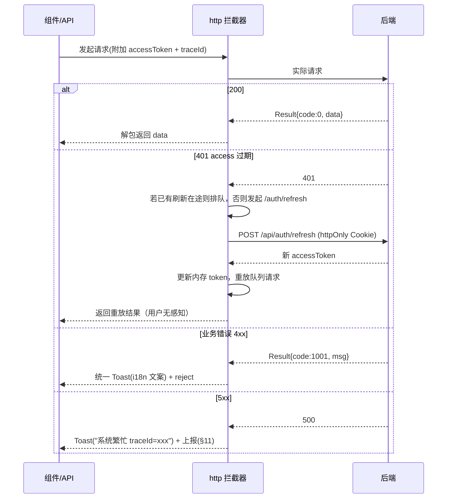
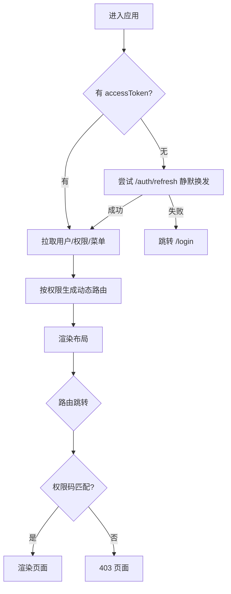

# 前端基础框架设计文档（cim-ap Frontend）

> 本文档为 `cim-ap` 前端设计与实现说明，涵盖技术栈与目录、请求层全链路、认证与路由守卫、权限体系、状态管理、国际化热切换、主题规范、组件与表单、性能与工程化、前端安全、可观测、测试与部署。
> 章节编号自 §1 起，与总文档、后端文档相互独立；跨文档引用已标注来源（如「后端文档 §5」）。
> 全文采用统一方法论：**先列常见做法利弊、指出不足，再给本框架优化设计**，与后端文档口径一致。
> ⚠️ 本文为**设计文档**，不代表代码已实现；当前仓库尚无前端工程代码，实现状态见[总文档 §8](../../README.md#8-实现状态与落地路线)。

## 目录

- [1. 技术栈与目录结构](#1-技术栈与目录结构)
- [2. 请求层设计（Axios 全链路）](#2-请求层设计axios-全链路)
- [3. 认证与路由守卫](#3-认证与路由守卫)
- [4. 权限体系（菜单 / 按钮 / 接口）](#4-权限体系菜单--按钮--接口)
- [5. 状态管理（Zustand）](#5-状态管理zustand)
- [6. 国际化（i18n 热切换）](#6-国际化i18n-热切换)
- [7. 主题与 SCSS 规范](#7-主题与-scss-规范)
- [8. 组件与表单](#8-组件与表单)
- [9. 性能与工程化](#9-性能与工程化)
- [10. 前端安全](#10-前端安全)
- [11. 前端可观测](#11-前端可观测)
- [12. 测试策略](#12-测试策略)
- [13. 构建与部署](#13-构建与部署)

---

---

## 1. 技术栈与目录结构

> **仓库定位**：本目录即仓库顶层 `web/`（前端工程根，`package.json` / `index.html` 在此），下文的 `src/` 即 `web/src/`。仓库整体采用 `server/` + `web/` 顶层划分，命名取舍与工程约定见[总文档 §4](../../README.md#4-仓库目录结构)。

```
web/                         # 前端工程根（对应仓库顶层 `web/`，Vite 工程，package.json / index.html 在此）
├── package.json
├── index.html
├── Dockerfile
└── src/
    ├── main.tsx                 # 应用入口
    ├── App.tsx                  # 根组件 + 路由
├── assets/                  # 静态资源
├── styles/                  # SCSS：variables / mixins / global / theme
├── layouts/                 # 布局（侧边栏/头部/内容）
├── router/                  # 路由表 + 动态路由 + 守卫
├── store/                   # 状态管理（Zustand：auth / user / app / dict）
├── services/                # API 请求封装（Axios 实例 + 拦截器 + 模块 API）
├── components/              # 通用组件（表格/表单/上传/权限组件）
├── hooks/                   # 自定义 Hooks（usePermission / useTable / useRequest）
├── utils/                   # 工具函数
├── locales/                 # i18n 资源与初始化
├── types/                   # 全局 TS 类型（与后端 DTO/Result 对齐）
└── modules/                 # 业务模块（按功能拆分，自包含）
    ├── system/              # 用户/角色/菜单
    └── dashboard/           # 看板示例
```

#### 利弊分析（常见做法 vs 本框架优化）

| 维度 | 常见做法 | 不足 / 风险 | 本框架优化 |
| --- | --- | --- | --- |
| **目录组织** | 按技术类型扁平（components/pages 各一大坨） | 随业务膨胀变成垃圾场，跨模块改动互相踩 | **按业务模块 `modules/*` 自包含**，通用能力上浮到 components/hooks |
| **类型定义** | 接口返回 `any` | 后端改字段前端静默崩溃，无编译期保障 | **`types/` 与后端 DTO/Result 对齐**（可由 OpenAPI 生成，见后端 §17） |
| **环境配置** | 硬编码 baseURL | 多环境切换要改代码 | **`import.meta.env.*` + `.env.{mode}`** 分环境 |
| **API 组织** | 组件内直接 `axios.get` | 散落各处、难改 baseURL/难 mock | **统一 `services/` 模块 API 层**，组件只调 API 函数 |
| **状态管理** | 全部塞全局 store | store 臃肿、任何变更触发大范围重渲染 | **按域切片 store**（§5），服务端数据优先用 SWR/React Query 缓存 |

**关键设计点：**

1. **模块自包含**：业务按 `modules/{module}` 归拢（页面/组件/API/类型），跨模块共享才上浮到通用目录，避免组件垃圾桶。
2. **类型与后端契约对齐**：`Result<T>`、`Page<T>` 等响应结构在 `types/` 中定义，可由后端 OpenAPI（后端 §17）自动生成，前后端契约编译期可见。
3. **API 层收敛**：所有请求经 `services/` 封装，统一走 `http` 实例（§2），便于统一拦截、mock 与埋点。
4. **路径别名**：`@/` 指向 `src/`，避免深层相对路径 `../../../`。

---

## 2. 请求层设计（Axios 全链路）

请求层是前端与后端的唯一通道。朴素「一个 axios 实例 + 简单加 token」会在真实场景频繁出问题：**401 并发重复刷新、错误提示不统一、链路无法追踪、重复请求无法取消**。本节**先列利弊，再给优化设计**（与后端 §5 认证、§14 可观测、§16 幂等对齐）。

#### 利弊分析（常见做法 vs 本框架优化）

| 维度 | 常见做法 | 不足 / 风险 | 本框架优化 |
| --- | --- | --- | --- |
| **令牌附加** | 每次从 `localStorage` 读 token | XSS 可窃取（与后端 §5 矛盾） | **accessToken 仅存内存**（Zustand），refresh 由后端 `httpOnly` Cookie 自动携带 |
| **401 处理** | 直接跳登录 | access 短期（10min）过期即掉线，体验差 | **401 无感刷新**：拦截 401 → 用 refresh 换发 → 重放原请求 |
| **并发 401** | 每个请求各自刷新 | N 个请求并发触发 N 次刷新，后端轮换下互相挤掉 → 全部失败 | **刷新单例 + 请求队列**：同一时刻仅一次刷新，其余排队重放 |
| **错误提示** | 各处 `message.error(e.message)` | 提示不一致、未国际化、5xx 暴露细节 | **统一错误出口**：按 `Result.code` 映射 i18n 文案，5xx 仅提示 traceId |
| **链路追踪** | 无 | 前后端日志无法串联 | **请求头透传 `X-Trace-Id`**，与后端 MDC/OTel（后端 §14）联动 |
| **重复请求** | 不加控制 | 用户连点产生重复提交（与后端幂等 §16 脱节） | **幂等键 `Idempotency-Key` + 请求去重**（同一 key 在途只发一次） |
| **超时/重试** | 全局固定 timeout，无重试 | 弱网误判、偶发抖动即失败 | **分类超时 + 幂等请求有限重试**（仅 GET/幂等接口） |
| **取消请求** | 无 | 路由切换后旧请求仍回调，数据错乱 | **`AbortController` 按路由/组件取消** |

#### 优化后的请求链路



#### 关键代码示例

```ts
// services/http.ts —— 统一请求封装（含无感刷新 + 队列 + traceId + 幂等）
import axios, { AxiosError, InternalAxiosRequestConfig } from 'axios';
import { getAccessToken, setAccessToken, clearAuth } from '@/store/auth';
import { toast } from '@/components/Message';
import i18n from '@/locales';

const http = axios.create({
  baseURL: import.meta.env.VITE_API_BASE,
  timeout: 15000,
  withCredentials: true,   // 携带 refreshToken(httpOnly Cookie)
});

// 在途请求去重（幂等键 -> Promise），防连点重复提交
const inflight = new Map<string, Promise<any>>();

http.interceptors.request.use((cfg) => {
  const token = getAccessToken();                      // 内存中的 accessToken
  if (token) cfg.headers.Authorization = `Bearer ${token}`;
  cfg.headers['X-Trace-Id'] = cfg.headers['X-Trace-Id'] ?? crypto.randomUUID();
  cfg.headers['Accept-Language'] = i18n.language;      // 后端按此解析 i18n（后端 §7）
  return cfg;
});

http.interceptors.response.use(
  (res) => {
    const body = res.data;                             // 后端统一 Result<T>
    if (body.code === 0) return body.data;
    toast.error(i18n.t(`biz.${body.code}`, body.msg));  // 按 code 映射 i18n
    return Promise.reject(Object.assign(new Error(body.msg), { code: body.code, errors: body.errors }));
  },
  async (err: AxiosError<any>) => {
    const status = err.response?.status;
    const original = err.config as InternalAxiosRequestConfig & { _retry?: boolean };

    if (status === 401 && !original._retry) {
      original._retry = true;
      const token = await ensureRefreshed();           // 刷新单例（下方）
      if (token) { original.headers.Authorization = `Bearer ${token}`; return http(original); }
      clearAuth(); location.replace('/login'); return Promise.reject(err);
    }
    if (status && status >= 500) {
      const traceId = err.response?.data?.traceId;
      toast.error(i18n.t('sys.error', { traceId }));   // 仅暴露 traceId（后端 §4）
      reportError(err, traceId);                       // 上报（§11）
    }
    return Promise.reject(err);
  }
);

/** 刷新单例：并发 401 只触发一次换发，其余排队 */
let refreshTask: Promise<string | null> | null = null;
export function ensureRefreshed(): Promise<string | null> {
  if (!refreshTask) {
    refreshTask = axios.post('/api/auth/refresh', null, { baseURL: import.meta.env.VITE_API_BASE, withCredentials: true })
      .then((r) => { const t = r.data?.data?.accessToken; setAccessToken(t); return t ?? null; })
      .catch(() => null)
      .finally(() => { refreshTask = null; });
  }
  return refreshTask;
}

/** 幂等提交：同一 key 在途只发一次（配合后端 §16 Idempotency-Key） */
export function idempotentPost<T>(url: string, data: unknown, key = url) {
  if (inflight.has(key)) return inflight.get(key) as Promise<T>;
  const p = http.post(url, data, { headers: { 'Idempotency-Key': key } })
    .finally(() => inflight.delete(key));
  inflight.set(key, p);
  return p;
}
export default http;
```

**关键设计点：**

1. **accessToken 存内存、refresh 走 Cookie**：与后端 §5 一致，杜绝 XSS 窃取；页面刷新后靠 refresh 静默换发恢复登录态。
2. **401 无感刷新 + 刷新单例 + 队列重放**：并发请求只触发一次 `/auth/refresh`，避免轮换机制（后端 §5 jti 复用检测）把并发刷新误判为"令牌泄露"而整族吊销。
3. **统一错误出口**：业务码映射 i18n 文案，字段级 `errors` 直连表单；5xx 只提示 `traceId` 并上报。
4. **链路透传**：`X-Trace-Id` 与后端 MDC/OTel 串联（后端 §14），前后端同一次请求可对齐日志。
5. **幂等与去重**：写操作带 `Idempotency-Key`，前端在途去重 + 后端幂等（后端 §16）双保险，防连点重复提交。
6. **取消请求**：路由切换/组件卸载用 `AbortController` 取消在途请求，避免旧数据覆盖新页面。

---

## 3. 认证与路由守卫

认证与路由是前端第一道门。朴素「token 存 localStorage + 路由只判有没有 token」既不安全（与后端 §5 冲突），也做不了按钮级精细控制。本节**先列利弊，再给优化设计**（与后端 §5、§15 对齐）。

#### 利弊分析（常见做法 vs 本框架优化）

| 维度 | 常见做法 | 不足 / 风险 | 本框架优化 |
| --- | --- | --- | --- |
| **令牌存储** | `localStorage` | XSS 窃取后令牌长期有效 | **内存 + httpOnly Cookie**（§2），刷新靠静默换发 |
| **路由来源** | 前端硬编码路由表 | 改菜单要发版；不同角色看到同一套路由 | **后端下发菜单/权限 → 前端动态生成路由**（与后端 §21.1 RBAC 一致） |
| **守卫粒度** | 只判「是否登录」 | 登录后仍可手动输入 URL 越权进入无权限页面 | **双层守卫**：登录态 + 权限码校验，越权跳 403 |
| **权限同步** | 登录后权限固定 | 管理员改权限后前端不生效 | **权限版本号**：后端 token_version 变化即重拉权限（后端 §5） |
| **首屏白屏** | 权限未加载完就渲染 | 闪现无菜单/误判 403 | **权限就绪后再渲染**（`bootstrap` 阶段拉取，loading 态） |
| **退出** | 前端清 token | 后端令牌仍有效，无法真正踢人 | **调 `/auth/logout` 让后端 bump 版本**（后端 §5），前端再清内存 |
| **口令传输** | 明文 POST，仅依赖 HTTPS | TLS 终止在网关/CDN、企业出站代理、APM 抓包都可能看到明文 | **应用层加密**：向 `/auth/challenge` 取动态公钥加密，`nonce` 防重放（详见下文与后端 §5.1） |

#### 优化后的流程



#### 口令传输加密（客户端）

登录、修改密码的口令**严禁明文传输**。客户端负责「第一次不可逆哈希 + 公钥加密」，服务端在此基础上再做二次派生（后端 §5.1）——**服务端即使拿到 clientDigest 也不能直接使用**，这是前后端共同的红线。

```ts
// services/auth.ts —— 口令加密传输
import http from './http';

/** ① 从服务端获取一次性挑战与公钥（禁止前端硬编码公钥） */
export async function fetchChallenge() {
  const { data } = await http.get('/api/auth/challenge');
  return data as { kid: string; publicKey: string; nonce: string; ts: number; alg: 'SM2' | 'RSA-OAEP' };
}

/**
 * ② 口令 → clientDigest（不可逆）→ 公钥加密
 * 注意：clientDigest 只是「客户端摘要」，服务端会再混入 pepper 二次派生后才存库，
 *       因此它不等于最终凭证，任何人拿到 clientDigest 也无法直接登录。
 */
export async function encryptPassword(username: string, rawPassword: string) {
  const { kid, publicKey, nonce, ts, alg } = await fetchChallenge();

  const c1 = sm3(`${username.toLowerCase()}:${rawPassword}`);      // 国密 SM3 / 或 SHA-256
  const payload = JSON.stringify({ nonce, ts, username, c1 });
  const cipher = await (alg === 'SM2' ? sm2Encrypt : rsaOaepEncrypt)(publicKey, payload);

  rawPassword = '';                                                // ③ 用后立即从内存抹除
  return { kid, nonce, ts, cipher };
}

/** 登录：提交密文而非口令本身 */
export async function login(username: string, rawPassword: string) {
  const secret = await encryptPassword(username, rawPassword);
  return http.post('/api/auth/login', { username, ...secret });
}

/** 修改密码：旧口令 + 新口令走同一条加密通道 */
export async function changePassword(username: string, oldPwd: string, newPwd: string) {
  const [oldSecret, newSecret] = await Promise.all([
    encryptPassword(username, oldPwd),
    encryptPassword(username, newPwd),
  ]);
  const { data } = await http.put('/api/user/password', { oldSecret, newSecret });
  return data;                                                     // 成功后后端 bump token_version，见 §3 退出
}
```

**客户端红线：**

| 禁止 | 说明 |
| --- | --- |
| 明文 POST 口令 | 登录/改密一律走 `encryptPassword` |
| 前端硬编码公钥 | 必须向 `/api/auth/challenge` 动态取，`kid` 支持服务端轮换 |
| 把口令/`cipher`/`clientDigest` 写进 `localStorage`、Cookie、URL、表单默认值 | 违反「令牌零落盘」同一红线（§10） |
| `console.log` 打印口令或 `payload` | 含访问控制后台，禁止任何形式的输出 |
| 表单用 `type="text"` 且 `autoComplete` 未关闭 | 应为 `type="password" autoComplete="new-password"`，防浏览器明文留存 |

> **国密优先**：默认 **SM2 + SM3**；当运行环境不支持国密时自动降级 **RSA-OAEP + SHA-256**（算法由服务端 `challenge.alg` 告知，前端不写死），切换对上层透明。

#### 关键代码示例

```tsx
// router/guard.tsx —— 双层守卫（登录态 + 权限码）
import { Navigate, useLocation } from 'react-router-dom';
import { useAuthStore } from '@/store/auth';
import { usePermission } from '@/hooks/usePermission';

export function AuthGuard({ children, code }: { children: ReactNode; code?: string }) {
  const { ready, isLogin } = useAuthStore();
  const { has } = usePermission();
  const location = useLocation();

  if (!ready) return <PageLoading />;                        // 权限未就绪不渲染，避免误判 403
  if (!isLogin) return <Navigate to="/login" replace state={{ from: location }} />;
  if (code && !has(code)) return <Navigate to="/403" replace />;  // 越权进 403
  return <>{children}</>;
}

// 动态路由：后端下发菜单（i18n_code + path + 权限码），前端按权限过滤生成
export function buildRoutes(menus: MenuVO[], has: (c: string) => boolean): RouteObject[] {
  return menus.filter((m) => !m.code || has(m.code))
              .map((m) => ({ path: m.path, element: <AuthGuard code={m.code}><LazyPage name={m.component}/></AuthGuard> }));
}
```

**关键设计点：**

1. **路由由后端驱动**：菜单与权限来自后端 RBAC（后端 §21.1），前端不硬编码；菜单名走 i18n 键（后端 §7）。
2. **双层守卫 + 403**：登录态与权限码分离校验，杜绝「登录后手动输 URL 越权」。
3. **权限就绪再渲染**：`ready` 标志位避免首屏白屏与误判 403。
4. **退出联动后端**：调 `/auth/logout` 触发版本号 bump（后端 §5），实现真正的即时失效与踢人。
5. **登录后回跳**：`state.from` 记录来源，登录后回到原页面。

---

## 4. 权限体系（菜单 / 按钮 / 接口）

后端 §5/§21.1 已定义功能权限（权限码 `module:res:action`）与数据权限。前端若只做「菜单隐藏」，会出现**按钮可见但接口 403、或隐藏了但 URL 仍可访问**的割裂。本节**先列利弊，再给优化设计**。

#### 利弊分析（常见做法 vs 本框架优化）

| 维度 | 常见做法 | 不足 / 风险 | 本框架优化 |
| --- | --- | --- | --- |
| **权限粒度** | 仅菜单级 | 按钮无法控制；接口仍可被调用 | **菜单 / 按钮 / 接口三级同一套权限码** |
| **按钮控制** | 手写 `v-if/hasPerm` 散落 | 逻辑重复、易漏判 | **统一 `<Perms>` 权限组件 + `usePermission` Hook** |
| **权限来源** | 前端常量表 | 与后端权限码漂移、改权限要发版 | **权限集由后端下发**（登录/刷新时加载），前端只做匹配 |
| **超级管理员** | 前端硬编码判断 | 与后端 `is_super` 不一致 | 后端返回 `super` 标志，前端统一 `has()` 短路放通 |
| **数据权限** | 前端不感知 | 列表展示他人数据或对空列表困惑 | 前端仅负责传参，隔离由后端 `@DataPermission`（后端 §5）保证，**前端不做数据过滤** |

#### 关键代码示例

```tsx
// hooks/usePermission.ts —— 统一权限判定入口
export function usePermission() {
  const { permissions, isSuper } = useAuthStore();
  const has = useCallback((code?: string) => !code || isSuper || permissions.includes(code), [permissions, isSuper]);
  const hasAny = (...codes: string[]) => codes.some(has);
  const hasAll = (...codes: string[]) => codes.every(has);
  return { has, hasAny, hasAll };
}

// components/Perms.tsx —— 权限指令式组件（按钮级）
export function Perms({ code, fallback = null, children }: { code: string; fallback?: ReactNode; children: ReactNode }) {
  const { has } = usePermission();
  return <>{has(code) ? children : fallback}</>;
}

// 用法：无权限时按钮直接不渲染（不靠 CSS 隐藏）
<Perms code="sys:user:create">
  <Button type="primary" onClick={onCreate}>新建用户</Button>
</Perms>

// 表格操作列：无权限隐藏整列
{has('sys:user:delete') && <Table.Column title="操作" render={(_, r) => <Popconfirm onConfirm={() => remove(r.id)}>删除</Popconfirm>} />}
```

**关键设计点：**

1. **一套权限码贯穿三级**：菜单（路由过滤）、按钮（`<Perms>`）、接口（后端 `@PreAuthorize`）共用 `module:res:action`，前后端语义一致。
2. **无权限不渲染而非隐藏**：`<Perms>` 未授权时不挂载组件（非 `display:none`），避免 DOM 中残留可被调试工具恢复的操作入口。
3. **`isSuper` 短路**：后端下发超级管理员标志，前端 `has()` 统一放通，避免硬编码散落。
4. **前端不做数据隔离**：数据权限（租户/工厂/部门）由后端 `@DataPermission` + 租户过滤器保证（后端 §5/§10），前端只负责展示后端返回的数据，避免"前端过滤"造成的安全错觉。

---

## 5. 状态管理（Zustand）

朴素「所有东西塞全局 store」会导致**无关重渲染、刷新即丢失、敏感信息落盘**。本节**先列利弊，再给优化设计**。

#### 利弊分析（常见做法 vs 本框架优化）

| 维度 | 常见做法 | 不足 / 风险 | 本框架优化 |
| --- | --- | --- | --- |
| **store 粒度** | 单一巨型 store | 任意字段变更触发大范围重渲染 | **按域切片**：`auth`(令牌/权限) / `user`(资料) / `app`(主题/布局/语言) / `dict`(字典) |
| **服务端数据** | 全部塞 store 手动管理 | 需要自己处理缓存/失效/重试，代码膨胀 | **服务端状态用 SWR / React Query**（缓存+失效+重试），store 只存会话级状态 |
| **持久化** | 整个 store persist | token 落 localStorage（与后端 §5 冲突）、敏感信息泄露 | **持久化白名单**：仅 `lang`/`theme` 等非敏感项持久化，**令牌与权限绝不落盘** |
| **选择器** | 直接取整个 state | 组件订阅过多，重渲染失控 | **细粒度 selector + `shallow`**，只订阅关心的字段 |
| **权限刷新** | 登录后不再更新 | 管理员改权限前端不生效 | 监听后端 token 版本/权限变更事件，**失效即重拉**（后端 §5） |

#### 关键代码示例

```ts
// store/auth.ts —— 会话切片（令牌仅内存，绝不持久化）
import { create } from 'zustand';

interface AuthState {
  accessToken: string | null;
  permissions: string[];
  isSuper: boolean;
  ready: boolean;                 // 权限是否已就绪（供守卫使用）
  setSession: (s: Partial<AuthState>) => void;
  clearAuth: () => void;
}
export const useAuthStore = create<AuthState>((set) => ({
  accessToken: null, permissions: [], isSuper: false, ready: false,
  setSession: (s) => set(s),
  clearAuth: () => set({ accessToken: null, permissions: [], isSuper: false, ready: false }),
}));
export const getAccessToken = () => useAuthStore.getState().accessToken;   // 供 axios 拦截器读取
export const setAccessToken = (t: string) => useAuthStore.getState().setSession({ accessToken: t });

// 非敏感偏好的持久化白名单（lang/theme 可落盘；token/权限绝不落盘）
persist(useAppStore, {
  name: 'cim-app',
  partialize: (s) => ({ lang: s.lang, theme: s.theme, collapsed: s.collapsed }),
});
```

**关键设计点：**

1. **切片隔离**：`auth`/`user`/`app`/`dict` 各自独立，减少无关重渲染；服务端数据交给 SWR/React Query 缓存。
2. **持久化白名单**：仅语言、主题、布局等非敏感项持久化；**accessToken 与权限集只存内存**（页面刷新靠 refresh 恢复），从根本上规避 XSS 窃取（呼应后端 §5/§15）。
3. **细粒度订阅**：组件用 selector 精确订阅，避免大对象变更引发全局重渲染。
4. **权限可刷新**：提供 `reloadPermissions()`，在权限变更/版本失效后重拉，与后端版本号机制联动。

---

## 6. 国际化（i18n 热切换）

后端 §7 已把全部文案入库（两表 + Redis + 版本号）。前端若仍用打包进产物的静态 JSON，就失去了"热更新免发版"的意义。本节**先列利弊，再给优化设计**。

#### 利弊分析（常见做法 vs 本框架优化）

| 维度 | 常见做法 | 不足 / 风险 | 本框架优化 |
| --- | --- | --- | --- |
| **文案来源** | 打包时静态 JSON | 改文案要重新构建发版 | **运行时从后端拉取**（`GET /api/i18n/messages`），与后端 §7 一致 |
| **更新感知** | 每次启动全量拉 | 流量浪费 | **版本号比对**：`v={i18n:version}`，未变更命中本地缓存 |
| **切换体验** | 切换语言刷新页面 | 中断操作、状态丢失 | **热切换**：拉取语言包 → `addResourceBundle` → `changeLanguage`，无需刷新 |
| **回退策略** | 缺 key 时直接显示 `common.user.name` | 界面出现英文代码，不专业且暴露内部实现细节 | **四级兜底**：目标语言 → **默认 `zh-CN`** → 内置静态兜底包 → `humanize(key)`，**永不显示裸 key** |
| **默认兜底语言** | fallback 配成 en-US（或直接缺失） | 不符合国内 CIM 场景，多数用户看不懂 | **默认兜底固定为中文（`zh-CN`）**，且不可为空 |
| **硬编码文案** | 组件里直接写死 `<Button>确定</Button>` | 无法翻译、无法热更、改文案要全局搜索 | **ESLint 门禁拦截硬编码文案**，一律走 `t()` |
| **缺漏感知** | 静默失败，上线后才被发现 | 缺陷后置 | **缺失 key 上报**：开发环境控制台告警 + 上报 `/api/i18n/missing` 生成待翻译工单 |
| **占位符** | 前端拼接字符串 | 语序错乱、翻译困难 | **i18n 占位符 `{name}`**，由 MessageFormat 按语言语序渲染 |
| **XSS** | 直接用 `dangerouslySetInnerHTML` 渲染译文 | 译文被注入脚本 | **默认文本渲染，禁止 innerHTML**（见 §10） |

#### 关键代码示例

```ts
// locales/index.ts —— i18n 初始化 + 版本化拉取 + 热切换
import i18n from 'i18next';
import { initReactI18next } from 'react-i18next';
import http from '@/services/http';
import zhCNBuiltin from './zh-CN.builtin.json';   // 内置静态兜底最小集（随包发布）

/** 默认兜底语言固定为中文，不允许为空或改成其他语言 */
export const DEFAULT_LANG = 'zh-CN';

/** key → 可读文案：`user.name` → `User name`（与后端 humanize 同口径） */
function humanize(key: string) {
  const tail = key.includes('.') ? key.slice(key.lastIndexOf('.') + 1) : key;
  return tail.split(/[._-]/).filter(Boolean)
             .map((s) => s[0].toUpperCase() + s.slice(1)).join(' ');
}

/** 缺失译文上报：开发环境告警 + 上报后端生成待翻译工单 */
function reportMissing(key: string, lang?: string) {
  if (import.meta.env.DEV) console.warn(`[i18n] 缺失译文: ${key} (${lang})`);
  http.post('/api/i18n/missing', { key, lang }).catch(() => {});
}

i18n.use(initReactI18next).init({
  lng: DEFAULT_LANG,
  fallbackLng: [DEFAULT_LANG],                    // 兜底链终点必须是中文
  resources: { [DEFAULT_LANG]: { translation: zhCNBuiltin } },  // L3 内置兜底
  saveMissing: true,
  missingKeyHandler: (lngs, _ns, key) => reportMissing(key, lngs[0]),
  parseMissingKeyHandler: humanize,               // L4：绝不返回裸 key
});

/** 按语言 + 版本号拉取（版本号未变则命中本地缓存，免重复下载） */
export async function loadMessages(lang: string, version?: string) {
  const cacheKey = `i18n:${lang}:v`;
  const cached = localStorage.getItem(cacheKey);
  if (cached && version && cached === version && i18n.hasResourceBundle(lang, 'translation')) return;
  const { data } = await http.get('/api/i18n/messages', { params: { lang, v: version } });
  i18n.addResourceBundle(lang, 'translation', data, true, true);
  localStorage.setItem(cacheKey, version ?? '');
}

/** 语言热切换：不刷新页面，即时生效；偏好同步后端 sys_user.lang */
export async function switchLanguage(lang: string, version?: string) {
  await loadMessages(lang, version);
  await i18n.changeLanguage(lang);
  document.documentElement.lang = lang;
  useAppStore.getState().setLang(lang);           // 持久化偏好（非敏感）
  await http.put('/api/user/preference', { lang }).catch(() => {}); // 同步到用户偏好（后端 §7）
}
```

**关键设计点：**

1. **运行时拉取 + 版本号缓存**：与后端 §7 的 `i18n:version` 对齐，译文后台改完前端下次拉取即生效，**免发版**。
2. **无刷新热切换**：`addResourceBundle` + `changeLanguage` 即时生效，Header 语言切换器即调用 `switchLanguage`。
3. **四级兜底（永不显示裸 key）**：目标语言(L1) → **默认 `zh-CN`**(L2) → 内置静态兜底包(L3) → `humanize(key)`(L4)。L4 会把 `common.user.name` 降级为可读的 `Name`，**任何情况下都不会把原始 key 暴露给用户**；同时触发缺失上报，由后台生成待翻译工单。**禁止省略任何一级**，尤其不能让 i18next 直接返回裸 code。
4. **偏好同步**：本地持久化 + 回写 `sys_user.lang`，多端一致。
5. **内容安全**：译文一律按纯文本渲染，禁用 `dangerouslySetInnerHTML`（§10）。

#### 硬编码文案门禁（编码强制约束）

仅靠人工自觉无法杜绝硬编码，**必须有工具拦截**：

| 手段 | 配置 | 拦截内容 |
| --- | --- | --- |
| ESLint 规则 | `react/jsx-no-literals`（结合白名单） | JSX 中直接书写的中文文案，如 `<Button>确定</Button>` |
| 自定义规则 | 扫描 `t('...')` 之外的中文字符串 | `title="用户管理"`、`message: '操作成功'`、`placeholder="请输入"` |
| Stylelint / i18n 扫描 | CI 阶段扫描 `.tsx/.ts` | 遗漏的硬编码中文（含模板字符串） |
| 覆盖率检查 | 对比各语言 key 集合 | 非默认语言译文缺失率超过阈值（如 >2%）即告警 |

```js
// .eslintrc.cjs —— JSX 内禁止硬编码文案（白名单外的字面量一律报错）
module.exports = {
  rules: {
    'react/jsx-no-literals': ['error', {
      noStrings: true,
      allowedStrings: ['-', '/', '·', '—'],   // 仅允许标点与非文案字符
    }],
  },
};
```

> **规范**：所有面向用户的文案必须走 `t()`，例如 `<Button>{t('common.confirm')}</Button>`；key 统一小写蛇形、按 `模块.对象.语义` 组织，杜绝拿完整英文句子当 key。

---

## 7. 主题与 SCSS 规范

采用 **Design Token + BEM**，配色以中性灰度为主、强调色为辅，字体使用系统级无衬线（含 PingFang SC 回退）。需支持亮/暗主题与品牌换肤。

#### 利弊分析（常见做法 vs 本框架优化）

| 维度 | 常见做法 | 不足 / 风险 | 本框架优化 |
| --- | --- | --- | --- |
| **主题变量** | SCSS 变量编译期固定 | 运行时无法切换暗色/换肤 | **CSS 自定义属性（CSS Variables）运行时可改**，SCSS 变量仅作编译期回退 |
| **暗色实现** | 复制一套样式 | 维护两份、易漂移 | **同一 Token 两套取值**（`[data-theme=dark]` 覆盖变量） |
| **命名** | 随意类名 | 全局污染、冲突 | **BEM（`cim-card__header--active`）+ CSS Modules** 作用域隔离 |
| **组件样式** | 各处覆盖 antd 样式 | 覆盖散乱、升级易崩 | **统一在 `styles/theme` 覆盖 antd token**，业务只消费 Token |
| **字体** | 单一字体 | 中文平台字形不一致 | **系统字体栈含 PingFang SC / 微软雅黑回退** |

```scss
// styles/_tokens.scss —— Design Token（编译期回退）
$color-primary: #1f6feb;
$color-text:    #1f2329;
$color-bg:      #ffffff;
$radius-base:   6px;
$font-family: "PingFang SC", "Microsoft YaHei", system-ui, sans-serif;

// styles/theme.css —— 运行时可切换的 CSS 变量（暗色覆盖）
:root {
  --cim-color-primary: #{$color-primary};
  --cim-color-text: #{$color-text};
  --cim-color-bg: #{$color-bg};
  --cim-radius: #{$radius-base};
  --cim-font: #{$font-family};
}
[data-theme='dark'] {
  --cim-color-primary: #58a6ff;
  --cim-color-text: #e6edf3;
  --cim-color-bg: #0d1117;
}
// 使用：.cim-card { background: var(--cim-color-bg); border-radius: var(--cim-radius); font-family: var(--cim-font); }
```

**关键设计点：**

1. **Token 双层**：SCSS 变量负责编译期，CSS 变量负责运行时切换（暗色/换肤无需重新构建）。
2. **BEM + CSS Modules**：类名 `cim-block__element--modifier`，配合 CSS Modules 杜绝全局污染。
3. **统一覆盖 antd**：主题 token 集中在 `styles/theme`，业务组件不直接覆盖组件库内部样式，降低升级成本。
4. **字体栈**：`PingFang SC` → `Microsoft YaHei` → `system-ui`，保证跨平台一致。

---

## 8. 组件与表单

企业级后台大量是「列表 + 表单」。朴素每个页面手写表格分页与校验，代码重复且**前后端校验规则不一致**。本节**先列利弊，再给优化设计**（与后端 §4 校验/i18n、§17 分页对齐）。

#### 利弊分析（常见做法 vs 本框架优化）

| 维度 | 常见做法 | 不足 / 风险 | 本框架优化 |
| --- | --- | --- | --- |
| **列表页** | 每页手写分页/loading/查询 | 大量重复、交互不一致 | **`useTable` Hook 或 ProTable**（分页/loading/查询/刷新统一） |
| **表单校验** | 手写 if 判断 | 规则分散、与后端不一致 | **React Hook Form + Zod 声明式 schema**，规则与后端 Bean Validation 对齐 |
| **错误展示** | 自己映射 message | 字段级错误无法落到具体表单项 | **消费后端字段级 `errors`**（后端 §4）回填到表单项 |
| **字典/枚举** | 硬编码 options | 改枚举要发版 | **字典走后端字典表 + 缓存**（`useDict`），标签走 i18n |
| **上传** | 直接传后端 | 大文件超时、无进度/断点 | **分片/断点续传 + 进度**，对接对象存储（后端 §6 文件中心） |

```tsx
// 表单 schema 与后端校验规则对齐；后端字段级 errors 回填
const schema = z.object({
  username: z.string().min(3).max(32),
  email: z.string().email(),
});
const { register, setError, handleSubmit } = useForm({ resolver: zodResolver(schema) });

async function onSubmit(values: any) {
  try { await createUser(values); }
  catch (e: any) {
    Object.entries(e.errors ?? {}).forEach(([field, msg]) =>   // 后端 Result.errors（后端 §4）
      setError(field as any, { message: msg as string }));
  }
}
```

**关键设计点：**

1. **列表能力 Hook 化**：`useTable` 统管分页/排序/查询/loading，与后端统一 `PageQuery`+`Page<T>`（后端 §17）对齐。
2. **声明式校验**：Zod schema 与后端 Bean Validation 规则保持一致，前端即时反馈、后端最终兜底（双层校验）。
3. **字段级错误回填**：直接消费后端返回的 `errors` Map，精确定位到表单项。
4. **字典与枚举动态化**：`useDict(code)` 从后端字典读取并缓存，选项标签走 i18n，改枚举不发版。

---

## 9. 性能与工程化

朴素「一把梭打包」在中大型后台会**首屏慢、包体大、交互卡**。本节**先列利弊，再给优化设计**。

#### 利弊分析（常见做法 vs 本框架优化）

| 维度 | 常见做法 | 不足 / 风险 | 本框架优化 |
| --- | --- | --- | --- |
| **打包** | 单 bundle | 首屏 JS 数 MB，TTI 慢 | **路由级懒加载 + 手动分包**（vendor/antd 分离）+ gzip/brotli |
| **依赖体积** | 全量引入组件库/工具库 | 包体膨胀 | **按需引入 + 体积门禁**（CI 检查 chunk 超限告警） |
| **大列表** | 全量渲染 | 千行表格卡顿 | **虚拟滚动**（antd Virtual Table / react-window） |
| **重渲染** | 不做 memo | 输入即卡 | **`memo` + `useCallback` + 细粒度 selector**（§5） |
| **重复请求** | 每次挂载都请求 | 频繁切换页面重复拉取 | **SWR/React Query 缓存 + 重复请求去重**（§2） |
| **质量门禁** | 无 | 风格漂移、低级错误上线 | **ESLint + Prettier + Stylelint + TS strict + Husky 提交前校验** |
| **构建分析** | 无 | 包体变大无人知 | **`rollup-plugin-visualizer` 定期分析**，CI 体积回归告警 |

**关键设计点：**

1. **代码分割**：路由 `React.lazy` + `Suspense`；`manualChunks` 分离 react/antd/业务包，首屏只加载必要 chunk。
2. **渲染优化**：大列表虚拟滚动；组件 `memo` 化；store 细粒度订阅避免无关重渲染。
3. **请求优化**：SWR/React Query 缓存 + 请求去重 + 取消在途请求（§2），减少无效流量。
4. **工程化门禁**：TS strict + ESLint/Prettier/Stylelint + Husky `pre-commit`（lint-staged），CI 跑类型检查与构建体积分析，超限告警。

---

## 10. 前端安全

安全是前后端共同责任。后端 §5/§15 已做大量防护，但**前端若把令牌落盘、用 innerHTML 渲染译文，后端防护形同虚设**。本节**先列利弊，再给优化设计**。

#### 利弊分析（常见做法 vs 本框架优化）

| 维度 | 常见做法 | 不足 / 风险 | 本框架优化 |
| --- | --- | --- | --- |
| **令牌存储** | `localStorage` | XSS 即可窃取（后端 §5 已否定） | **内存 + httpOnly Cookie**（§2/§5），绝不落盘 |
| **XSS 渲染** | `dangerouslySetInnerHTML` 渲染富文本/译文 | 注入脚本窃取数据 | **默认纯文本渲染**；确需富文本走白名单消毒（DOMPurify） |
| **CSP** | 无 | 注入脚本可执行、外链资源被篡改 | **CSP 响应头**（Nginx，见 §13）：禁 `unsafe-inline`、限定 script-src |
| **依赖风险** | 不审计 | 引入含 CVE 的 npm 包 | **`pnpm audit` + CI 依赖扫描**，锁版本（lockfile 提交） |
| **敏感信息** | 控制台打印 token、URL 带令牌 | 泄露到日志/浏览器历史 | **禁止打印/URL 传递令牌**；生产关闭 debug 日志 |
| **重定向** | 登录回跳任意 URL | 开放重定向钓鱼 | **回跳地址白名单校验**（仅允许同源路径） |
| **CSRF** | 无防护 | Cookie 通道被跨站利用 | 依赖后端 `SameSite=Strict`（后端 §15）+ `withCredentials` 限定域 |

**关键设计点：**

1. **令牌零落盘**：与后端 §5 一致，从源头消除 XSS 窃取面。
2. **输出编码**：所有动态内容（含 i18n 译文 §6）按文本渲染；富文本必须 DOMPurify 白名单消毒。
3. **CSP + 依赖治理**：Nginx 下发 CSP；CI 对 npm 依赖做漏洞扫描与体积/许可检查。
4. **重定向白名单**：`state.from` 仅接受同源相对路径，防开放重定向。

---

## 11. 前端可观测

后端 §14 已有指标/链路/日志，但若前端异常不采集，**线上白屏无人知晓、无法与后端日志串联**。本节**先列利弊，再给优化设计**。

#### 利弊分析（常见做法 vs 本框架优化）

| 维度 | 常见做法 | 不足 / 风险 | 本框架优化 |
| --- | --- | --- | --- |
| **异常采集** | 仅 `console.error` | 线上异常完全不可见 | **全局错误捕获**：`window.onerror` + `unhandledrejection` + React ErrorBoundary |
| **链路串联** | 无 | 前后端日志对不上 | **请求头透传 `X-Trace-Id`**（§2），异常上报携带 traceId 与后端对齐 |
| **性能度量** | 无 | 慢页面无数据支撑 | **Web Vitals 采集**（LCP/INP/CLS）上报 |
| **接口监控** | 无 | 后端慢但前端不知 | **拦截层埋点**：URL / 耗时 / 状态码，慢请求与错误率上报 |
| **上报策略** | 每条即发 | 刷屏、影响性能 | **采样 + 合并 + 批量上报**，失败本地暂存重试 |
| **Source Map** | 上传到公网 | 源码泄露 | **构建产物不带 map 或仅上传至内网监控平台** |

```ts
// 全局异常 + 性能采集 + traceId 串联
window.addEventListener('error', (e) => reportError(e.error ?? e.message));
window.addEventListener('unhandledrejection', (e) => reportError(e.reason));

// 响应拦截器已注入 traceId（§2）；埋点附在 reportError(err, traceId)
onLCP((m) => reportMetric('LCP', m.value)); onINP((m) => reportMetric('INP', m.value)); onCLS((m) => reportMetric('CLS', m.value));
```

**关键设计点：**

1. **异常全覆盖**：ErrorBoundary（React 渲染异常）+ 全局监听（脚本/异步错误）+ 拦截层（接口错误）。
2. **traceId 串联**：请求透传的 `X-Trace-Id` 随异常一起上报，可在后端日志/链路中直接定位同一次调用（后端 §14）。
3. **性能与接口埋点**：Web Vitals + 接口耗时/错误率，慢请求与高频错误可量化。
4. **上报治理**：采样率 + 批量合并 + 失败暂存；生产不暴露 source map 到公网。

---

## 12. 测试策略

前端若只靠手工点击，重构即失控。本节**先列利弊，再给优化设计**（与后端 §18 测试金字塔对应）。

#### 利弊分析（常见做法 vs 本框架优化）

| 维度 | 常见做法 | 不足 / 风险 | 本框架优化 |
| --- | --- | --- | --- |
| **测试重心** | 堆 E2E | 慢、脆、反馈晚 | **测试金字塔**：单测/组件测为主，契约测次之，E2E 覆盖关键链路 |
| **接口依赖** | 直连真实后端 | 测试不稳定、无法离线跑 | **MSW 拦截 mock**，基于 OpenAPI 契约（后端 §17）生成 |
| **逻辑覆盖** | 只测渲染 | 权限/请求/刷新等核心逻辑漏测 | **重点覆盖**：`usePermission`、401 刷新队列、幂等去重、i18n 回退 |
| **可访问性** | 无 | 无障碍问题上线 | **组件测接入 a11y 断言**（jest-axe） |
| **回归** | 人工 | 视觉/交互回归遗漏 | **关键页面 Playwright E2E**（登录/权限/CRUD 主流程） |

```ts
// MSW mock + 组件测试示例（覆盖权限渲染）
server.use(http.get('/api/user/page', () => HttpResponse.json({ code: 0, data: { content: [] } })));
it('无权限时不渲染新建按钮', () => {
  useAuthStore.setState({ permissions: [], isSuper: false });
  render(<UserList />);
  expect(screen.queryByText('新建用户')).toBeNull();
});
```

**关键设计点：**

1. **Vitest + RTL 为主**：组件与 Hook 单测（权限、请求、刷新队列）快且稳；MSW 解耦后端。
2. **Playwright 覆盖关键链路**：登录 → 权限路由 → CRUD 主流程的冒烟回归。
3. **契约驱动**：mock 与类型均基于后端 OpenAPI（后端 §17），后端破坏性变更在 CI 暴露。
4. **覆盖率门禁**：核心 `hooks`/`services` 目录设覆盖率下限，纳入 CI。

---

## 13. 构建与部署

```bash
cd web                   # 进入前端工程根（package.json 所在目录）

pnpm install
pnpm dev          # 开发模式 http://localhost:5173
pnpm build        # 产物输出 web/dist/
pnpm preview      # 本地预览产物
```

前端构建为**纯静态资源**，由 Nginx 托管并反向代理 `/api` 至后端；配合 `docker-compose` 可一键拉起 `backend + mysql + redis + nginx`。

#### 利弊分析（常见做法 vs 本框架优化）

| 维度 | 常见做法 | 不足 / 风险 | 本框架优化 |
| --- | --- | --- | --- |
| **部署形态** | 需要 Node 运行时 | 多一层依赖、易被攻破 | **静态产物 + Nginx/CDN**，无 Node 运行时暴露面 |
| **缓存策略** | 全站 no-cache 或全缓存 | 要么慢要么发版不生效 | **入口 HTML `no-cache` + 带 hash 的静态资源长期缓存** |
| **路由 fallback** | 未配置 | 刷新子路由 404 | **Nginx `try_files $uri /index.html`**（SPA History 模式） |
| **安全头** | 无 | XSS/点击劫持风险 | **Nginx 下发 CSP/HSTS/X-Frame-Options**（§10） |
| **环境配置** | 构建时写死 | 换环境要重新构建 | **运行时配置注入**（`config.js` 挂载 window，构建一次多环境可用） |
| **灰度** | 全量替换 | 新版本问题影响所有人 | **按版本目录发布 + Nginx 流量切分**（后端 §23 灰度一致） |

```nginx
# Nginx 关键配置（SPA fallback + 静态缓存 + 安全头 + API 反代）
server {
  root /usr/share/nginx/html;
  add_header Content-Security-Policy "default-src 'self'; script-src 'self'" always;
  add_header X-Frame-Options DENY always;
  add_header Strict-Transport-Security "max-age=31536000" always;

  location / { try_files $uri $uri/ /index.html; }                 # SPA History 回退
  location /assets/ { expires 1y; add_header Cache-Control "public, immutable"; }  # hash 资源长缓存
  location = /index.html { add_header Cache-Control "no-cache"; }  # 入口禁用缓存，保证发版生效
  location /api/ { proxy_pass http://backend:8080/; proxy_set_header X-Trace-Id $request_id; }
}
```

**关键设计点：**

1. **静态托管**：产物无 Node 依赖，部署简单、攻击面小；CDN 加速可选。
2. **缓存分层**：hash 资源长缓存、入口 HTML 不缓存，兼顾性能与发版即时生效。
3. **SPA 回退 + 安全头**：`try_files` 解决刷新 404；CSP/HSTS 等由 Nginx 统一注入（§10）。
4. **运行时配置**：`config.js` 注入 `VITE_API_BASE` 等，一次构建适配多环境，避免环境差异重新打包。
5. **灰度发布**：版本目录 + 流量切分，与后端 §23 灰度策略一致，出问题可快速回退。

---

> 本文档为 `cim-ap` 前端基础框架的自包含设计说明。请求层（§2）、认证路由（§3）、权限（§4）、状态（§5）、国际化（§6）均与后端文档对应章节（§5 认证、§7 i18n、§14 可观测、§15 安全、§16 幂等、§17 API 规范、§21.1 RBAC）严格对齐，保证前后端契约一致、安全口径统一。
